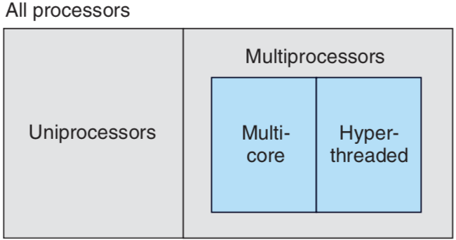
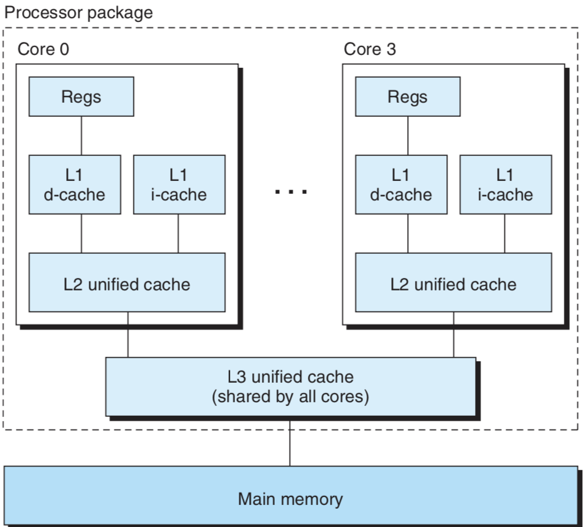

# 동시성과 병렬성 훑어보기

**동시성(concurrency)**은 다수의 동시에 벌어지는 일을 갖는 시스템에 관한 일반적인 개념을 말할 때 사용하며, **병렬성(parallelism)**은 동시성을 사용해서 시스템을 더 빠르게 동작하도록 하는 것을 말한다.

### 스레드 수준 동시성

프로세스 추상화 개념을 이용하면 다수의 프로그램이 동시에 실행되는 시스템을 생각해볼 수 있으며, 이것은 **동시성**으로 이어진다. **스레드**를 이용하면 한 개의 프로세스 내에서 실행되는 다수의 제어 흐름을 가질 수 있다.

1960년대 초반 *시간 공유(time sharing)* 기법의 출현으로 동시 실행이 나타났다. 이것은 한 개의 컴퓨터가 실행하는 프로세스를 빠르게 전환하는 방법을 사용한다. 이런 형태의 동시성은 여러 명이 한 개의 웹 서버로부터 페이지를 사용하고자 할 때처럼 다수의 사용자들이 시스템과 동시에 교신할 수 있게 한다. 또한 하나의 PC에서 웹 브라우저와 문서 편집기를 실행하면서 스트리밍 음악을 플레이하는 것처럼 한 명의 사용자가 다수의 태스크를 동시에 연관될 수 있게 해준다. 최근까지도 대부분의 실질적인 계산은 한 개의 프로세서에 의해 이루어지고 있다. 이러한 시스템 구성을 **단일 프로세서 시스템**이라고 한다.

어떤 시스템이 여러 개의 프로세서를 가지고 하나의 운영체제 커널의 제어 하에 동작하는 경우를 **멀티 프로세서 시스템**이라고 한다. 옛날에는 대규모의 계산에나 이용되었지만, 최근에는 **멀티코어 프로세서**와 **하이퍼스레딩** 기법의 출현으로 일반적인 환경이 되었다.

**멀티코어 프로세서**는 하나의 칩에 여러 개의 CPU(코어)를 내장하고 있다. 위 그림은 인텔 i7 프로세서 코어의 구성을 보여준다. i7은 네 개의 CPU 코어를 가지고 있으며, 각각 별도의 L1, L2 캐시를 가지고 코어는 메인 메모리 인터페이스뿐만 아니라 상위 수준 캐시를 공유한다.

> **하이퍼스레딩**(**Hyper-Threading** Technology, 이하 HTT)은 인텔이 동시 멀티**스레딩**을 구현한 기술이다. 물리상 실행 장치 한 개에 가상 실행 장치 두 개를 할당해 성능을 높이려는 기술이다. -위키백과-

**멀티스레딩**이라고도 하는 **하이퍼스레딩**은 하나의 CPU가 여러 개의 제어 흐름을 실행할 수 있게 해주는 기술이다. 하나의 물리적 CPU안에 프로그램 카운터나 레지스터 파일 같은 논리적 하드웨어 사본을 여러 개 가지고 있다. (반면에 부동소수점 연산기는 하나만 있다.)

기존의 프로세서가 스레드 간의 전환을 하는 데 약 2만 클럭 사이클이 요구되는 반면에 하이퍼스레드 프로세서에서는 매 사이클마다 실행할 스레드를 결정한다. 예를 들어 어느 스레드가 데이터를 캐시에 로딩하기 위해 대기해야 한다면, CPU는 다른 스레드를 실행할 수 있다. 위 인텔 i7 프로세서에서는 각각의 코어가 두 개의 스레드를 실행할 수 있으며, 4코어 시스템이므로 8개의 스레드를 병렬로 실행할 수 있다.

---

### 명령어 수준 병렬성(Instruction-Level Parallelism)

**명령어 수준 병렬성**이란 훨씬 낮은 수준에서의 추상화로 여러 개의 명령어를 한 번에 실행하는 것을 말한다. 옛날에는 한 개의 명령어를 실행하는 데 여러 클럭 사이클이 필요했지만, 최근의 프로세서들은 매 클럭마다 여러 개의 명령어를 실행할 수 있다. 사이클당 한 개 이상의 명령어를 실행할 수 있는 프로세서를 **슈퍼스칼라(super-scalar)**라고 한다. 최근 프로세서들은 대부분 슈퍼스칼라를 지원한다. 응용 프로그래머는 이것을 통해 자신이 작성한 프로그램의 성능을 이해할 수 있게 된다. 이를 통해 작성된 코드가 더 높은 수준의 명령어 수준 병렬성을 갖게 될 것이며, 따라서 더 빨리 동작하게 된다.

---

### 싱글 명령어 다중 데이터 병렬성 (SIMD)

> **SIMD**(Single Instruction Multiple Data)는 병렬 프로세서의 한 종류로, 하나의 명령어로 여러 개의 값을 동시에 계산하는 방식이다. -위키백과-

최신 프로세서들은 최하위 수준에서 **SIMD 병렬성**이라는 모드로 한 개의 명령어가 병렬로 다수의 연산을 수행할 수 있는 특수 하드웨어를 가지고 있다. 예를 들어 인텔과 AMD사의 최신 프로세서는 8쌍의 단일 정밀도 부동소수(c언어: float)들 간의 덧셈 연산을 병렬로 실행할 수 있는 명령어를 가지고 있다.

---