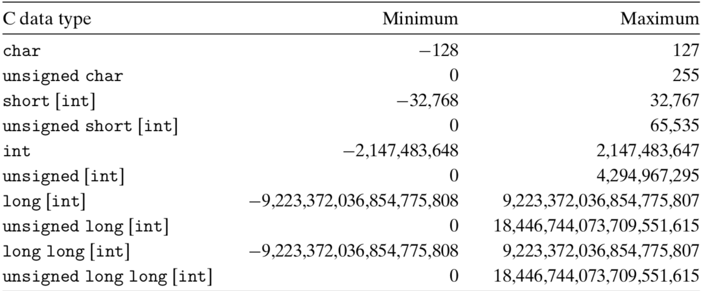
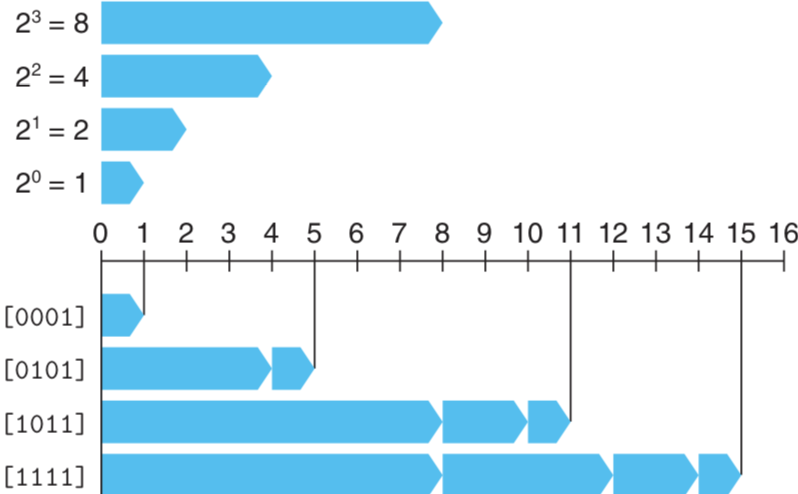
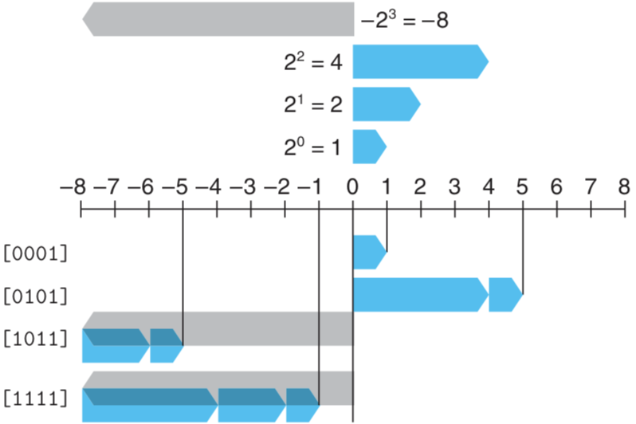

# 정수의 표시

이 포스팅에서는 정수를 표시하기 위해 사용할 수 있는 두 가지 방법:

- 양수만 표시할 수 있는 방법
- 음수, 0, 양수 모두를 표시할 수 있는 방법

에 대해 설명할 예정이다.

---

## C 언어의 정수형 데이터 타입

위 그림은 64비트 프로그램에서의 C 언어의 정수형 데이터 타입의 일반적인 범위를 보여준다. 주목해야 할 중요한 특징은 음수의 범위가 1 더 넓다는 것인데, 왜 이런 특징이 생기는지에 대해서는 음수가 컴퓨터에서 어떻게 표시되는지 알면 이해할 수 있을 것이다.

---

## 비부호형 인코딩

> **unsigned**는 C/C++ 언어에서 사용되는 지정자로 정수형과 같이 사용되어 부호 비트를 제거해 저장 가능한 양수 범위를 두배로 늘이는 역할을 한다. char와 int의 signed 정수형 변수에서 MSB가 부호 비트이다. 1이면 음수이고 0이면 양수이다. 그러나 unsigned을 사용하면 음수를 사용하지 않겠다는 의미 이므로 부호 비트가 필요 없다. 따라서 이진수와 같은 십진수가 된다. -위키백과-

n비트의 정수형 데이터 타입이 있다고 하자. 전체  벡터를 나타내기 위해서 벡터의 각 비트를 [Xn-1, Xn-2,  ..., X0]으로 표시해서 사용할 수 있다. X를 이진수 표시(0 or1)로 작성된 숫자로 생각하면 **비부호형** 해석을 할 수 있다. X가 1의 값을 갖는 경우는 2^i 값이 정수의 값을 계산할 때 포함되어야 한다는 것을 의미한다.

- 
- [0001] = 0 * 2^3 + 0 * 2^2 + 0 * 2^1 + 1 * 2^0 = 0 + 0 + 0 + 1 = 1
- [0101] = 0 * 2^3 + 1 * 2^2 + 0 * 2^1 + 1 * 2^0 = 0 + 4 + 0 + 1 = 5
- [1011] = 1 * 2^3 + 0 * 2^2 + 1 * 2^1 + 1 * 2^0 = 8 + 0 + 2 + 1 = 11
- [1111] = 1 * 2^3 + 1 * 2^2 + 1 * 2^1 + 1 * 2^0 = 8 + 4 + 2 + 1 = 15

n비트로 표시할 수 있는 값의 범위를 보자. 정수 0은 비트 벡터 [00 ... 0]을 가지며 최소값이 되고, 최대값은  [11 ... 1]이 된다. n이 4인 4비트의 경우를 예로 들면 [1111] = 2^4 -1 =.15가 된다. 즉, 비부호형 값의 범위는 0과 2*n -1이다.

---

## 2의 보수 인코딩: 부호형

> **2의 보수**란 어떤 수를 커다란 2의 제곱수에서 빼서 얻은 이진수이다. 2의 보수는 대부분의 산술연산에서 원래 숫자의 음수처럼 취급된다. 주어진 이진수보다 한 자리 높고 가장 높은 자리가 1이며 나머지가 0인 수에서 주어진 수를 빼서 얻은 수가 2의 보수이다. 혹은 주어진 이진수의 모든 자리의 숫자를 반전(0을 1로, 1을 0으로)시킨 뒤 여기에 1을 더하면 2의 보수를 얻을 수 있다. -위키백과-

많은 시스템에서 음수 값을 표시한다. 부호형 숫자를 표시하는 경우 가장 일반적으로 **2의 보수**를 사용한다. 이것은 워드(word)에서 가장 중요한 비트(MSB)를 음수 자리값을 갖는 것으로 해석하는 형태로 정의된다.

벡터의 각 비트 [Xn-1, Xn-2,  ..., X0]에서 가장 중요한 비트(MSB)인 Xn-1을 **부호 비트**라고 부른다.

- [0001] = -0 * 2^3 + 0 * 2^2 + 0 * 2^1 + 1 * 2^0 = 0 + 0 + 0 + 1 =  1
- [0101] = -0 * 2^3 + 1 * 2^2 + 0 * 2^1 + 1 * 2^0 = 0 + 4 + 0 + 1 =  5
- [1011] = -1 * 2^3 + 0 * 2^2 + 1 * 2^1 + 1 * 2^0 = -8 + 0 + 2 + 1 = -5
- [1111] = -1 * 2^3 + 1 * 2^2 + 1 * 2^1 + 1 * 2^0 = -8 + 4 + 2 + 1 = -1

위 그림에서 왼쪽으로 향하는 막대를 사용해서 부호 비트가 음의 자리값을 갖는 것을 나타낸다. 가장 중요한 비트(MSB)가 1일 때 이것은 음수를 나타낸다.

n비트 2의 보수로 나타낼 수 있는 값의 범위를 보자. 가장 장은 수는 비트 벡터 [10 ... 0]이며, 가장 큰 값은 [01 ... 1이다. 4비트를 예로 들면 -8 ~ 7이다. 즉, 2의 보수 값의 범위는 2^(n-1) ~ 2^(n-1) - 1이다.

---