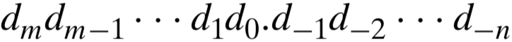
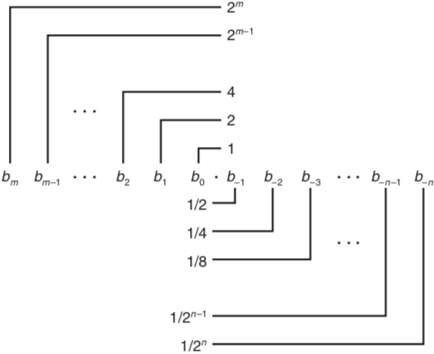
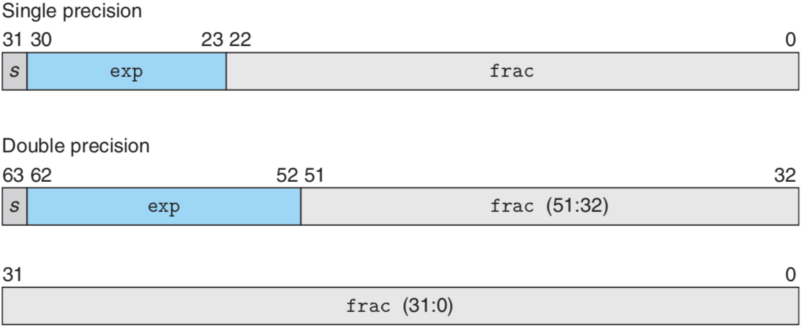
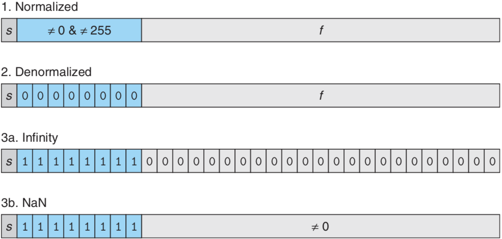

# 부동소수점 (IEEE 754)

부동소수점 표현은 `V = x * 2^y` 형태의 소수를 인코딩한다. 1980년대까지 컴퓨터 생산 업체는 부동소수점 숫자를 표시하는 방식과 수행해야 하는 연산들을 자기 나름대로 고안해서 사용했다. 그러나 1985년경에 IEEE 표준 754의 출현으로 여러 가지 컴퓨터의 호환성이 크게 향상되었다.

>  **IEEE** 754는 전기 전자 기술자 협회(**IEEE**)에서 개발한 컴퓨터에서 **부동소수점**을 표현하는 가장 널리 쓰이는 표준이다. ±0 등의 수와 무한, NaN 등의 기호를 표시하는 법과 이러한 수에 대한 연산을 정의하고 있다. -위키백과-

---

## 비율 이진수(Fractional Binary Numbers)

부동소수점을 이해하기 위한 첫 단계는 비율 이진수에 대해 아는 것이다. 우선, 친숙한 십진수 표기를 살펴보자.

- 

여기서 각 십진 숫자 d는 0에서 9 사이의 값을 갖는다. 숫자들의 자리값은 십진 소수점 부호(`.`)에 상대적으로 정의된다. 즉, '.'부호 좌측의 숫자들은 양의 제곱을 자리값으로 가지며, 우측의 숫자들은 음의 제곱을 자리값으로 갖게 되어 소수 값을 만든다.

- 12.34*(10)* : 1 * 10^*1* + 2 * 10^*0* + 3 * 10^*-1* + 4 * 10^*-2* =. 12(34/100)와 같이 나타낸다.

마찬가지로 이진수로 다음과 같은 형태의 표현법을 보자.

비율 이진수 표시: 이진 소수점 좌측의 숫자들은 2^*i* 형태의 자리값을 가지며, 우측의 값은 1/2^*i* 자리값을 가진다. 여기서 각 이진 숫자 비트 b*i*는 0과 1을 값을 가진다. 부호 `.`는 이제 **이진 소수점**이 되고, 좌측의 비트들은 2의 양의 제곱을 자리값으로 가지며, 우측은 2의 음의 제곱을 자리값으로 가진다.

- 101.11*(2)* : 1 * 2^*2* + 0 * 2^*1* + 1 * 2^*0* + 1 * 2^*-1* + 1 * 2^*-2* = 4 + 0 + 1 + (1/2) + (1/4) = 5(3/4)

0.11 ... 1*(2)* 형태의 숫자들은 1 바로 아래의 수를 나타낸다. 예를 들어 0.111111*(2)*는 63/64를 나타낸다. 이런 값들을 표시하기 위해 약식 표기로 **1.0 - ε**를 사용한다.

십진수 표기법에서 1/3이나 5/7은 정확히 표시할 수 없다. 마찬가지로 비율 이진수 표기는 `x * 2^y`로 나타낼 수 있는 수만 표시할 수 있다. 다른 값들은 오직 **근사화(rounding)**할 수밖에 없다.

---

## IEEE 부동소수점 표시

비율 이진수처럼 위치에 기반을 둔 표기법은 값이 큰 수를 표시할 때 효율적이지 못한다. 예를 들어 5 * 2^*100*은 비트패턴 101 다음에 0이 100개나 따라온다. 그래서 수를 `x * 2^y`로 나타내서 x와 y 값으로 표시한다.

**IEEE 부동 소수점 표준은 수를 `V = (-1)^s * 2^E * M ` 형태로 나타낸다:**

- **부호 s**는 숫자가 음수인지(s=1) 양수인지(s=0)를 결정한다. 여기서 0을 나타내기 위한 부호 비트는 특별하게 다룬다.
- **지수 E**는 2의 제곱으로 자리값을 제공한다. (음수 제곱도 가능)
- **가수 M**은 비율 이진수로 1과 2 - ε. 사이. 또는 0과 1 - ε 사이 값을 갖는다.

**부동소수점 수의 비트 표시는 이 값들을 인코딩하기 위해 세 개의 필드로 나누어진다:**

- **한 개의 부호 비트 s**는 부호 s를 직접 인코딩한다.
- k비트 **지수 필드 exp**는 지수 E를 인코딩한다.
- n비트 **가수 필드 frac**는 가수 M을 인코딩한다. 인코딩된 값은 지수 필드가 0인지 여부에도 관계된다. 정밀도에 따라 범위가 제한될 수 있다.

위 그림은 이 세 개의 필드로 두 개의 가장 일반적인 형식에 대해 워드로 나타내는 방법을 보여준다. 단일-정밀도 부동 소수점 형식(C: float)에서는 필드 s, exp, frac으로 1, k:8, n:23비트를 가지며, 총 32비트로 표시된다. 이중-정밀도 부동소수점 형식(C: double)은 필드 s, exp, frac으로 1, k:11, n:52비트를 가지며, 총 64비트로 표시된다.

주어진 비트 표시로 인코딩된 값은 exp 값에 따라 세 개의 다른 경우로 나뉜다.

#### - Case 1: 정규화 값 (Normalized Values)

가장 일반적으로 지수 필드 exp의 비트 패턴이 모두 0이나 1이 아닌 경우다. 단일정밀도에서 지수 필드는 8비트이므로 256가지를 표현할 수 있지만, 아래에서 설명할 예정인 최소값 0과 최대값 1은 예약되어 있으므로 실제로 254가지만 표현할 수 있다. 음수와 양수 모두를 표현해야 하므로 지수 필드는 부호형 정수를 **바이어스(bias)** 형태로 나타낸다. 단일 정밀도의 경우 -126에서 +127 범위의 값을 가지며, 이중정밀도는 -1022에서 +1023의 범위의 값을 가진다. bias는 단일정밀도에서는 127, 이중정밀도에서는 1024를 가진다. 단일정밀도의 경우 127을 0으로 생각해서 지수 값은 bias를 더한 값이 된다.

(바이어스 값이 127인 경우 바이어스된 지수를 0부터 255까지 표현할 수 있으므로 결국 지수는 -127부터 128까지 표현할 수 있다.)

#### - Case 2: 비정규화 값 (Denormalized Values)

지수 필드가 모두 0일 때 나타낸 수는 비정규화 형태를 갖는다. 숫자 0.0을 표시하는 목적이다. 흥미롭게도 부호 비트 s 가 1인 경우에는 -0.0이 된다.

#### - Case 3: 특수 값 (Special Values)

지수 필드가 모두 1인 경우다. 이 경우 가수 필드가 모두 0이면 무한대를 나타낸다. s=0이면 +∞, s=1이면 -∞를 의미한다. 무한대는 두 개의 매우 큰 값의 곱셈이나 0으로 나눌 때 나타난다. 가수 필드가 0이 아니면, 결과값은 NaN이라고 하며 "Not a Number"의 약자다.

---

## 숫자 예제

십진수 -12.375을 단일정밀도 부동 소수점 형식으로 나타내 보자. 

먼저 -12.375는 음수이므로 부호 s를 1로 채운다.

| 부호 필드(1bit) | 지수 필드(8bit) | 가수 필드(23bit) |
| --------------- | --------------- | ---------------- |
| 1               |                 |                  |

절대값 12.375를 비율 이진수를 사용해 이진법으로 표현하면 1100.011이 된다.

- 1100.011*(2)*: 1 * 2^*3* + 1 * 2^*2* + 1 * 2^*-2* + 1 * 2^*-3* = 8 + 4 + 1/4 + 1/8 = 12 + 25/100 + 125/1000 = 12 + 375/1000 = 12.375

이 이진법을 정규화 한다. 여기서 정규화란 가수 M의 맨 앞자리의 비트가 1이 오도록 하는 것이다. 정규화가 되면 가수 M은 1.xxxx..와 같은 형태가 된다.

- 1.100011 * 2^*3*

정규화가 되면 가수 M의 정수 부분은 항상 1이므로 이진 표시에서 생략한다. 32비트(단일정밀도)에서 가수 필드는 23비트이지만 가장 앞의 1비트는 생략되어 있으므로 실제로 24비트를 표현하고 있다. 가수 필드 frac에 100011을 채우고 남은 부분은 모두 0으로 채운다.

| 부호 필드 s (1bit) | 지수 필드 exp (8bit) | 가수 필드 frac (23bit)  |
| ------------------ | -------------------- | ----------------------- |
| 1                  |                      | 10001100000000000000000 |

지수 E만 남았다. 단일정밀도 부동소수점에서 지수 필드 exp는 8비트로 구성되어 있고 -126 ~ 127 범위를 가진다. 여기서 지수는 3이므로 exp = bias + E 공식을 이용해 127 + 3: 130이 된다. 130은 이진수로 10000010이다.

| 부호 필드 s (1bit) | 지수 필드 exp (8bit) | 가수 필드 frac (23bit)  |
| ------------------ | -------------------- | ----------------------- |
| 1                  | 10000010             | 10001100000000000000000 |

---

## C 언어에서의 부동소수점, 근사법(Rounding)

C 언어에서는 두 가지 부동소수점 자료형 `float`과 `double`을 제공한다. 이 자료형은 각각 단일 및 이중정밀도 부동소수점에 대응된다. 부동소수점 산술연산은 표시방법이 제한된 범위와 정밀도를 갖기 때문에 실제 연산의 근사값을 사용할 수밖에 없다. C 언어에서는 **짝수 근사법**를 사용한다.

#### - 짝수 근사법 (Round-to-even)

짝수 근사법은 가까운 값이 2개인 경우 (예를 들어 0.5인 경우 가장 가까운 값은 0과 1) 가수부의 마지막 자리가 짝수인 값을 선택하는 방법이다.

---