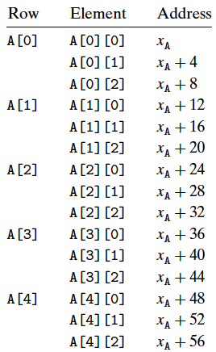

# 배열의 할당과 접근

C에서 배열은 스칼라 데이터를 보다 큰 자료형으로 연계시키는 수단이다. C는 배열 원소들에 대한 포인터를 만들고 이들 포인터 간에 연산을 하는 단순한 구현 방법을 사용하고 있다.

---

## 1. 기본원리

자료형 *T*와 정수형 상수 *N*에 대해서 다음과 같은 선언을 보자:

```cpp
T A[N];
```

시작하는 위치를 *X*_A로 표시하자

1. 이것은 *L***N* 바이트의 연속적인 공간을 메모리에 할당하며, 여기서 *L*(바이트 단위)은 자료형 *T*의 크기를 나타낸다.
2. 위 선언문은 새로운 식별자 A를 통해서 배열이 시작하는 위치의 포인터로 사용한다. 포인터의 값은 *X_A*이다. 배열의 각 원소는 0에서 *N* - 1 사이의 정수형 인덱스를 사용해서 접근할 수 있다. 배열의 원소 *i*는 주소 *X*_A + *L* * *i*에 저장된다.

```cpp
char    A[12];
char*   B[8];
int     c[6];
double* D[5];
```

| Array | Element size | Total size | Start address | Element *i*  |
| ----- | ------------ | ---------- | ------------- | ------------ |
| A     | 1            | 12         | *X*_A         | *X*_A + *i*  |
| B     | 8            | 64         | *X*_B         | *X*_B + 8*i* |
| C     | 4            | 24         | *X*_C         | *X*_C + 4*i* |
| D     | 8            | 40         | *X*_D         | *X*_D + 8*i* |

배열 A는 12개의 단일 바이트(char) 원소로 구성, 배열 C는 각각 4바이트씩 필요로 하는 6개의 정수, 배열 B와 D는 모두 포인터의 배열이므로 원소는 각각 8바이트 크기를 갖는다.

```assembly
movl (%rdx, %rcx, 4), %eax
```

위 코드는 E가 정수형 데이터 값들의 배열이고, E[i]를 계산하는 예시다. E의 주소는 레지스터 `%rdx`에, *i*는 `%rcx`에 저장되어 있다. 그러면, 다음의 인스트럭션은 주소계산 *X*_E + 4*i*를 수행하고 메모리 위치를 읽어서 그 결과를 레지스터 `%eax`에 저장한다.

### 포인터 연산

배열 첨자 계산 방식은 포인터에도 적용될 수 있다. 배열 참조 `A[i]`는 식 `*(A+i)`와 동일하다. 이것은 *i*번째 배열 원소의 주소를 계산해서 이 메모리 위치에 접근한다. 위 예시를 통해 어셈블리 코드를 살펴보자:

| Expression | Type | Assembly code                 |
| ---------- | ---- | ----------------------------- |
| E          | int* | movq %rdx, %rax               |
| E[0]       | int  | movl (%rdx), %eax             |
| E[i]       | int  | movl (%rdx, %rcx, 4), %eax    |
| &E[2]      | int* | leaq 8(%rdx), %rax            |
| E+i-1      | int* | leaq -4(%rdx, %rcx, 4), %eax  |
| *(E+i-3)   | int  | movl -12(%rdx, %rcx, 4), %eax |

배열 값을 리턴하는 연산들은 자료형 int를 가지며, 그래서 4바이트 연산과 레지스터를 쓴다. 포인터를 리턴하는 연산들은 자료형 int*을 가지며, 그래서 8바이트 연산과 레지스터를 쓴다.

---

## 2. 다중 배열

배열 할당과 참조에 관한 원칙은 배열의 배열에도 적용된다.

```cpp
int A[5][3];
```

은 다음의 선언문과 동일하다:

```cpp
typedef int row3_t[3]; //  4 * 3 = 12 bytes 
row3_t A[5];           // 12 * 5 = 60 bytes
```

A 배열의 총 크기는 60바이트다. 다섯 개의 행과 세 개의 열을 갖는 이차원 배열로 볼 수 있다. 배열의 원소들은 메모리에 "**행 우선**(row major)" 순서로 저장되는데, 이것은 A[0]으로 표시하는 모든 행 0의 원소들 다음에 A[1]의 원소가 따라오는 방식으로 저장되는 것을 의미한다.

다차원 배열의 원소를 접근하기 위해서 컴파일러는 원하는 워놋의 오프셋을 계산하는 코드를 생성하고, 배열의 시작을 기본 주소로, 오프셋을 인덱스로 하는 `MOV` 인스트럭션을 사용한다.

```cpp
T D[ROW][COLUMN];
```

위와 같이 선언된 배열에 대해서 배열 원소 `D[i][j]`는 다음과 같다:

```cpp
&D[i][j] = X_D + L(COLUMN * i + j) // L은 자료형 T의 크기
```



`int A[5][3]` 코드로 정의한 배열 A에서 X_A, i, j는 각각 %rdi, %rsi, %rdx에 위치한다고 하자. 그러면 배열 원소 `A[i][j]`는 레지스터 %eax에 다음과 같은 코드에 의해 복사될 수 있다:

```assembly
// A in %rdi, i in %rsi, j in %rdx
leaq	(%rsi, %rsi, 2), %rax	// Compute 3i
leaq	(%rdi, %rax, 4), %rax	// Compute X_A + 12i
movl	(%rax, %rdx, 4), %eax	// Read from M[X_A + 12i + 4j]
```

---