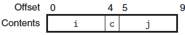

# 자료구조

C 언어는 서로 다른 유형의 객체를 연결해서 자료형을 만드는 두 가지 방법을 제공한다:

- `struct`  : **구조체**는 다수의 객체를 하나의 단위로 연결한다.
- `union` : **공용체**는 하나의 객체를 여러 개의 다른 자료형으로 참조될 수 있게 한다.

---

## 구조체

`struct` 선언은 서로 다른 유형의 객체들을 하나의 객체로 묶어주는 자료형을 생성한다. 하나의 구조체 내의 서로 다른 필드들은 이름을 이용해서 참조된다. 구조체의 포인터가 첫 번째 바이트 주소이고, 모든 필드가 메모리의 연속된 영역에 저장된다는 점에서 배열과 유사하다. 컴파일러는 구조체의 각 필드에 대한 바이트 오프셋을 가리키는 정보를 관리한다.

```cpp
struct rect
{
    int i;
    int j;
    int a[2];
    int* p;
}
```

위 구조체는 네 개의 필드를 가진다: 두 개의 4바이트 정수, 두 개의 4바이트 정수로 이루어진 배열, 8바이트 정수형 포인터: 총 24 바이트

| Offset   | 0    | 4    | 8    |      | 16   |
| -------- | ---- | ---- | ---- | ---- | ---- |
| Contents | i    | j    | a[0] | a[1] | p    |

구조체의 각 필드에 접근하기 위해서 컴파일러는 구조체 주소에 적절한 오프셋 값을 더하는 코드를 생성한다. 예를 들어, struct rec* 자료형의 변수 r이 레지스터 %rdi에 저장된다고 가정하자. 그러면, 다음의 코드는 r->i 필드를 r->j로 복사한다.

```assembly
// r in %rdi
movl	(%rdi), %eax	// get r->i
movl	%eax, 4(%rdi)	// Store in r->j
```

---

## 공용체

`union`은 하나의 객체가 다수의 자료형에 따라 참조될 수 있도록 해준다. 다른 필드들이 메모리의 다른 블록을 참조하는 구조체와 다르게 같은 블록을 참조한다.

```cpp
struct S3
{
    char c;
    int i[2];
    double v;
};
union U3
{
    char c;
    int i[2];
    double v;
};
```

x86-64 머신에서 컴파일될 때 각 필드의 오프셋 크기는 아래와 같다:

| Type | c    | i    | v    | Size |
| ---- | ---- | ---- | ---- | ---- |
| S3   | 0    | 4    | 16   | 24   |
| U3   | 0    | 0    | 0    | 8    |

공용체의 전체 크기는 필드 중에서 크기가 가장 큰 것과 같고, 공용체 U3* 자료형의 포인터 p에 대해서 p->c, p->i[0], p->v 같은 참조들은 모두 자료구조의 시작 부분을 참조한다.

---

## 데이터의 정렬

컴퓨터 시스템들은 기본 자료형들에 대해 사용 가능한 주소를 제한하고 있어서 어떤 객체의 주소는 어떤 값 *K*(일반적으로 2, 4, 8)의 배수가 되도록 요구한다. 이러한 **정렬 제한**은 프로세서와 메모리 시스템 간의 인터페이스를 구성하는 하드웨어의 설계를 단순화한다.

만일 double 값의 주소가 8의 배수로 정렬될 것이라고 보장된다면, 이 값은 하나의 메모리 연산으로 읽거나 쓸 수 있다. 그렇지 않다면, 객체가 두 개의 8바이트 메모리 블록에 걸쳐서 나누어져 있을 수 있으므로 메모리에 두 번 접근해야 한다.

```assembly
.align 8
```

위 코드는 다음에 오는 데이터가 8의 배수인 주소로 시작하도록 보장해 준다.

구조체가 관련된 코드에서 컴파일러는 구조체의 각 원소가 각각의 정렬 요구사항을 만족하도록 필드 할당 시 빈 공간을 삽입한다. 그러면 구조체는 자신의 시작주소가 가져야 하는 정렬 요건이 정해진다.

```cpp
struct S1
{
    int i;
    char c;
    int j;
};
```

컴파일러가 최소 크기인 9바이트 할당을 사용했다고 가정하자:



그러면, 필드 i와 j 모두에 대해 4바이트 정렬 요건을 만족시키는 것은 불가능해진다. 대신에 컴파일러든 필드 c와 j 사이에 3바이트 공간을 삽입한다:


그 결과 j는 오프셋 8을 가지게 되고, 전체 구조체의 크기는 12바이트가 된다. 추가로, 컴파일러는 구조체의 마지막에 0을 채워서 구조체 배열에서 각 원소가 각각의 정렬 요건을 만족하도록 해준다.

---