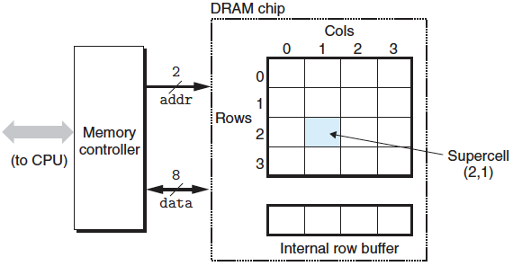
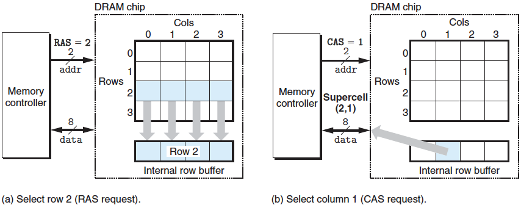
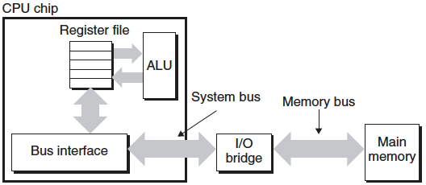

# 랜덤-접근 메모리

랜덤-접근 메모리(RAM: Random-Acesss Memory)는 두 종류가 있다.

- 정적 램(SRAM) : 캐시 메모리로 사용되며 CPU칩 내부 또는 외부에 장착된다.
- 동적 램(DRAM) : 메인 메모리와 그래픽 시스템의 프레임 버퍼로 사용된다.

SRAM이 DRAM보다 더 빠르고 훨씬 더 비싸며, 일반적인 컴퓨터는 수십 메가바이트의 SRAM과 수천 메가바이트의 DRAM을 가진다.

## 1. SRAM

SRAM은 각 비트를 **이중안정(bistable)** 메모리 셀(cell)에 저장한다. 각 셀은 여섯 개의 트랜지스터 회로로 구현된다. 이 회로는 두 개의 전압 구성 또는 상태로 무한히 머물러 있을 수 있는 특성을 가진다. 이중안정 본성으로 인해 SRAM 메모리 셀은 자신의 값을 전원이 공급되는 한 무한히 유지하게 된다.

---

## 2. DRAM

DRAM은 각 비트를 전하로 커패시터에 저장한다. 각 셀은 커패시터 하나와 접근 트랜지스터 하나로 구성된다. SRAM과 달리, DRAM 셀은 외란에 대해서 매우 민감하다. 커패시터 전압이 달라지면 다시 회복할 수 없다.

여러 가지 원인으로 인한 누수 전류는 DRAM 셀이 10에서 100밀리초 사이에 전하를 상실하게 하지만, 다행히도 나노초 클럭 사이클 시간으로 동작하는 컴퓨터에 대해서 이 유지시간은 꽤 긴 것이다. 메모리 시스템은 주기적으로 메모리의 모든 비트를 읽었다가 다시 써주는 방식으로 리프레시한다.

|      | Transistors per bit | Relative access time | Persistent | Sensitive | cost   | Applications               |
| ---- | ------------------- | -------------------- | ---------- | --------- | ------ | -------------------------- |
| SRAM | 6                   | 1x                   | Yes        | No        | 1,000x | Cache memory               |
| DRAM | 1                   | 10x                  | No         | Yes       | 1x     | Main memory, Frame buffers |

위 표는 SRAM과 DRAM의 특성들을 요약한 것이다. SRAM은 전원이 공급되는 한 지속성을 가지며, 리프레시가 필요하지 않다. SRAM은 DRAM보다 빨리 접근할 수 있고, 빛이나 전기적 잡은 같은 외란에 민감하지 않다. SRAM 셀들이 트랜지스터를 더 많이 사용하므로 더 낮은 밀도를 가지고, 보다 비싸고 좀 더 전력을 많이 소모한다.

---

## 3. 일반 DRAM

DRAM 칩 내의 셀들은 *d* **슈퍼셀**들로 나누어지며, 각각은 *w* DRAM 셀들로 이루어지므로 총 *dw* 비트의 정보를 저장한다. 슈퍼셀들은 r rows와 c columns로 이루어진 직사각형의 배열로 구성되어 있다.



위 그림은 *d* = 16 슈퍼셀, 슈퍼셀당 *w* = 8 비트를 갖는 16 x 8 = 128 비트 DRAM의 칩의 구성을 보여준다. 색칠한 상자는 주소 (2, 1)에서의 슈퍼셀을 나타내는대. 정보는 핀(pin)이라고 부르는 외부 커텍터를 통해서 칩의 안과 밖을 흘러다니며, 각 핀은 1비트 신호를 전송한다.

각각의 DRAM 칩은 *w* 비트를 일정 시간에 DRAM 칩으로, 그리고 칩으로부터 전송할 수 있는 **메모리 컨트롤러**로 알려진 회로에 연결된다. 슈퍼셀(i, j)의 내용을 읽으려면 메모리 컨트롤러는 addr핀을 통해 행 주소 i를 DRAM에 보내고, 다음에 열 주소 j를 보낸다.



예를 들어, 그림 (a)처럼 행 주소 2를 보내면 DRAM은 행 2의 전체 내용을 내부 행 버퍼에 복사한다. 다음으로 그림 (b)처럼 열 주소 1을 보내면, DRAM은 행 버퍼에서 슈퍼셀 (2, 1)에 있는 8비트를 복사해서 메모리 컨트롤러로 보낸다.

---

## 4. 비휘발성 메모리

DRAM과 SRAM은 전원이 꺼지면 정보도 잃어버리므로 **휘발성**이다. 반면에 **비휘발성 메모리**는 전원이 꺼져도 정보를 유지한다. 비휘발성 메모리는 종류가 다양하며, 읽기 작업뿐만 아니라 일부는 쓰기 작업도 되지만 역사적인 이유로 **ROM(Read-only memory)**이라고 부른다.

- PROM(Programmable ROM) : 단 한 번 프로그램될 수 있다. PROM은 각 메모리 셀에 높은 전류를 흘리면 한 번에 끊어질 수 있는 일종의 퓨즈(fuse)를 가지고 있다.
- EPROM(Erasable programmable ROM) : 빛이 저장장치 셀에 도달할 수 있는 투명을 창을 가지고 있으며, 이 창을 통해 자외선을 비추면 0으로 지울 수 있다. 1을 쓸 수 있는 특별한 장치를 사용해서 프로그래밍할 수 있으며, 한 개의 EPROM은 1,000번 단위로 지우고 재프로그램할 수 있다.
- EEPROM(Electrically EPROM) : EPROM과 유사하지만, PCB에서 직접 재프로그램될 수 있다. EEPROM은 다 쓸 때까지 105번 재프로그램할 수 있다.
- 플래시 메모리(Flash memory) : EEPROM에 기반을 둔 비휘발성 메모리의 일종으로 중요한 저장장치 기술이다. 디지털카메라, 스마트폰 등 다량의 전자기기에서 빠르고 안정적인 비휘발성 저장장치의 역할을 수행하므로 어디서나 찾아볼 수 있다.

ROM 디바이스에 저장된 프로그램들을 **펌웨어(firmware)**이라고 부르며, 컴퓨터의 전원이 공급되면 ROM에 저장된 펌웨어를 실행시킨다.

---

## 5. 메인 메모리 접근하기

데이터는 '버스'라는 전기회로를 통해 CPU와 DRAM 메인 메모리간에 앞뒤로 교환된다. 매 전송은 **버스 트랜잭션(bus transaction)**이라고 부르는 일련의 단계들을 통한다. 읽기 트랜잭션은 데이터를 메인 메모리에서 CPU로 이동시키고, 쓰기 트랜잭션은 CPU에서 메인 메모리로 이동시킨다.



CPU가 다음과 같은 **로드** 연산을 하면:

```assembly
movq A, %rax
```

여기서 주소 A의 내용은 레지스터 `%rax`에 로드된다. CPU 칩 내에 **버스 인터페이스**라고 부르는 회로는 버스에서 읽기 트랜잭션을 개시한다. 읽기 트랜잭션은 세 단계로 이루어진다.

1. CPU는 주소 A를 시스템 버스에 보낸다. I/O 브릿지는 신호를 메모리 버스를 따라 보낸다. (여기서 I/O 브릿지는 시스템 버스의 전기적 신호를 메모리 버스의 전기적 신호로 변환한다.)
2. 메인 메모리는 메모리 버스에서 주소 신호를 감지하고, 메모리 버스로부터 주소를 읽고, DRAM에서 데이터 워드를 선입하며, 데이터를 메모리 버스에 쓴다.
3. CPU는 시스템 버스에서 데이터를 감지하고, 버스에서 데이터를 읽은 뒤에 이것을 레지스터 `%rax`에 복사한다.

반대로, CPU가 다음과 같이 **적재** 연산을 하면:

```assembly
movq %rax, A
```

위 인스트럭션은 레지스터 `%rax`의 내용을 주소 A에 기록하고, CPU는 쓰기 트랜잭션을 개시한다.

1. CPU는 주소를 시스템 버스에 보낸다. 메모리는 메모리 버스에서 주소를 읽고 데이터가 도착하기를 기다린다.
2. CPU는 `%rax`에 있는 데이터를 시스템 버스에 복사한다.
3. 메인 메모리는 데이터를 메모리 버스에 읽고 비트들을 DRAM에 저장한다.

---