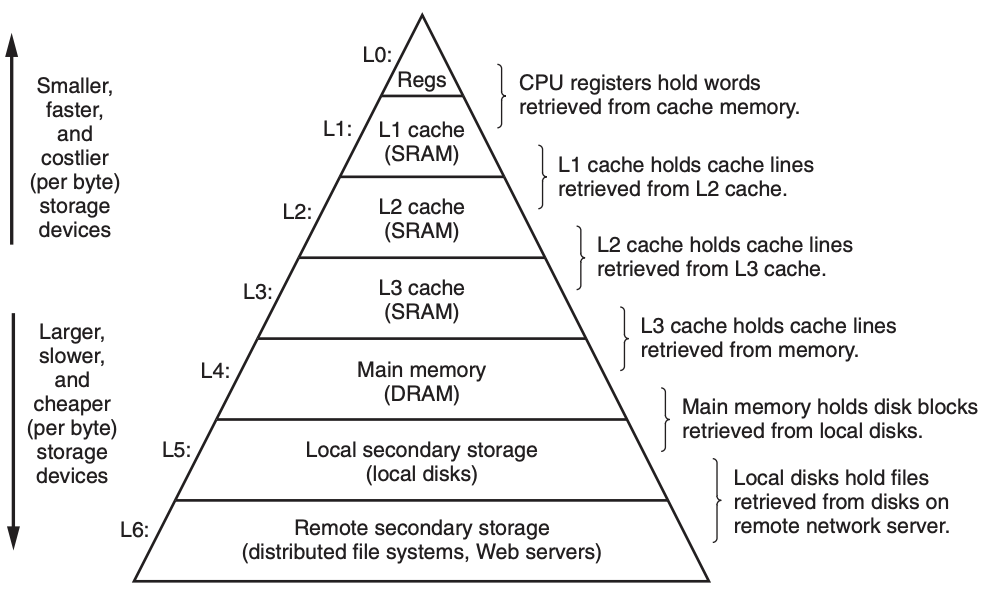
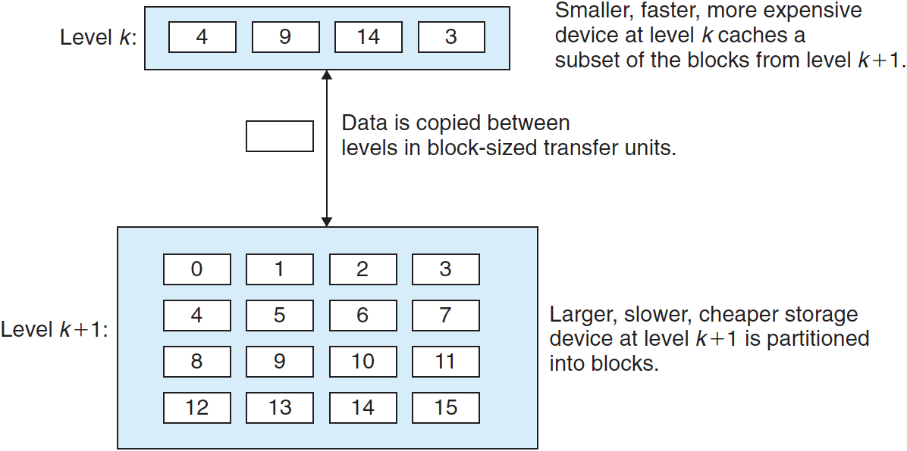

# 메모리 계층구조와 캐시

모든 컴퓨터 시스템의 저장장치들은 아래 그림과 같이 **메모리 계층구조**로 구성되어 있다. 계층의 꼭대기에서부터 맨 밑바닥까지 이동할수록 저장장치들은 더 느리고, 더 크고, 바이트당 가격이 싸진다.

메모리 계층구조의 주요 아이디어는 한 레벨의 저장장치가 다음 하위레벨 저장장치의 캐시 역할을 한다는 것이다. L1과 L2 캐시는 각각 L2와 L3의 캐시다. L3 캐시는 메인 메모리의 캐시이고, 메인 메모리는 디스크의 캐시 역할을 한다. 일부 분산 파일시스템을 가지는 네트워크 시스템에서 로컬 디스크는 다른 시스템의 디스크에 저장된 데이터의 캐시 역할을 수행한다.

최상위(L0)에는 CPU가 한 클럭 사이클 내에 접근할 수 있는 적은 수의 빠른 CPU 레지스터들이 위치한다. 다음은 몇 CPU 클럭 사이클 내에 접근할 수 있는 적당한 크기의 SRAM 기반 캐시 메모리가 위치한다. 그다음으로 수백, 수천 클럭 사이클 동안에 접근될 수 있는 DRAM 기반 메인메모리가 따라온다. 다음으로 느리지만 크기가 큰 지역 디스크와 네트워크로 접근할 수 있는 추가적인 수준의 디스크가 있다.

---

## 1. 메모리 계층구조에서의 캐시

**캐시(chache)**는 더 크고 느린 디바이스에 저장된 데이터 객체를 위한 준비 영역으로 사용하는 작고 빠른 저장장치다. 캐시를 사용하는 과정을 **캐싱(caching)**이라고 한다.

위 그림은 메모리 계층구조에서 캐싱의 일반적인 개념을 보여준다. 레벨 k+1에서 저장장치는 **블록(block)**이라고 하는 연속된 데이터 객체 블록으로 나뉜다. 각 블록은 유일한 주소 또는 이름을 가지며, 블록은 고정크기나 가변크기를 가진다.

마찬가지고, 레벨 *k*에서의 저장장치는 레벨 *k*+1에 있는 블록들과 같은 크기인 더 작은 집합의 블록들로 나뉜다. 시간상 아무 때나 레벨 *k*에 있는 캐시는 레벨 *k*+1에서 온 블록들의 부분집합 사본을 포함한다. 예를 들어, 위 그림에서 레벨 *k* 캐시는 블록 4, 9, 14, 3의 사본을 가지고 있다.

---

## 2. 캐시 적중 (cache hit)

어떤 프로그램이 레벨 *k*+1로부터 특정 데이터 객체 *d*를 필요할 때, 먼제 레벨 *k*에 저장된 블록등 중에서 *d*를 찾는다. 만일 *d*가 레벨 k에 우연히 캐시되어 있다면, 이를 **캐시 적중(cache hit)**이라고 한다. 프로그램은 *d*를 레벨 *k*에서 직접 읽으며, 메모리 계층구조의 특성에 의해 이것은 레벨 *k*+1에서 읽는 것보다 더 빠르다. 예를 들어, 좋은 시간 지역성을 갖은 프로그램은 레벨 *k*에서 캐시 적중된 결과인 블록 14로부터 데이터를 읽을 것이다.

---

## 3. 캐시 미스 (cache miss)

만일 데이터 객체 d가 레벨 k에서 캐시되지 않는다면 **캐시 미스(cache miss)**가 발생한 것이다. 미스가 발생하면, 레벨 k에서의 캐시는 레벨 k+1에 있는 캐시로부터 d를 포함하는 블록을 가져오며, 만일 레벨 k 캐시가 꽉 찬 상태 full이라면 기존 블록을 덮어쓰기도 한다.

기존 블록을 덮어쓰는 과정은 블록을 교체하거나 축출하며, 어떤 블록을 교체할지에 관한 결정은 캐시의 교체 정책에 의해 정해진다.

- 랜덤 교체 정책: 랜덤으로 블록을 선택
- 최근에 가장 덜 사용한(LRU) 교체 정책: 가장 과거에 접근한 블록을 선택

---

## 4. 캐시 활용

- **시간 지역성 활용하기** : 같은 데이터 객체는 시간 지역성 때문에 여러 번 재사용될 가능성이 있다. 일단 어떤 데이터 객체에 첫 미스가 발생했을 때 캐시로 복사되고 난 후에는 이 객체로 연속적인 다수의 캐시 적중을 기대할 수 있다. 캐시가 아래 단계보다 더 빠르므로 캐시 적중이 처음의 미스보다 더 빨리 서비스될 수 있다.
- **공간 지역성 활용하기** : 블록들은 대게 여러 개의 데이터 객체들을 포함한다. 공간 지역성으로 인해, 미스가 발생한 후에 하나의 블록을 복사하는 비용은 차후에 이 블록 내의 다른 객체들을 참조하기 때문에 줄어들게 된다.

---