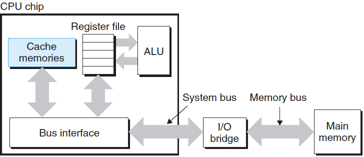
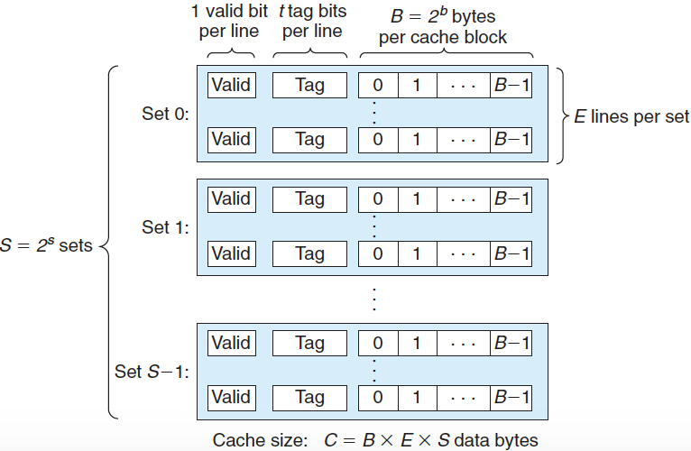
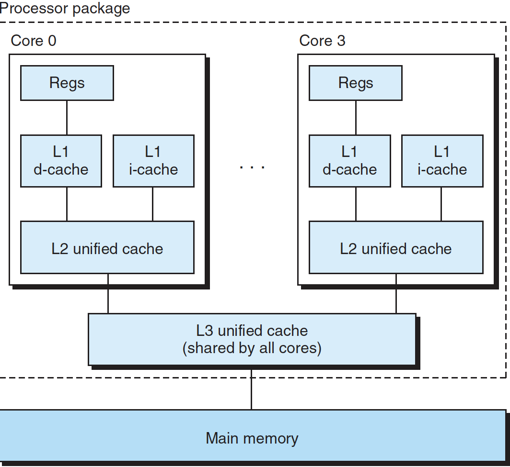

# 캐시 메모리

초기 컴퓨터 시스템의 메모리 계층구조는 CPU 레지스터, 메인메모리, 디스크 저장장치 이렇게 세 단계였지만 CPU와 메인메모리 간의 커져가는 격차로 인해 시스템 설계자들은 SRAM **캐시 메모리**를 끼워 넣게 되었다.



---

## 1. 기본 캐시 메모리 구조와 읽기 쓰기



위 그림에서의 시스템에 대한 캐시는 *S* = 2^*s*개의 **캐시 집합(cache set)**의 배열로 구성된다. 각각의 집합은 *E*개의 **캐시 라인(cache line)**들로 이루어진다. 각 라인은 다음과 같이 세 개로 구성된다.

- *B* = 2^*b* : 바이트의 데이터 **블록**
- Valid : 해당 라인이 의미 있는 정보를 포함하고 있는지를 나타내는 **유효 비트**
- Tag : 캐시 라인에 저장된 블록을 유일하게 구분할 수 있는 **태그 비트**

CPU가 메인메모리 주소 *A*에서 하나의 워드를 읽으라는 `load` 인스트럭션에 의해 지시받으면, CPU는 주소 *A*를 캐시로 보낸다. 만일 캐시가 해당 워드의 사본을 주소 *A*에 해당 워드의 사본을 가졌는지 알 수 있을까? 캐시는 요청된 워드를 간단히 주소 비트만 조사해서 찾아낼 수 있으며, 해시 함수를 사용하는 해시 테이블과 유사하다.


위 그림과 같이 *m* 주소 비트를 세 개의 필드로 나눈다. 집합 인덱스 비트는 워드가 어떤 집합에 저장되어야 하는지 알려주며, 태그 비트는 집합의 몇 번째 라인이 워드를 포함하고 있는지 알려준다. 집합의 라인은 유효 비트가 1이고, 해당 줄의 태그 비트가 주소 A의 태그 비트와 일치할 때만 해당 워드를 포함한다. 찾았다면, 블록 오프셋 비트를 사용하여 데이터 내 워드의 오프셋을 알 수 있다.

캐시 동작은 단순하다. 먼저 원하는 워드 *w*의 사본을 캐시에서 찾는다. 만일 적중이 발생하면 *w*를 즉시 CPU에 리턴한다. 그러나 미스가 발생하면 CPU는 대기하게 되고, 메모리 계층구조에서의 다음 하위 레벨에서 *w*를 포함하고 있는 블록을 선입해서 이 블록을 같은 캐시 라인에 저장하고 *w*를 CPU에 리턴한다.

쓰기에 대한 상황은 좀 더 복잡하다. 이미 캐시에 들어 있는(캐시 적중) 워드 *w*를 쓰려고 한다고 가정하자. 캐시는 w에 대한 자신의 사본을 갱신한 후에, 계층구조에서의 다음 하위 레벨에 있는 *w*의 사본을 갱신해야 한다. 

- Write-through : 가장 간단한 방법으로, 즉시 *w*의 캐시 블록 전체를 다음 하위 레벨로 써주는 것이다. 간단하지만 매 쓰기 작업마다 버스 트래픽을 발생시키는 단점이 있다.
- Write-back : 블록이 블록 교체 알고리즘에 의해 캐시에서 축출될 때에만 갱신된 블록을 하위 레벨에 써준다. 좀 더 복잡하다는 단점이 있다.

---

## 2. 직접매핑 캐시

캐시는 집합당 캐시 라인의 수 E에 의해 서로 다른 클래스로 구분된다. 집합당 정확히 한 개의 라인을 갖는 경우(E = 1)는 **직접매핑 캐시**라고 한다. 직접매핑 캐시에서 캐시가 어떤 요청이 적중인지 미스인지 결정하고, 요청한 워드를 뽑아내기 위해 수행하는 작업은 세 단계로 이루어진다: 


1. 집합 선택 : 캐시는 s개의 집합 인덱스 비트를 w의 주소 중에서 뽑아낸다. 이 비트들은 집합 번호에 대응하는 비부호형 정수로 해석된다.


2. 라인 매칭: 워드 w의 사본이 집합 i에 포함된 캐시 라인에 들어 있는지 결정한다. w의 사본은 유효 비트가 설정되고, 캐시 라인의 태그가 w의 주소에 있는 태그와 일치하기만 하면 이 라인에 들어 있게 된다.

3. 워드 선택: 캐시 적중이 발생하면 w가 블록 내 어딘가에 있다는 것을 알게 된다. 원하는 워드가 블록 내 어디에서 시작하는지 결정한다. 블록 오프셋 비트는 원하는 워드의 첫 바이트 오프셋을 제공한다.

다음과 같이 직접 매핑 캐시가 주어졌다고 하자. (*S*, *E*, *B*, *m*) = (4, 1, 2, 4)

- 네 개의 집합
- 집합당 한 개의 라인
- 블록당 2바이트
- 4비트 주소

아래 표는 4비트 전체 주소 공간을 보여준다:

| Adrress | Tag bits | Index bits | Offset bits | Block number |
| ------- | -------- | ---------- | ----------- | ------------ |
| 0       | 0        | 00         | 0           | 0            |
| 1       | 0        | 00         | 1           | 0            |
| 2       | 0        | 01         | 0           | 1            |
| 3       | 0        | 01         | 1           | 1            |
| 4       | 0        | 10         | 0           | 2            |
| 5       | 0        | 10         | 1           | 2            |
| 6       | 0        | 11         | 0           | 3            |
| 7       | 0        | 11         | 1           | 3            |
| 8       | 1        | 00         | 0           | 4            |
| 9       | 1        | 00         | 1           | 4            |
| 10      | 1        | 01         | 0           | 5            |
| 11      | 1        | 01         | 1           | 5            |
| 12      | 1        | 10         | 0           | 6            |
| 13      | 1        | 10         | 1           | 6            |
| 14      | 1        | 11         | 0           | 7            |
| 15      | 1        | 11         | 1           | 7            |

CPU가 연속된 읽기 작업을 수행할 때 캐시의 동작을 시뮬레이션해보자. 초기에 캐시는 비어 있으므로 각 유효비트는 0이다.

| Set  | Valid | Tag  | block[0] | block[1] |
| ---- | ----- | ---- | -------- | -------- |
| 0    | 0     |      |          |          |
| 1    | 0     |      |          |          |
| 2    | 0     |      |          |          |
| 3    | 0     |      |          |          |

#### 1. 주소 0에서 워드 데이터를 읽는다.

집합 0에 대한 유효 비트가 0이므로 캐시 미스다. 캐시는 메모리에서 블록 0을 로드해오고, 이 블록을 집합 0에 저장한다. 그 후에 캐시는 메모리  위치 0에 있는 내용인 m[0]을 block[0]에서 리턴해준다.

| Set  | Valid | Tag  | block[0] | block[1] |
| ---- | ----- | ---- | -------- | -------- |
| 0    | 1     | 0    | m[0]     | m[1]     |
| 1    | 0     |      |          |          |
| 2    | 0     |      |          |          |
| 3    | 0     |      |          |          |

#### 2. 주소 1에서 워드 데이터를 읽는다.

캐시 적중이 된다. 캐시는 즉시 이 캐시 라인의 block[1]에서 m[1]을 리턴한다. 캐시의 상태는 변화가 없다.

#### 3. 주소 13에서 워드 데이터를 읽는다.

집합 2에 있는 캐시 라인이 유효하지 않으므로 캐시 미스다. 캐시는 메모리에서 블록 6을 로드해오고, 이 블록을 집합 2에 저장한다. 그 후에 새 캐시 라인의 blcok[1]로부터 m[13]을 리턴한다.

| Set  | Valid | Tag  | block[0] | block[1] |
| ---- | ----- | ---- | -------- | -------- |
| 0    | 1     | 0    | m[0]     | m[1]     |
| 1    | 0     |      |          |          |
| 2    | 1     | 1    | m[12]    | m[13]    |
| 3    | 0     |      |          |          |

#### 4. 주소 8에서 워드 데이터를 읽는다.

집합 0의 캐시 라인은 유효하지만, 태그가 일치하지 않으므로 캐시 미스다. 캐시는 블록 4를 로드해와서 집합 0에 저장한다. 새로운 캐시 라인의 block[0]으로 부터 m[8]을 리턴한다.

| Set  | Valid | Tag  | block[0] | block[1] |
| ---- | ----- | ---- | -------- | -------- |
| 0    | 1     | 1    | m[8]     | m[9]     |
| 1    | 0     |      |          |          |
| 2    | 1     | 1    | m[12]    | m[13]    |
| 3    | 0     |      |          |          |

#### 5. 주소 0에서 워드 데이터를 읽는다.

이것은 방금 주소 8을 참조하면서 블록 0을 교체했기 때문에 다시 캐시 미스가 된다. 캐시에는 공간이 많이 있지만 같은 집합으로 매핑하는 블록들로 번갈아서 참조하는 이런 종류의 미스는 충돌 미스의 예가 된다.

### 직접매핑 캐시에서 충돌 미스

```cpp
float dotprod(float x[8], float y[8]) // x: 4 * 8 bytes, y: 4 * 8 bytes
{
    float sum = 0.0f;
    
    for(int i = 0; i < 8; ++i)
        sum += x[i] * y[i];
    
    return sum;
}
```

위 함수는 *x*와 *y*에 대해 좋은 공간 지역성을 가지므로 많은 수의 캐시 적중을 누릴 수 있을 거라고 기대할지도 모른다. 그러나 캐시가 32바이트라고 가정할 경우 연속적인 메모리상에서 *x*[i]와 *y*[i]는 캐시 충돌을 일으켜 빈번한 캐시 미스가 일어난다. 이럴 경우 *x*를 `float x[12]`로 정의하면 패딩에 의해 충돌 미스를 제거할 수 있다.

---

## 3. 집합결합성 캐시

직접매핑 캐시의 충돌 미스 문제는 각 집합이 정확히 하나의 라인만을 갖는다는 제한에서 오는 것이다. **집합결합성 캐시**는 이 제한을 완화하기 위해 각 집합이 하나 이상의 캐시 라인을 가진다.

1. 집합 선택 : 직접매핑 캐시와 같다.
2. 라인 매칭과 워드 선택 : 집접매핑 캐시보다 더 복잡한데, 그 이유는 요청한 워드가 집합에 있는지 결정하기 위해 여러 개 라인의 태그와 유효 비트를 조사해야 하기 때문이다. 아래 그림은 집합결합성 캐시에서 라인 매칭을 보여주는데, 보통 (key, value) 쌍의 배열로, key로 태그와 유효 비트가 결합되어 있고, 값은 블록의 내용이다.


---

## 4. 완전결합성 캐시

**완전결합성 캐시**는 모든 캐시 라인들을 갖는 하나의 집합으로 구성된다. 하나의 집합만 있으므로 주소에는 집합 인덱스 비트가 없고, 주소가 태그와 블록 오프셋으로만 나누어진다. 라인의 매칭과 워드 선택은 집합결합성 캐시와 같다.

집합 결합성 캐시는 수많은 태그를 병렬로 검색해야 하므로 크기가 큰 동시에 빠르게 만들기 어렵다. **완전 결합성 캐시**는 주로 가상 메모리 시스템에서 페이지 테이블 엔트리들을 캐싱하는 작은 캐시에서 사용한다.

---

## 5. 실제 캐시 계층구조의 해부

사실 캐시들은 데이터뿐만 아니라 인스트럭션들도 저장할 수 있다. 인스트럭션을 보관하는 캐시는 **i-cache**라고 한다. 데이터만을 보관하는 캐시는 **d-cache**이고, 인스트럭션과 데이터를 함께 저장하는 캐시는 **unified-cache**라고 한다.

현대 프로세서들은 분리된 i-cache와 d-cache를 가지고 있다. 여기에는 여러 가지 이유가 있는데, 두 개의 별도 캐시가 있으면 프로세서는 인스트럭션 워드와 데이터 워드를 동시에 읽을 수 있는 장점이 있다. 



위 그림은 인텔 코어 i7 프로세서에 대한 캐시 계층구조를 보여준다. 각 CPU 칩은 네 개의 코어를 가지고 있다. 각 코어는 자체적인 개인 L1 i-cache, L1 d-cache, L2 unified cache를 가지고 있다. 모든 코어들은 한 개의 L3 unified cache를 서로 공유한다. 이 계층구조의 특진은 모든 SRAM 캐시 메모리들이 CPU 칩 내에 들어있다는 점이다.

아래 표는 코어 i7 캐시의 기본 특성들을 보여준다:

| Cache type       | Access time (cycles) | Cache size (C) | Assoc. (E) | Block size (B) | Sets (S) |
| ---------------- | -------------------- | -------------- | ---------- | -------------- | -------- |
| L1 i-cache       | 4                    | 32 KB          | 8          | 64 B           | 64       |
| L1 d-cache       | 4                    | 32 KB          | 8          | 64 B           | 64       |
| L2 unified cache | 10                   | 256 KB         | 8          | 64 B           | 512      |
| L3 unified cache | 40-75                | 8 MB           | 16         | 64 B           | 8,192    |

---