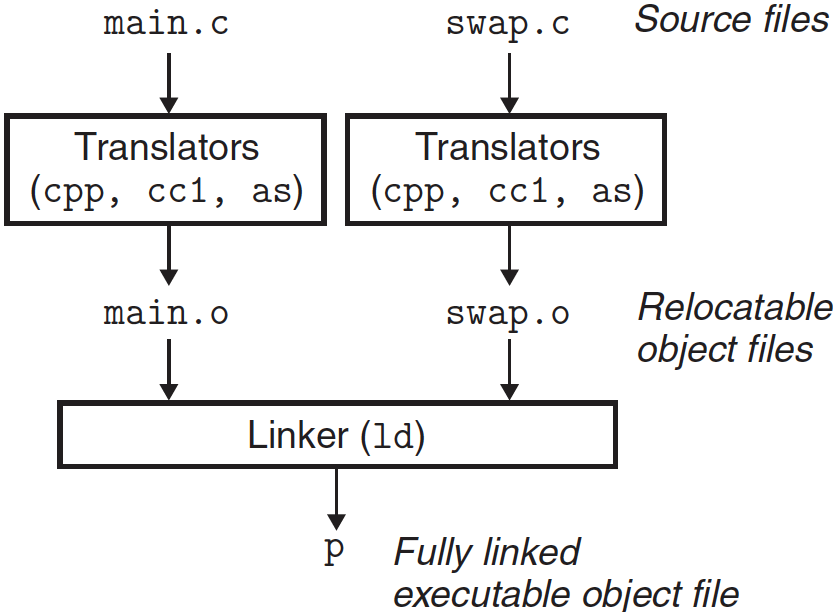
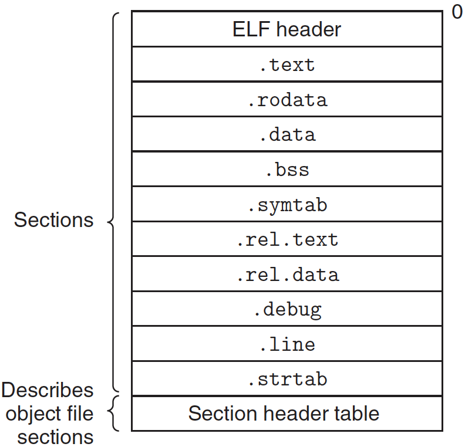

# 링커 1/2

**링킹(linking)**은 여러 개의 코드와 데이터를 모아서 연결하여 메모리에 로드될 수 있고 실행될 수 있는 한 개의 파일로 만드는 작업이다. 링킹은 컴파일 시에 수행할 수 있으며, 이때 소스코드는 머신 코드로 번역된다.

---

## 1. 컴파일러 드라이버

대부분의 컴파일 시스템은 사용자를 대신해서 언어 전처리기, 컴파일러, 어셈블러, 링커를 필요에 따라 호출하는 **컴파일러 드라이버**를 제공한다.

```cpp
// main.c
int sum(int* a, int n);

int array[2] = {1, 2};

int main()
{
    int val = sum(array, 2);
    return val;
}
```

```cpp
// sum.c
int sum(int* a, int n)
{
    int i, s = 0;
    
    for(i = 0; i < n; ++i)
        s += a[i];
    return s;
}
```

위 C 프로그램은 링커가 어떻게 동작하는지에 대한 중요한 개념을 다루는 데 사용할 예제다.



위 그림은 컴파일 드라이버가 ASCII 소스 파일에서 예제 프그램을 실행 목적 파일로 번역하는 동작 내용을 요약한 것이다.

1. 드라이버는 먼저 C 전처리기(cpp)를 돌리고, 이것은 C 소스 파일 main.c를 중 ASCII 중간 파일인 main.i로 번역한다.

2. 다음으로, 드라이버는 C 컴파일러(cc1)를 돌려서 main.i를 ASCII 어셈블리 언어 파일인 main.s로 번역해준다.
3. 그 다음에 드라이버는 어셈블러(as)를 돌려서, main.s를 **재배치 가능한 바이너리 목적 파일**인 main.o로 번역해준다.

드라이버는 sum.o를 생성하기 위해서 같은 과정을 반복 수행한다.

4. 마지막으로, 링커 프로그램(ld)를 실행하는데, 이것은 시스템 목적 파일들과 함께 **실행 가능 목적 파일**을 생성하기 위해 main.o와 sum.o를 연결한다.

실행파일을 실행시키려면, Linux 쉘에서 프로그램 이름을 명령줄에 입력하면 된다:

```
linux> ./p
```

쉘은 로더(loader)라고 부르는 운영체제 내의 함수를 호출하며, 로더는 실행파일 p의 코드와 데이터를 모두 메모리에 복사하고, 제어를 프로그램의 시작 부분으로 전환한다.

---

## 2. 정적 연결

실행파일을 만들기 위해서 링커는 두 가지 주요 작업을 수행한다.

#### - 1단계. 심볼 해석(symbol resolution)

목적 파일들은 **심볼**들을 정의하고 참조하며 여기서 각 심볼은 함수, 전역 변수 또는 정적변수에 대응된다. 심볼 해석의 목적은 각각의 심볼 참조를 정확하게 하나의 심볼 정의에 연결하는 것이다.

#### - 2단계. 재배치(relocation)

컴파일러와 어셈블러는 주소 0번지에서 시작하는 코드와 데이터 섹션(연속적인 바이트)들을 생성한다. 링커는 이 섹션들을 각 심볼 정의와 연결시켜서 **재배치**하며, 이 심볼들로 가는 모든 참조를 수정해서 이들이 이 메모리 위치를 가리키도록 한다.

링커에 대한 몇 가지 기본 사실들을 기억해야 한다: 목적 파일들은 단지 바이트 블록들의 집합이라는 것이다. 이 블록들은 프로그램 코드, 프로그램 데이터, 링커와 로더를 안내하는 데이터 구조를 포함한다. 링커는 블록들을 함께 연결하고 이 연결된 블록들을 위한 런타임 위치를 결정하며, 코드와 데이터 블록 내에 여러 가지 위치를 수정한다.

---

## 3. 목적 파일

> 컴퓨터 과학에서 **목적** 코드 또는 **목적 파일**은 컴파일러나 어셈블러가 소스 코드 **파일**을 컴파일 또는 어셈블해서 생성하는 **파일**이다. **목적 파일**들은 기계어나 혹은 이에 준하는 RTL과 같은 이진 코드로 이루어져 있다. -위키백과-

목적 파일에는 세 가지 형태가 있다:

- **재배치 가능 목적 파일 (relocatable object file)** : 실행 가능 목적 파일을 생성하기 위해 다른 재배치 가능 목적 파일들과 결합될 수 있는 바이너리 코드와 데이터를 포함한다.
- **실행 가능 목적 파일 (excutable object file)** : 메모리에 직접 복사될 수 있고 실행될 수 있는 형태로 바이너리 코드와 데이터를 포함한다.
- **공유 목적 파일 (shared object file)** : 로드타임 또는 런타임시에 동적으로 링크되고 메모리에 로드될 수 있는 특수한 타입의 재배치 가능 목적 파일이다.

컴파일러와 어셈블러는 재배치 가능 목적 파일을 생성한다(+ 공유 목적 파일). 링커는 실행 가능 목적 파일을 생성한다. 기술적으로 하나의 **목적 모듈**은 바이트의 배열이며, **목적 파일**은 디스크에 파일로 저장된 목적 모듈이다.

목적 파일은 특정 목적 파일 형식에 따라 구성되며, 여기서는 x86-64 리눅스의 Excutable and Linkable Format(ELF)를 다룬다.

---

## 4. 재배치 가능 목적 파일



위 그림은 ELF 재배치 가능 목적 파일의 포맷을 보여준다. **ELF 헤더**는 이 파일을 생성한 워드 크기와 시스템의 바이트 순서를 나타내는 16바이트 배열로 시작한다. ELF 헤더의 나머지는 링커가 목적 파일을 구문분석하고 해석하도록 하는 정보를 포함한다. (ELF 헤더 크기, 목적 파일 타입, 머신 타입, 섹션 헤더 테이블의 파일 오프셋, 섹션 헤더 테이블의 크기 및 엔트리 수 등)

여러 가지 섹션들의 위치와 크기는 **섹션 헤더 테이블**로 나타내며, 이 테이블은 목적 파일의 각 섹션에 대해 고정된 크기의 엔트리를 가진다.

ELF 헤더와 섹션 헤더 테이블 사이에 섹션 내용이 들어 있다. ELF 재배치 가능 목적 파일은 다음과 같은 섹션들을 포함한다:

- .text : 컴파일된 프로그램의 머신 코드
- .rodata : printf 문장의 포맷 스트링, switch 문의 점프 테이블과 같은 읽기-허용 데이터
- .data : **초기화된** C 전역 변수 및 정적변수. C 지역 변수들은 런타임에 스택에 저장되며, .data나 .bss 섹션에는 나타나지 않는다.
- .bss : **초기화되지 않은** C 전역 변수 및 정적 변수 그리고 0으로 초기화된 전역 변수 및 정적 변수. 이 섹션은 목적 파일에 실제 공간을 차지하지는 않는다. 단순히 위치를 표시하는 것이다. 초기화 하지 않은 변수들은 목적 파일에서 실제 디스크 공간을 차지하지 않고, 런타임에 이 변수들은 메모리에 0으로 초기화되어 할당된다.
- .symtab : 프로그램에서 정의되고 참조되는 전역 변수들과 함수에 대한 정보를 가지고 있는 **심볼 테이블**. 지역 변수에 대한 엔트리를 가지고 있지 않다.
- .rel.text : 링커가 이 목적 파일을 다른 파일들과 연결할 때 수정되어야 하는 .text 섹션 내 위치들의 리스트. 일반적으로 외부 함수를 호출하거나 전역 변수를 참조하는 인스트럭션들은 모두 수정되어야 한다. 실행 가능 목적 파일에서는 이 재배치 정보가 필요하지 않으므로 빠진다.
- .rel.data : 이 모듈에 의해 정의되거나 참조되는 전역 변수들에 대한 재배치 정보. 일반적으로 초기값이 전역 변수 또는 외부에 정의된 함수의 주소인 초기화된 전역 변수들은 수정되어야 한다.
- .debug : 프로그램 내에서 정의된 지역 변수들과 typed, 프로그램과 최초 C 소스 파일에서 정의되고 참조되는 전역 변수들을 위한 엔트리를 갖는 디버깅 심볼 테이블. 컴파일러 드라이버가 -g 옵션으로 불린 경우에만 생성된다.
- .line : 최초 C 소스 프로그램과 .text 섹션 내 머신 코드 인스트럭션 내 라인 번호들 간의 매핑. 컴파일러 드라이버가 -g 옵션으로 불린 경우에만 생성된다.
- .strtab : .strtab과 .debug 섹션들 내에 있는 심볼 테이블과 섹션 헤더들에 있는 섹션 이름을 위한 스트링. 스트링 테이블은 널 문자로 종료된 스트링의 배열이다.

---

## 5. 심볼과 심볼 테이블

재배치 가능 목적 모듈 *m*은 *m*에 의해서 정의되고 참조되는 심볼들에 대한 정보를 포함하는 심볼 테이블을 가지고 있다. 링커의 콘텍스트 내에 세 가지 서로 다른 종류의 심볼이 존재한다:

- 모듈 *m*에 의해 정의되고 다른 모듈들에 의해서 참조될 수 있는 **전역 심볼**. 전역 링커 심볼은 **비정적 C 함수**와 **전역 변수**들에 대응된다.
- 모듈 *m*에 의해 참조되지만 다른 모듈에 의해 정의된 **전역 심볼**. 이러한 심볼을 **external**이라고 부르며, 다른 모듈 내에서 정의된 비정적 C 함수와 전역 변수들에 대응된다.
- 모듈 *m*에 의해서 베타적으로 참조되고 정의된 **지역 심볼**. 이들은 **static** 타입 선언으로 정의된 **정적 C 함수**와 **전역 변수**들에 대응된다. 이 심볼들은 모듈 *m* 내 어디에서나 접근할 수 있지만, 다른 모듈에 의해서는 참조될 수 없다.

지역 링커 심볼들이 지역 변수와 같지 않다. symtab에 있는 심볼 테이블은 비정적 지역 변수들에 대응되는 심볼을 포함하지 않는다. 흥미롭게도 C의 static 타입 선언으로 정의된 지역 프로시져 변수들은 스택에서 관리되지 않는다. 대신, 컴파일러는 .data나 .bss에서 각 정의에 대해 공간을 할당하며, 심볼 테이블 내 지역 링커 심볼들을 유일한 이름을 갖도록 생성한다.

```cpp
int f()
{
    static int x = 0;
    return x;
}

int g()
{
    static int x = 1;
    return x;
}
```

위 프로그램 경우네 컴파일러는 서로 다른 이름을 갖는 한 쌍의 지역 링커 심볼들을 어셈블러에 보낸다. 예를 들어, x.1을 함수 f 내의 정의를 위해서 사용하고, x.2를 함수 g 내의 정의를 위해서 사용할 수 있다.

심볼 테이블은 컴파일러에 의해 어셈블리어 .s 파일에 export된 심볼을 사용해서 어셈블러에 의해 만들어진다. ELF 심볼 테이블은 .symtab 섹션에 들어있다.

```cpp
typedef struct 
{
    int name;		/* String table offset */
    char type: 4;	/* Function or data (4 bits) */
    	 binding: 4;/* Local or global (4 bits) */
    char reserved;	/* Unused */
    short section;	/* Section header index */
    long value;		/* Section offset or absolute address */
    long size;		/* Object size in bytes */
} Elf64_Symbol;
```

- name : 널 문자로 종료된 심볼의 스트링 이름을 가리키는 스트링 테이블 내 바이트 오프셋
- type : 데이터 또는 함수
- binding : 심볼의 지역/전역 여부
- value : 심볼의 주소
  - 재배치 가능 모듈에서는 객체가 정의된 섹션 시작 부분의 오프셋
  - 실행 가능 목적 파일에서는 절대 런타임 주소
- size : 객체의 크기(바이트 단위)

각 심볼은 섹현 헤더 테이블 내 인덱스인 section 필드로 표시한 목적 파일의 일부 섹션에 연관되어 있다. 여기에는 섹션 헤더 테이블에 엔트리가 없는 세 개의 특별한 의사 섹션(pseudo section)이 존재한다:

- ABS : 재배치 해서는 안되는 심볼들
- UNDEF : 정의되지 않은 심볼들(목적 모듈에서는 참조만 되고 다른 곳에서 정의된 심볼들)
- COMMON : 아직 할당되지 않거나 초기화되지 않은 데이터 객체를 위한 것, 이 COMMON 심볼들에 대해서 value 필드는 정렬 요건을 제시하며, size는 최소 크기를 알려준다.

이 의사 섹션들은 재배치 가능 목적 파일에만 존재하고, 실행 가능 목적 파일에는 존재하지 않는다.

---

| Num: | Value            | Size | Type   | Bind   | Vis     | Ndx  | Name  |
| ---- | ---------------- | ---- | ------ | ------ | ------- | ---- | ----- |
| 8:   | 0000000000000000 | 24   | FUNC   | GLOBAL | DEFAULT | 1    | main  |
| 9:   | 0000000000000000 | 8    | OBJECT | GLOBAL | DEFAULT | 3    | array |
| 10:  | 0000000000000000 | 0    | NOTYPE | GLOBAL | DEFAULT | UND  | sum   |

위 표는 main.o에 대한 재배치 가능 목적 파일의 마지막 세 개의 심볼 테이블 엔트리를 보여준다.

표에서 전역 심볼 main의 정의에 대한 엔트리를 볼 수 있다. 이것은 .text 섹션의 오프셋 0(즉, value)에 위치한 24바이트 함수다. 그 다음으로 전역심볼 array의 정의가 따라오는데, 이것은 .data 섹션의 오프셋 0에 위치한다. 마지막 엔트리는 외부 심볼 sum의 참조다. 각각의 섹션을 정수 인덱스로 식별하므로 Ndx=1은 .text 섹션을, Ndx=3은 .data 섹션을 나타낸다.

---