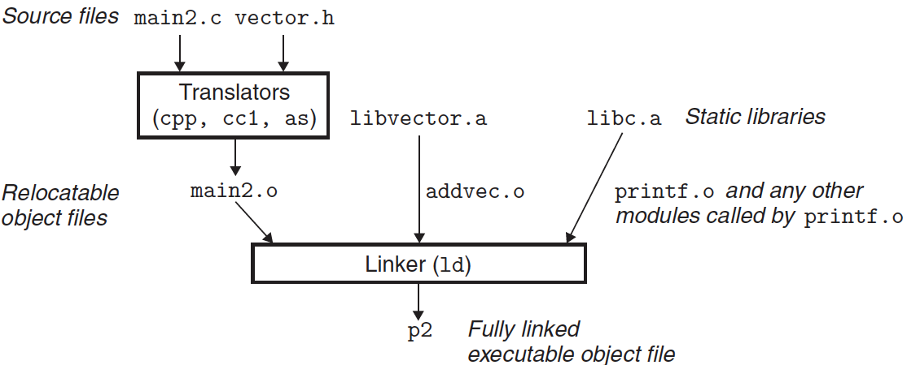
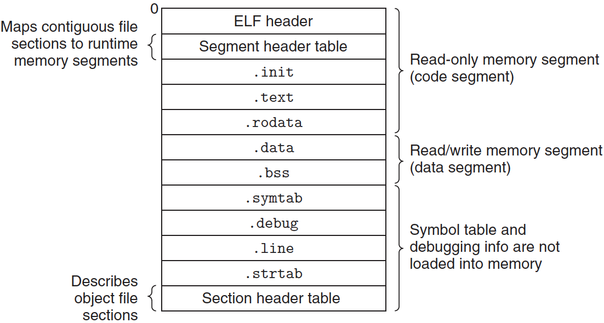
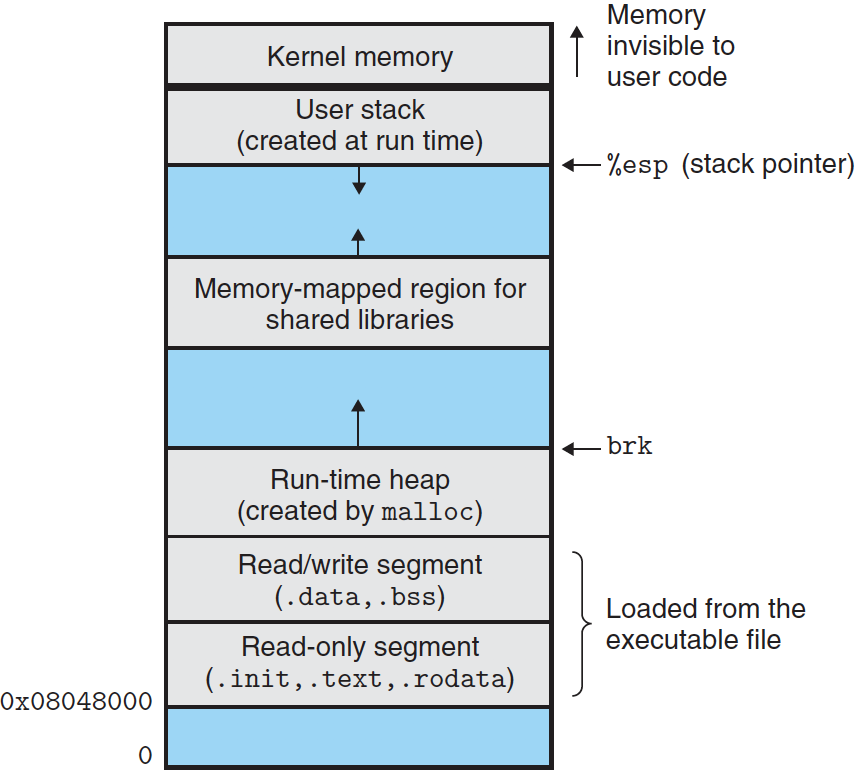
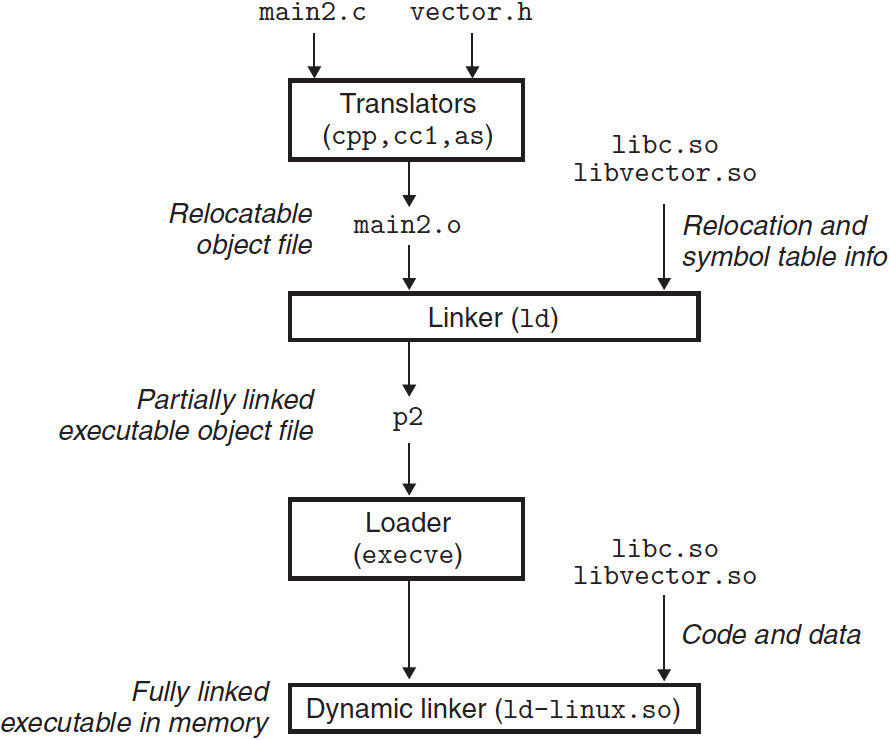

# 링커 2/2

**링킹**을 이해하면 다른 중요한 시스템 개념을 이해할 수 있다. 링커가 만든 실행 가능 목적 파일은 로딩과 프로그램 실행 같은 중요한 시스템 함수, 가상 메모리, 페이징, 메모리 매핑에서 중요한 역할을 하게 된다.

---

## 6. 심볼 해석

링커는 자식의 입력 재배치 가능 목적 파일들의 심볼 테이블로부터 정확히 한 개의 심볼 정의에 각 참조를 연결해서 심볼 참조를 해석한다. 컴파일러는 모듈당 단 하나의 지역 심볼 정의만을 허한다. 또한 컴파일러는 지역 링커 심볼들이 가지는 정적 지역 변수들이 유일한 이름을 갖도록 보장한다.

그러나 전역 심볼들에 대한 참조는 까다롭다. 컴파일러가 현재 모듈에서 정의되지 않은 심볼(변수나 함수 이름)을 만나면, 이것이 다른 모듈에서 정의되어 있다고 가정하고 링커 심볼 테이블 엔트리를 생성하며, 링커가 이것을 처리하도록 남겨둔다. 만약 링커가 자신의 입력 모듈 중에 어디에서라도 참조된 심볼을 위한 정의를 찾을 수 없다면 에러 메시지를 출력하고 종료한다.

```cpp
void foo(void);

int main()
{
    foo();
    return 0;
}
```

위 코드를 컴파일하고 링크하려고 하면, 컴파일러는 아무 문제 없이 동작하지만, 링커는 foo에 대한 참조를 해석할 수 없을 때 종료한다.

---

## 7. 정적 라이브러리와 링크하기

모든 컴파일 시스템은 관련된 객체 모듈들을 **정적 라이브러리**라고 부르는 한 개의 파일로 패키징하는 메커니즘을 제공하며, 이 라이브러리는 다음에 링커의 입력으로 제공될 수 있다. 실행 파일을 만들 때, 링커는 응용프로그램이 참조하는 라이브러리 내의 객체 모듈들만 복사한다.

libc.a 라이브러리에는 atoi, printf, scanf, strcpy, rand 같은 표준 I/O, 스트링 처리, 정수 수학 함수 등의 광범위한 C 함수들을 정의하고 있다.

리눅스 시스템에서, 정적 라이브러리는 **아카이브**라고 알려진 특정 파일 포맷으로 디스크 상에 저장된다. 아카이브는 연결된 재배치 가능 목적 파일들의 집합으로, 헤더는 각 멤버 목적 파일의 크기와 위치를 기술한다.

라이브러리에 대한 논의를 좀 더 구체적으로 하기 위해 아래 코드를 보자:

```cpp
// addvec.c
int addcnt = 0;

void addvec(int* x, int* y, int* z, int n)
{
    int i;
    
    addcnt++;
    
    for(i = 0; i < n; ++i)
        z[i] = x[i] + y[i];
}
```

```cpp
// multvec.c
int multcnt = 0;

void multvec(int* x, int* y, int* z, int n)
{
    int i;
    
    multcnt++;
    
    for(i = 0; i < n; ++i)
        z[i] = x[i] * y[i];
}
```

위 함수의 정적 라이브러리를 생성하기 위해서 다음과 같이 AR 도구를 사용할 수 있다:

```
linux> gcc -c addvec.c multvec.c
linux> ar rcs libvector.a addvec.o multvec.o
```

이 라이브러리를 사용하기 위해서 main.2.c와 같이 addvec 라이브러리 루틴을 호출하는 응용프로그램을 작성할 수 있다:

```cpp
// main2.c
#include <stdio.h>
#include "vector.h" // => libector.a의 루틴들에 대한 함수 프로토타입들을 정의하고 있다.

int x[2] = {1, 3};
int y[2] = {3, 4};
int z[2];

int main()
{
    addvec(x, y, z, 2);
    printf("z = [%d %d]\n", z[0], z[1]);
    return 0;
}
```



링커가 실행되면 addvec.o에서 정의된 addvec 심볼이 main2.o에서 참조되는지 결정해야 하며, 그래서 addvec.o를 실행파일에 복사한다. 프로그램이 multvec.o에 의해 정의된 심볼들을 참조하지 않으므로 링커는 이 모듈을 실행 파일에 복사하지 않는다. 링커는 또한 C 런타임 시스템으로부터 다른 모듈들과 함께 printf.o 모듈을 libc.a에서 복사한다.

---

## 8. 실행 가능 목적 파일

예제 C 프로그램은 ASCII 텍스트 파일들로 실행하는 데 필요한 모든 정보를 포함하는 하나의 바이너리 파일로 변환된다. ELF 실행 파일들은 연속적인 메모리 세그먼트에 매핑된 연속적인 실행 가능 파일들의 덩어리로 메모리에 로드하기 쉽도록 설계되었다. 아래 그림은 전형적인 ELF 파일에 있는 정보의 종류들은 요약한 것이다.



실행 가능 목적 파일의 포맷은 재배치 가능 목적 파일의 포맷과 유사하다. ELF 헤더는 이 파일의 전체적인 포맷을 설명하며, 프로그램이 실행될 때 첫 번째 인스트럭션의 주소인 프로그램 **엔트리 포인트**를 포함한다.

.text, .rodata, .data 섹션들은 이들 섹션들이 각자의 최종 런타임 메모리 주소로 재배치되었다는 점을 제외하고는 재배치 가능 목적 파일에 있는 섹션들과 유사하다.

섹션은 _init 이라는 작은 함수를 정의하는 데, 이것은 프로그램 초기화 코드에서 호출한다.

실행 파일이 **완전히 링크(재배치)**되었으므로 .rel 섹션을 필요로 하지 않는다.

---

## 9. 실행 가능 목적 파일의 로딩

```
linux> ./prog
```

쉘은 prog를 실행 가능 목적 파일이라고 가정하여 로더(loader)라는 메모리 상주 운영체제 코드를 호출해서 이 프로그램을 실행한다. 모든 리눅스 프로그램은 execve 함수를 호출해서 로더를 호출할 수 있다. 로더는 디스크로부터 실행 가능 목적 파일 내의 코드와 데이터를 메모리로 복사하고 이 프로그램의 첫 번째 인스트럭션, 즉 **엔트리 포인트**로 점프해서 프로그램을 실행한다. 이처럼 프로그램을 메모리로 복사하고 실행하는 과정을 **로딩**이라고 한다.



로더가 돌아갈 때, 위 그림과 유사한 메모리 이미지를 생성한다. 실행 파일 내부의 프로그램 헤더 테이블에 따라 실행 파일의 덩어리를 코드와 데이터 세그먼트로 복사한다. 그다음, 로더는 프로그램의 엔트리 포인트로 점프하며, 이것은 항상 _start 함수의 주소가 된다. 이 함수는 시스템 목적 파일 crt1.o에 정의되어 있으며, 모든 C 프로그램에서 이 점은 같다. _start 함수는 시스템 초기화 함수인 __libc_start_main을 호출하며, 이것은 libc.so에 정의되어 있다. 이 함수는 실행 환경을 초기화하고, 사용자 수준의 main 함수를 호출하고, 리턴 값을 처리하며, 필요한 경우 제어권을 커널로 넘겨준다.

---

## 10. 공유 라이브러리로 동적 링크하기

거의 모든 C 프로그램은 printf와 scanf 같은 표준 I/O 함수들을 사용한다. 런타임에 이 함수들을 위한 코드는 각각 실행되는 프로세스의 텍스트 세그먼트 내에서 복제된다. 수백 개의 프로세스가 돌고 있는 시스템에서, 이것은 메모리 시스템 자원의 상당한 낭비가 될 수 있다.

**공유 라이브러리**는 정적 라이브러리의 단점을 극복한다. 공유 라이브러리는 런타임이나 로드타임에 임의의 메모리 주소에서 로드되고, 메모리에서 프로그램으로 연결될 수 있는 목적 모듈이다. 이 과정은 **동적 링킹**이고, **동적 링커** 프로그램으로 수행된다.

공유 라이브러리는 **공유 객체**라고 불리며, 리눅스에서 .so 확장자로 나타낸다. 윈도우 운영체제는 많은 공유 라이브러리를 사용하며. 이들을 DLL(dynamic link libraries)라고 부른다.

공유 라이브러리들은 두 가지 다른 방법으로 "공유"된다.

1. 어떤 주어진 파일 시스템에서, 특정 라이브러리에 대해 정확히 한 개의 .so 파일만이 존재한다. 이 .so 파일 내의 코드와 데이터는 이 라이브러리를 참조하는 모든 실행 가능 목적 파일들에 의해 공유된다. (참조하는 실팽 파일 내에 복사되고 내장되는 정적 라이브러리와는 정 반대다.)
2. 메모리에 있는 공유 라이브러리의 .text 섹션은 서로 다른 실행 중의 프로세스들에 의해 공유될 수 있다.

앞에서 설명한 예제의 벡터 함수들의 공유 라이브러리 libvector.so를 만들기 위해서 컴파일러 드라이버를 링커로 특별한 명령어를 사용해서 호출한 다음 예제 프로그램과 링크한다:

```
linux> gcc -shared -fpic -o libvector.so addvec.c multvec.c
linux> gcc -o prog21 main2.c ./libvector.so
```

위 명령어는 실행 가능 목적 파일 prog21을 런타임에 libvector.so와 링크될 수 있는 형태로 생성한다.



기본 아이디어는 링킹의 일부는 실행 가능 파일이 생성될 때 정적으로 수행하고, 프로그램이 로드될 때 링킹 작업을 동적으로 완료하는 것이다.

로더가 실행파일 prog21을 로드하고 실행할 때, 부분적으로 링크된 실행파일 prog21을 로딩한다. 다음으로, prog21이 .interp 섹션을 포함하는 것을 감지하며, 이 섹션은 자기 자신이 이미 공유 객체인 동적 링커의 경로 이름을 포함한다. 제어를 응용 프로글매으로 넘기는 대신, 로더는 동적 링커를 로드하고 실행한다. 동적 링커는 링킹 작업을 다음과 같은 재배치를 수행해서 완료한다:

- libc.so의 텍스트와 데이터를 일부 메모리 세그먼트에 재배치
- 다른 메모리 세그먼트로 libvector.so의 텍스트와 데이터 재배치
- libc.so와 lib vector.so에서 정의된 심볼들로 prog21의 참조 재배치

마지막으로, 동적 링커는 제어를 응용 프로그램으로 넘겨준다. 이 지점에서 공유 라이브러리의 위치는 고정되며 프로그램을 실행하는 동안에 바뀌지 않는다.

---

## 11. 요약

- 링킹은 컴파일 시에 정적 링커에 의해 수행될 수 있으며, 로드타임과 런타임에는 동적 링커에 의해 수행된다.
- 링커는 목적 파일이라고 부르는 바이너리 파일을 처리하며, 세 가지 형태로 나뉜다.
  - 재배치 가능, 실행 가능, 공유 가능 목적 파일
- 링커의 두 가지 주요 임무
  - 심볼 해석: 목적 파일의 각 전역 심볼들이 유일한 정의에 연결되는 경우에 수행
  - 재배치: 각 심볼에 대한 절대 메모리 주소가 결정되고 이 객체들로의 참조가 변경되는 경우에 수행
- 정적 링커는 다중 재배치 가능 목적 파일들을 하나의 실행 가능 목적 파일로 연결해 준다.
- 다수의 목적 파일들은 하나의 정적 라이브러리로 연결될 수 있다.
- 로더는 실행 파일의 내용을 메모리로 매핑하고 프로그램을 실행한다.
- 로드 시에 로더는 부분적으로 링크된 실행 파일을 메모리로 매핑하고 동적 링커를 호출하는데, 이것은 공유 라이브러리를 로드하고, 프로그램 내 참조를 재배치함으로써 링크 작업을 완료한다.

---