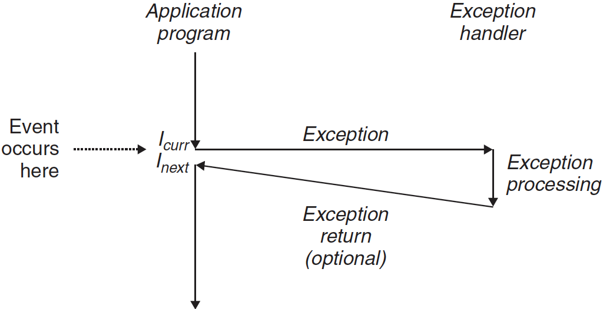
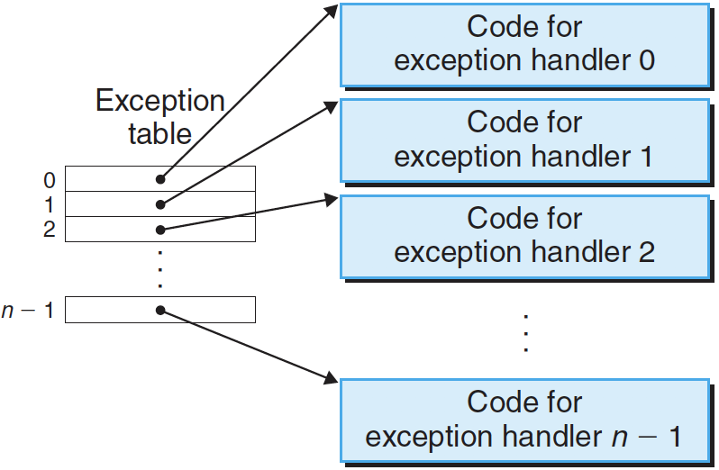
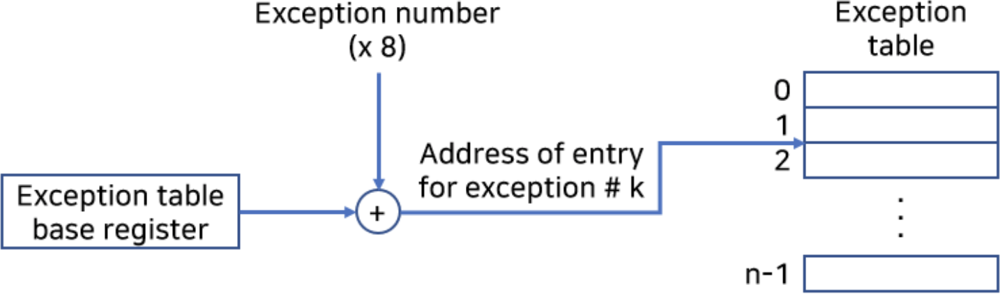
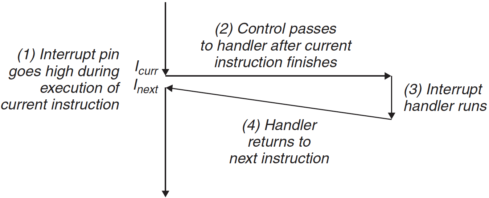
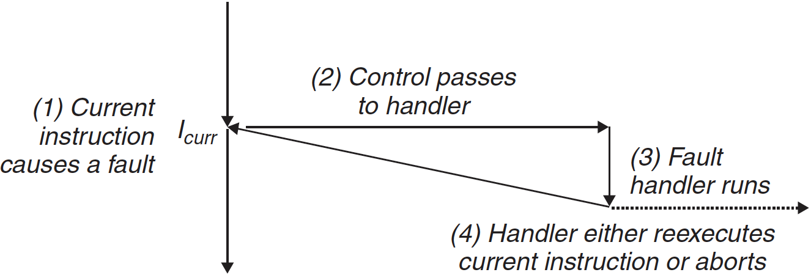

# 예외상황

프로세서에 전원을 처음 공급하는 시점부터 전원을 끌 때까지 프로그램 카운터(PC)는 연속된 값들을 가정한다.

$a_0$, $a_0$, … , $a_{n-1}​$

인스트럭션 $i_k$에 대응되는 주소가 $a_k$다. $a_k$에서 $a_{k+1}$로의 전환은 **제어이동**이라고 한다. 이러한 제어이동의 배열은 **제어 흐름** 또는 **프로세서의 제어 흐름**이라고 부른다.

가장 간단한 유형의 제어흐름은 "점진적인" 순서로,  메모리에 서로 나란히 있는 경우다. 점진적인 흐름에 갑작스런 변화가 생기는  경우는 `jmp`, `call`, `ret` 같은 인스트럭션에 의해 발생한다.

시스템은 프로그램에서 표현되지 않은 시스템 상태의 변화에도 반응할 수 있어야 한다. 시간, 입출력, 신호 등이 이러한 변화 중 하나가 될 수 있다.

현대 시스템은 특정 상황에 반응하기 위해  **예외적인 제어 흐름 (exceptional control flow (ECF))**을 만든다. 예외적인 제어 흐름은 컴퓨터 시스템의 모든 수준에서 발생한다.

- 하드웨어 수준에서 하드웨어에 의해서 검출되는 이벤트들은 예외 핸들러로 갑작스런 제어이동 발생
- 운영체제 커널 수준의 컨텍스트 스위칭을 통해 사용자 프로세스에서 다른 프로세스로 제어이동 발생
- 응용수준에서 프로세스의 시그널 보내고 받기
- 프로그램은 일반적인 스택 운영을 회피하고 다른 함수 내 임의의 위치로 비지역성 점프를 통한 에러 대응

---

**예외 상황**은 어떤 프로세서 상태의 변화에 대한 대응으로, 제어 흐름의 갑작스런 변화다. 

   

위 그림에서 프로세서는 $i_{curr}$를 실행하던 중에 상태 변화가 일어난다. 이 **상태**는 프로세서 내 다양한 비트들과 신호들로 인코드 된다. 상태 변화는 **이벤트**다. 이 이벤트는 현재 인스터럭션의 실행에 직접적으로 관련될 수 있다.(ex: 가상메모리 페이지 오류, 산술 오버플로우, divide by zero)

어느 경우이든지 프로세서가 이벤트가 발생했다는 것을 감지하면, **예외 테이블**이라고 하는 점프 테이블을 통해서 이 특정 종류의 이벤트를 처리하기 위해 특별히 설계된 운영체제 서브루틴(**예외처리 핸들러**)으로 간접프로지서 콜을 하게 된다.

예외처리 핸들러가 처리를 끝마치면, 예외상황을 발생시킨 이벤트 종류에 따라서 다음 세 가지 중의 한 가지 일이 발생한다.

1. 핸들러는 제어를 현재 인스트럭션 $i_{curr}$로 돌려준다. 이 인스트럭션은 이벤트가 발생했을 때 실행되고 있던 인스트럭션이다.
2. 핸들러는 제어를 $i_{next}$로 돌려주는데, 이 인스트럭션은 예외상황이 발생하지 않았더라면 다음에 실행되었을 인스트럭션이다.
3. 핸들러는 중단된 프로그램을 종료한다.

---

## 1. 예외처리

한 시스템 내에서 가능한 예외상황의 종류마다 중복되지 않은 양의 정수를 **예외번호**로 할당하고 있다. 이 숫자들의 일부는 프로세서 설계자가 할당하고, 나머지 번호는 운영체제 커널 설계자가 할당한다.

시스템 부팅 시, 운영체제는 **예외 테이블**이라고 하는 점프 테이블을 할당하고 초기화해서 엔트리 *k*가 예외상황 *k*에 대한 핸들러의 주소를 갖는다. 위 그림은 예외테이블의 포맷을 보여준다.

프로그램 런타임에 프로세서는 이벤트가 발생했다는 것을 감지하고, 대응되는 예외번호 *k*를 결정한다. 프로세서는 그 후에 예외 테이블의 엔트리 *k*를 감지하고, 대응되는 예외번호 *k*를 결정한다. 프로세서는 그 후에 예외 테이블의 엔트리 k를 통해서 간접 프로시저 콜을 하는 방법으로 예외상황을 발생시킨다.

위 그림은 프로세서가 예외 테이블을 이용해서 해당 예외 핸들러의 주소를 어떻게 만드는지 보여준다. 예외번호는 예외 테이블에서 인덱스이며, 이 테이블의 주소는 **예외 테이블 베이스 레지스터**라는 특별한 CPU 레지스터에 저장되어 있다.

예외 상황과 프로시저 콜은 유사하지만 차이가 있다.

1. 프로세서는 프로시저 콜을 사용해서 핸들러로 분기하기 전에 스택에 return address를 push한다. 주소는 예외 종류에 따라 현재 인스트럭션이나 다음 인스터럭션이 된다.
2. 프로세서는 핸들러가 리턴할 때 중단된 프로그램을 다시 시작하기 위해 스택 상에 추가적인 프로세서 상태를 push한다.
3. 제어가 사용자 프로그램에서 커널로 전환될 때, 모든 아이템은 사용자 스택이 아니라 커널 스택 상에 push된다.
4. 예외 핸들러는 커널 모드에서 돌아가는데, 이것은 이들이 모든 시스템 자원에 접근할 수 있는 것을 의미한다.

---

## 2. 예외의 종류

예외상황은 네 가지 종류로 구분할 수 있다: **인터럽트 (interrupt)**, **트랩(tranp)**, **오류 (fault)**, **중단 (abort)**

| Class     | Cause                         | Async/Sync | Return behavior                     |
| --------- | ----------------------------- | ---------- | ----------------------------------- |
| Interrupt | Signal from I/O device        | Async      | Always returns to next instruction  |
| Trap      | Intentional exception         | Sync       | Always return to next instrution    |
| Fault     | Potentially recoverable error | Sync       | Might return to current instruction |
| Abort     | Nonrecoverable error          | Sync       | Never returns                       |

### (1) 인터럽트(Interrupt)

> **인터럽트**(**Interrupt**)란 CPU가 프로그램을 실행하고 있을 때, 입출력 하드웨어 등의 장치나 또는 예외상황이 발생하여 처리가 필요할 경우에 CPU에게 알려 처리할 수 있도록 하는 것을 말한다. -위키백과-

**인터럽트**는 프로세서 외부에 있는 입출력 디바이스로부터 시그널의 결과로 **비동기적**으로 발생한다. 이는 특정 인스트럭션을 실행해서 발생한다는 것이 아니라는 의미다. 하드웨어 인터럽트를 위한 예외 핸들러는 종종 **인터럽트 핸들러**라고 부른다.

위 그림은 인터럽트의 처리 과정을 보여준다. 네트워크 어댑터, 디스크 컨트롤, 타이머 칩 같은 입출력 디바이스들은 프로세서 칩의 핀에 시그널을 보내서 인터럽트를 발생시키고, 인터럽트를 발생시킨 디바이스를 식별하는 예외번호를 시스템 버스에 보낸다.

프로세서는 인터럽트 핀이 high로 올라간 걸 발견하고 시스템 버스에서 예외번호를 읽으며, 적절한 인터럽트 핸들러를 호출한다. 핸들러가 린터할 때, 제어를 다음 인스트럭션으로 돌려준다. 이는 프로그램이 인터럽트가 마치 발생하지 않았던 것처럼 계속해서 실행되는 것이다.

나머지 예외들(트랩, 오류, 중단)은 동기적으로 일어나며, **오류 인스트럭션 (faulting instruction)**이라고 부른다.

### (2) 트랩(Trap)과 시스템 콜

> 컴퓨터 과학에서 **트랩**(Trap)은 어떤 프로세스가 특정 시스템 기능을 사용하려고 할 때 그 기능을 운영체제에게 요청하는 방법을 말한다.

**트랩**은 의도적인 예외상황으로, 어떤 인스트럭션을 실행한 결과로 발생한다. 트랩의 가장 중요한 사용은 **시스템 콜**로 사용자 프로그램과 커널 사이에서 프로시저와 유사한 인터페이스다.

> **시스템 호출**(system call)은 운영체제의 커널이 제공하는 서비스에 대해, 응용 프로그램의 요청에 따라 커널에 접근하기 위한 인터페이스이다. 보통 C나 C++과 같은 고급언어로 작성된 프로그램들은 직접 시스템 호출을 사용할 수 없기 때문에 고급 API를 통해 시스템 호출에 접근하게 하는 방법이다.

사용자 프로그램은 파일을 읽거나(read), 새로운 프로세스를 만들거나(fork), 새 프로그램을 로드하고(execve), 현재 프로세스를 종료하는 등의 서비스를 종종 커널에 요청한다. syscall 인스트럭션을 실행하면 트랩은 인자를 해독하고 적절한 커널 루틴을 호출하는 예외 핸들러로 이동시킨다.

위 그림은 시스템 콜에 대한 처리작업을 보여준다. 프로그래머 관점에서 시스템 콜은 보통의 함수 호출과 같다. 시스템 콜은 **커널 모드**에서 돌아가며, 커널 내에서 정의된 스택에 접근하며, 특권을 가진 인스트럭션을 실행할 수 있다.

### (3) 오류(Fault)

**오류**는 핸들러가 정정할 수 있을 가능성이 있는 에러 조건으로부터 발생한다. 오류가 발생하면 프로세서는 제어를 오류 핸들러로 이동해준다. 만일 핸들러가 에러 조건을 정정할 수 있다면, 제어를 오류를 발생시킨 인스트럭션으로 돌려주어서 거기서부터 재실행한다. 그렇지 않다면, 핸들러는 커널 내부의 abort 루틴으로 리턴해서 오류를 발생시킨 응용 프로그램을 종료한다.

### (4) 중단(Abort)

**중단**은 대개 DRAM이나 SRAM이 고장날 때 발생하는 패리티 에러와 하드웨어 같은 복구할 수 없는 치명적인 에러에서 발생한다. 중단 핸들러는 절대로 응용 프로그램으로 제어를 리턴하지 않는다.

---