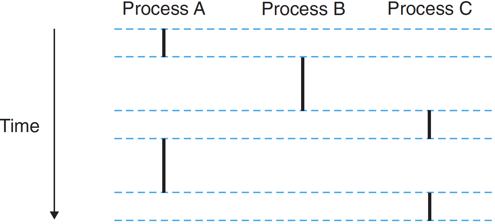
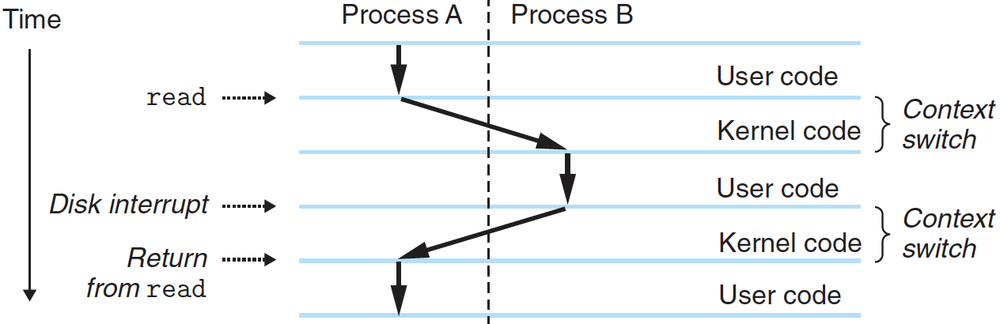

# 프로세스

프로그램을 시스템에서 실행할 때, 마치 프로그램이 단 한 개만 시스템에서 돌아가고 있는 것 같은 착각이 들게 된다. 프로세서는 프로그램 내의 인스트럭션들을 차례대로 중단 없이 실행하는 거처럼 보인다. 또한 프로그램의 코드와 데이터는 시스템 메모리상의 유일한 객체인 거처럼 보인다. 이러한 착각은 프로세스라는 개념으로 이루어진다.

> 프로세스는 컴퓨터에서 연속적으로 실행되고 있는 컴퓨터 프로그램을 말한다. -위키백과-

프로세스의 고전적인 정의는 **실행 프로그램의 인스턴스**다. 시스템 내의 각 프로그램은 어떤 프로세스의 **컨텍스트 (context)**에서 돌아간다. 컨텍스트는 프로그램이 정확하게 돌아가는 데 필요한 상태로 구성된다. 이 상태는 메모리에 저장된 프로그램의 코드와 데이터, 스택, 범용 레지스터 내용, 프로그램 카운터, 환경변수, 열려 있는 파일의 식별자를 포함한다.

사용자가 실행 목적 파일의 이름을 쉘에 입력해서 프로그램을 돌릴 때마다 쉘은 새로운 프로세스를 생성하고, 실행 목적 파일을 이 새로운 프로세스의 컨텍스트에서 실행한다. 

응용 프로그램은 또한 새로운 프로세스를 만들 수 있으며, 새 프로세스 커넥스트 내에서 자신의 코드나 다른 응용 코드를 돌릴 수 있다.

---

## 1. 논리적인 제어 흐름

위 그림은 세 개의 프로세스를 실행하는 시스템을 보여준다. 이 프로세서의 하나의 물리적 제어 흐름은 각 프로세스에 대해서 한 개씩 세 개의 논리흐름으로 나누어진다. 그림에서 세 개의 논리흐름이 서로 중첩되지 않는다.

위 그림에서의 요점은 하나의 프로세서를 사용해서 여러 프로세스가 교대로 돌아간다는 점이다. 각 프로세스는 자신의 흐름의 일부분을 실행하고 나서 다른 프로세스들로 순서를 바꾸어 실행하는 동안 **선점된다(일시적으로 정지된다)**.

---

## 2. 동시성 흐름

논리흐름은 컴퓨터 시스템 내에서 여러 가지 다른 형태를 가진다: 예외 핸들러, 프로세스, 시그널 핸들러, 쓰레드, 자바 프로세스 등

자신의 실행시간이 다른 흐름과 겹치는 논리흐름을 **동시성 흐름**이라고 부른다. 이 흐름은 **동시에 실행한다**. 좀 더 정확히 말해서, 만일 Y가 시작해서 종료하기 전에 X가 시작해서 종료하기 전에 Y가 시작할 때만 X와 Y는 동시적이다. 예를 들어 위 그림에서 프로세스 A와 B, B와 C는 동시적이다. 반면, B와 C는 동시적이지 않다.

동시성에서 프로세스가 다른 프로세스들과 교대로 실행되는 개념을 **멀티태스킹**이라고 한다. 한 프로세스가 자신의 흐름 일부를 실행하는 매 시간 주기를 **타임 슬라이스**라고 부르므로 멀티태스킹을 **타임 슬라이싱**이라고도 부른다. 예를 들어, 위 그림에서 프로세스 A에 대한 흐름은 두 개의 타임 슬라이스로 구성된다.

동시성 흐름에 대한 개념은 프로세서 코어나 컴퓨터 개수와는 무관하다. 만이 두 흐름이 시간상으로 중첩되면, 비록 이들이 같은 프로세서에서 돌아가고 있더라도 이들은 동시적이다. 반면 **병렬 흐름**은 다른 개념이다. 만일 두 개의 흐름이 서로 다른 프로세서 코어나 컴퓨터에서 동시에 돌아가고 있다면, 이것은 **병렬 흐름**이다. 즉, **병렬로 돌아간다**.

---

## 3. 사적 주소공간

프로세스는 각 프로그램에 자신이 시스템의 주소공간을 혼자서 사용한다는 착각을 일으킨다. 이것은 프로세스가 각 프로그램에 자신만의 **사적 주소공간**을 제공한다. 이 공간의 특정 주소에 연결된 메모리의 한 개 바이트가 일반적으로 다른 프로세스에 의해서 읽히거나 쓰일 수 없다는 의미로 이 공간은 사적이다.

주소공간의 아랫부분은 일반적인 코드, 데이터, 힙, 스택 세그먼트를 갖은 사용자 프로그램을 위해 예약된다. 코드 세그먼트는 항상 주소 0x400000에서 시작하며, 윗부분은 커널을 위해 예약되어 있다(운영체제의 메모리 상주 부분). 커널 부분은 커널이 프로세스를 대신해서 인스트럭션을 실행할 때 사용하는 코드, 데이터, 스택을 포함한다(예: 응용 프로그램이 시스템 콜을 실행할 때).

---

## 4. 사용자 및 커널 모드

프로세스는 현재 가지고 있는 특권을 저장하는 일부 제어 레지스터로 **모드 비트**를 제공한다. 모드 비트의 설정에 따라 커널 모드와 사용자 모드로 나뉜다.

커널 모드에서 돌고 있는 프로세스는 인스트럭션 집합의 어떤 인스트럭션도 실행할 수 있으며, 시스템 내의 어떤 메모리 위치도 접근할 수 있다.

사용자 모드의 프로세스는 프로세서를 멈추거나 모드 비트를 변경하거나, 입출력 연산을 초기화하는 것 같은 특수 인스트럭션을 실행할 수 없다. 또한, 주소공간의 커널 영역에 있는 코드나 데이터를 직접 참조할 수 없으므로 시스템 콜을 통해서 간접적으로 접근해야 한다.

응용 코드를 실행하는 프로세스는 처음에는 사용자 모드에 있다. 인터럽트, 오류, 트랩과 시스템 콜 같은 예외를 통해서 제어가 예외 핸들러로 넘어가면 커널 모드로 진입한다. 제어가 응용 코드로 돌아오면 프로세서는 모드를 커널 모드에서 다시 사용자 모드로 변경한다.

---

## 5. 컨텍스트 스위치

운영체제 커널은 **컨텍스트 스위치 (context switch)**이라고 알려진 예외적인 제어흐름의 상위수준 형태를 사용해서 멀티태스킹을 구현한다.

> **문맥 교환**(Context Switch)이란 하나의 프로세스가 CPU를 사용 중인 상태에서 다른 프로세스가 CPU를 사용하도록 하기 위해, 이전의 프로세스의 상태(문맥)를 보관하고 새로운 프로세스의 상태를 적재하는 작업을 말한다. 한 프로세스의 문맥은 그 프로세스의 프로세스 제어 블록에 기록되어 있다. -위키백과-

커널은 각 프로세스마다 **컨텍스트**를 유지한다. **컨텍스트**는 커널이 **선점된 프로세스를 다시 시작하는 데 필요로 하는 상태**다. 컨텍스트는 범용 레지스터, 부동소수점 레지스터, 프로그램 카운터, 사용자 스택, 상태 레지스터, 커널 스택, 여러 가지 커널 자료구조(*페이지 테이블*, *프로세스 테이블*, *파일 테이블* 등) 같은 객체의 값들로 구성된다.

커널은 프로세스가 실행되는 동안에 어떤 시점에 현재 프로세스를 일시정지하고 이전에 일시정지된 프로세스를 다시 시작할 것을 결정할 수 있다. 이 결정은 **스케줄링**이라고 하며, **스케줄러**라고 불리는 커널 내부의 코드에 의해 처리된다. 커널이 실행할 새 프로세스를 선택할 때 커널이 그 프로세스를 **스케줄**했다고 말한다.

커널이 실행할 **새 프로세스를 스케줄한 후에 현재 프로세스를 일시정지하는 것**을 **컨텍스트 스위치**라고 한다. 이 메커니즘을 사용해서 새로운 프로세스로 제어를 이동한다. 컨텍스트 스위치의 절차는 다음과 같다:

1. 현재 프로세스의 컨텍스트를 저장
2. 이전에 일시정지된 프로세스의 저장된 컨텍스트 복원
3. 제어를 이 새롭게 복원된 프로세스로 전달

#### (1) 컨텍스트 스위치는 커널이 사용자를 대신해서 시스템 콜을 실행하고 있을 때 일어날 수 있다.

만일 시스템 콜이 어떤 이벤트의 발생을 기다리기 때문에 블록 된다면 커널은 현재 프로세스를 sleep시키고 다른 프로세스로 전환한다. 예를 들어:

- read 시스템 콜이 디스크 접근을 요구하면 커널은 컨텍스트 스위치 할 수 있으며, 디스크로부터 데이터를 기다리는 대신 다른 프로세스를 돌릴 수 있다.
- sleep 시스템 콜로 호출하는 프로세스를 sleep 상태로 만들기 위해서 컨텍스트 스위치를 한다.

#### (2) 컨텍스트 스위치는 인터럽트의 결과로 발생할 수 있다.

예를 들어, 모든 시스템은 1ms 또는 10ms 마다 주기적인 타이머 인터럽트를 생성하는 메커니즘을 가지고 있다. 타이머 인터럽트가 일어날 때마다 커널은 현재 프로세스가 충분히 오래 실행되었다고 판단하여 새로운 프로세스로 전환할 것을 결정할 수 있다.

위 그림은 두 개의 프로세스 A와 B 사이에 컨텍스트 스위치를 보여준다. 그림에서 처음에 프로세스 A는 read 시스템 콜을 실행해서 커널에 트랩을 걸 때까지는 사용자 모드로 돌고 있다. 커널의 트랩 핸들러는 디스크 컨트롤러에게 DMA 전송을 요청하며, 디스크 컨트롤러가 데이터를 디스크에서 메모리로 전송을 완료한 후에 프로세서에 인터럽트를 걸도록 디스크를 제어한다.

디스크는 데이터를 선입하는데 비교적 긴 시간이 걸리므로 프로세서 중간에 아무것도 안하는 대신에 커널은 프로세스 A에서 B로 컨텍스트 스위치를 수행한다. 프로세스 B는 그 후에 디스크가 인터럽트를 보내서 데이터가 디스크에서 메모리로 전송되었다고 알려줄 때까지 사용자 모드에서 잠깐 동작한다.

커널은 프로세스 B가 충분히 오랫동안 동작했다고 인식하고 프로세스 A의 read 시스템 콜 이후에 나오는 인스트럭션 위치로 리턴하는 컨텍스트 스위치를 수행한다.

---