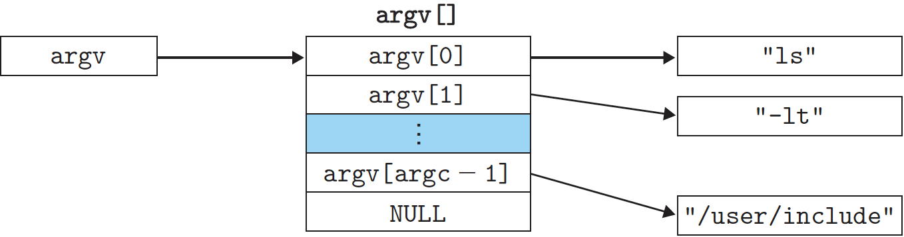
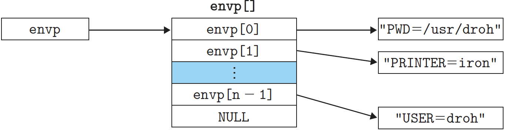

# 프로세스의 제어

Unix는 C 프로그램으로부터 프로세스를 제어하기 위한 많은 시슽메 콜을 제공한다.

## 1. 프로세스 ID 가져오기

각각의 프로세스는 고유의 양수(0이 아닌) 프로세스 ID (PID)를 가진다.

```cpp
#include <sys/type.h> // pid_t 타입의 정수를 정의
#include <unistd.h>

pid_t getpid(void);  // 호출하는 함수의 PID를 리턴
pid_t getppid(void); // 자신의 부모의 PID를 리턴 (호출하는 프로세스를 만든 프로세스)
```

---

## 2. 프로세스의 생성과 종료

프로그래머 관점에서 프로세스는 다음 세 가지 상태 중의 하나다:

- **실행중 (Running)** : 프로세스는 CPU에서 실행하고 있거나 실행을 기다리고 있으며, 커널에 의해서 스케줄된다.
- **정지 (Stopped)** : 프로세스는 정지한 상태이고 스케줄되지 않는다. 프로세스는 SIGSTOP, SIGTSTP, SIGTIN, SIGTTOU 시그널을 받게 되면 그 결과로 정지하고, SIGCONT 시그널을 받은 시점에서 다시 실행을 시작하게 된다.
- **종료 (Terminated)** : 프로세스는 영구적으로 정지된다. 프로세스는 다음 세 가지 이유 중의 하나로 종료된다:
  - 프로세스를 종료하는 시그널을 받았을 때
  - 메인 루틴에서 리턴할 때
  - exit 함수를 호출할 때

```cpp
#include <stdlib.h>

void exit(int status);
```

`exit` 함수는 **종료 상태** `status`로 프로세스를 종료한다.

**부모 프로세스**는 `fork`  함수를 호출해서 **자식 프로세스**를 생성한다.

```cpp
#include <sys/types.h>
#include <unistd.h>

pid_t fork(void);    // Returns: 0 to child, PID of child to parent, -1 on error
```

**중복된, 그러나 별도의 주소공간** : 새롭게 생성된 자식 프로세스는 부모 프로세스와 거의 같다. 자식 프로세스는 코드, 데이터 세그먼트, 힙, 공유된 라이브러리, 사용자 스택을 포함하는 부모 프로세스의 사용자수준 가상 주소공간과 같은 복사본을 가진다. 

**동시 실행** : 부모 프로세스와 자식 프로세스는 동시에 돌아가는 별도의 프로세스들이다. 이들의 논리적 제어 흐름 내의 인스트럭션들은 커널에 의해서 임의의 순서로 중첩될 수 있다.

**공유된 파일** : 또한 자식 프로세스는 부모 프로세스가 오픈한 파일 식별자 모두와 같은 사본을 가지므로 부모 프로세스가 오픈한 파일 모두를 읽고 쓸 수 있다.

부모 프로세스와 새롭게 생성된 자식 프로세스 간의 가장 중요한 차이는 이들이 서로 다른 PID를 가진다는 것이다.

`fork` 함수는 흥미로운데, **한 번 호출**되지만 **두 번 리턴**하기 때문이다.

- 부모 프로세스에서 fork는 자식의 PID를 리턴한다.
- 자식 프로세스에서 fork는 0을 리턴한다.

```cpp
int main()
{
    pid_t pid;
    int x = 1;
    
    pid = Fork();
    if(pid == 0) /* Child */
    {
        printf("child : x=%d\n", ++x);
        exit(0);
    }
    
    /* Parent */
    printf("parent: x=%d\n", --x);
    exit(0);
}

// parent: x = 0
// child : x = 2
```

처음에 부모는 변수 x를 1로 설정한다. 부모는 fork를 호출하고, 이것은 자신만의 사적 주소공간에서 부모와 함께 동시적으로 실행하는 자식 프로세스를 한 개 생성한다

위 예제에서 지역변수 *x*는 fork 함수라 리턴할 때 부모와 자식 모두에서 1을 가진다. 그러나 부모와 자식이 별도의 프로세스이므로 이들은 자신만의 사적 주소공간을 가진다. 부모나 자식이 변수 *x*에 대해 가하는 수정사항들은 모두 개인적이다.

---

## 3. 자식 프로세스의 청소

프로세스가 어떤 이유로 종료할 때, 커널은 시스템에서 즉시 제거하지 않는다. 그 대신, 프로세스는 부모가 청소할 때까지 종료된 상태로 남아 있다. 부모가 종료된 자식을 청소할 때 커널은 자식의 exit 상태를 부모에게 전달하며, 그 후 종료된 프로세스를 없앤다. 종료되었지만 아직 청소되지 않은 프로세스를 **좀비 (zombie)**라고 한다.

부모 프로세스 종료할 때, 커널은 init 프로세스(pid: 1)가 부모가 되게 하여, 좀비 프로세스들을 알아서 정리한다. 그러나 서버같이 오랫동안 실행하는 프로그램들은 좀비가 시스템 메모리를 잡아먹으므로 항상 좀비들을 소거해야 한다.

```cpp
#include <sys/types.h>
#include <sys/wait.h>

pid_t waitpid(pid_t pid, int *statusp, int options);
// Returns: PID of child if OK, 0 (if WNOHANG), or -1 on error
```

프로세스는 `waitpid` 함수를 호출해서 자신의 자식들이 종료되거나 정지되기를 기다릴 수 있다.

---

## 4. 프로세스 재우기

`sleep` 함수는 일정 기간 동안 프로세스를 정지시킨다.

```cpp
#include <unistd.h>

unsigned int sleep(unsigned int secs);	// Returns: secodns left to sleep
```

`sleep`은 요청한 시간이 지나면 0을 리턴하고, 그렇지 않으면 남은 시간 동안 잠을 잔다.

또 다른 유용한 함수는 `pause` 함수로, 호출하는 함수를 시그널이 프로세스에 의해서 수신될 때까지 잠을 재우는 함수다.

```cpp
#include <unistd.h>

int pause(void);	// Always returns -1
```

---

## 5. 프로그램의 로딩과 실행

`execve` 함수는 현재 프로그램의 컨텍스트 내에서 새로운 프로그램을 로드하고 실행한다.

```cpp
#include <unistd.h>

int execve(coonst char* filename, const char* argv[], const char* envp);
// Does not return if OK; returns -1 on error
```

`excve` 함수는 실행 가능 목적 파일 finename과 인자 리스트 argv, 환경변수 리스트 envp를 사용해서 로드하고 실행한다.



인자 리스트는 위 그림과 같은 자료구조로 표시디된다. argv 변수는 NULL로 종료되는 포인터의 배열을 가리키며, 각각의 포인터는 하나의 인자 스트링을 가진다. 관습에 의해 argv[0]은 실행 가능 목적 파일의 이름이다.



envp 변수는 NULL로 긑나는 환경변수 문자열 포인터 배열을 가리키며, 이 포인터 각각은 "name=value" 형태의 쌍이다.

execve가 filename을 로드한 후에 로딩 시작 코드를 호출한다. 시작 코드는 스택을 설정하고 제어를 새 프로그램의 메인 루틴으로 전달하며, 이 루틴은 다음과 같은 형태의 프로토타입을 갖는다.

```cpp
int main(int argc, char** argv, char** envp);

int main(int argc, char* argv[], char* envp[]);
```

 함수 main으로 가는 세 개의 이자가 존재하며, 이들 각각은 x86-64 스택 규범을 준수하며 레지스터에 저장된다:

1. `%rdi` , argc : argv[] 배열에 null이 아닌 포인터들의 수
2. `%rsi`, argv : argv[] 배열에서 첫 항목으로의 포인터
3. `%rdx`, envp : envp[] 배열에서 첫 항목으로의 포인터

리눅스는 환경 배열을 조작하기 위한 몇 개의 함수를 제공한다:

```cpp
#include <stdlib.h>

char* getenv(const char* name);
// Returns: pointer to name if it exists, NULL if no match
```

`getenv` 함수는 환경 배열에서 "name=value" 스트링을 검색한다. 찾게 되면 해당하는 값에 대한 포인터를 리턴하고, 그 외의 경우에는 NULL을 리턴한다.

```cpp
#include <stdlib.h>

int setenv(const char* name, const char* newvalue, int overwirte);
// Returns: 0 on success, -1 on error

void unsetenv(const char* name); // Returns: nothing
```

환경 배열이 "name=oldvalue" 형태의 스트링을 포함하면, `unsetenv`는 이것을 삭제하고 `setenv`는 oldvalue를 newvalue로 교체한다. 그러나 이것은 overwirte가 0이 아닐 때만 그렇다. 만일 name이 없다면 `setenv`는 "name=newvalue"를 배열에 추가한다.

---