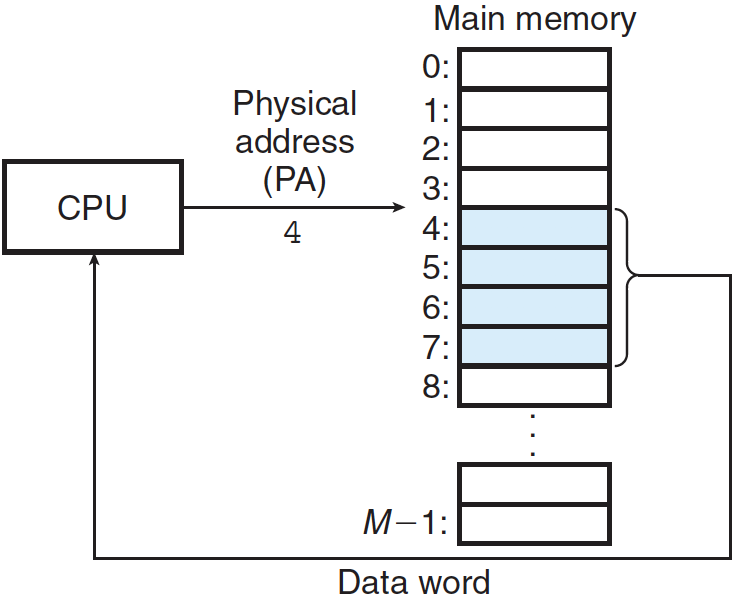
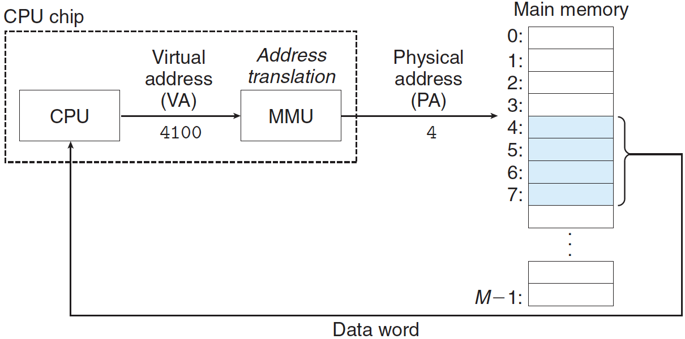
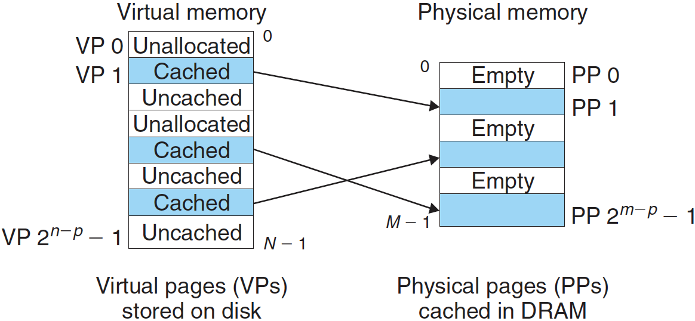
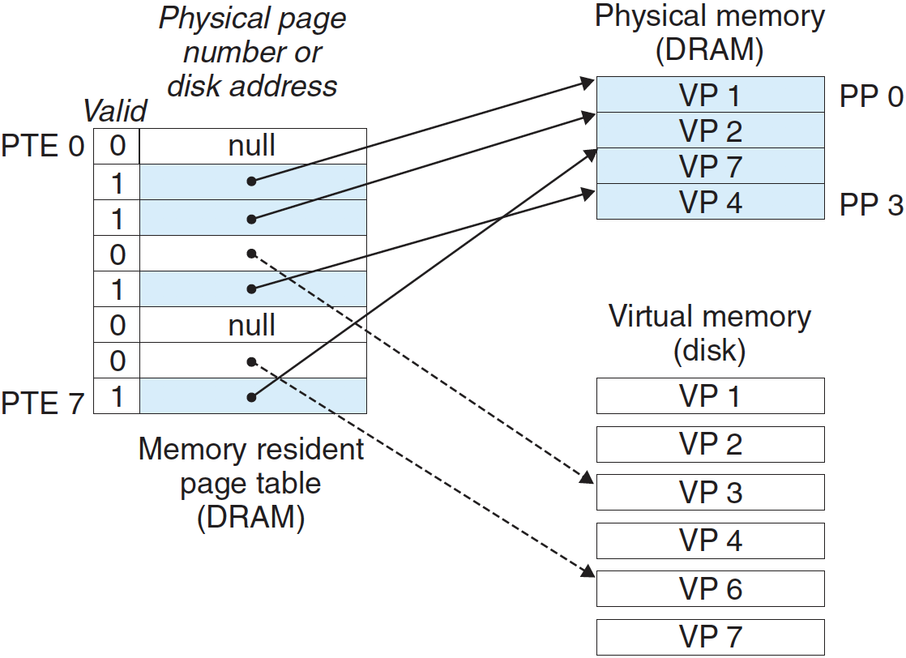
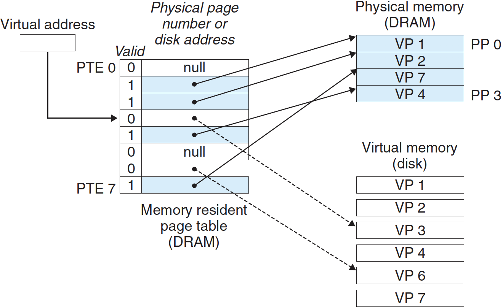
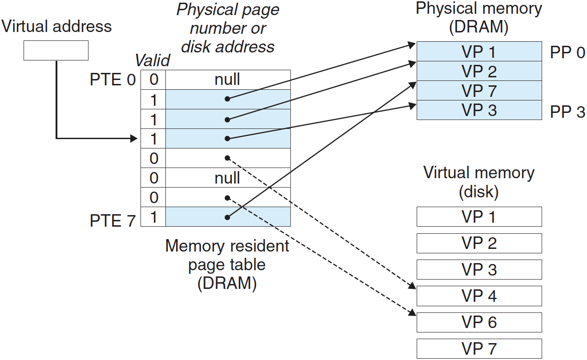
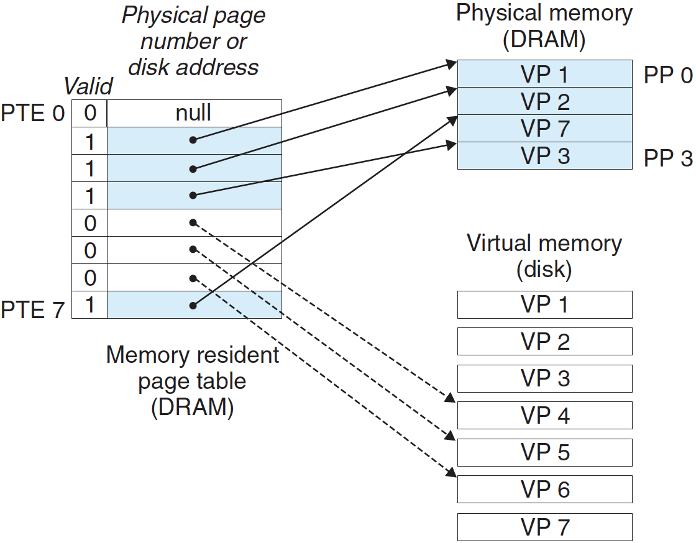
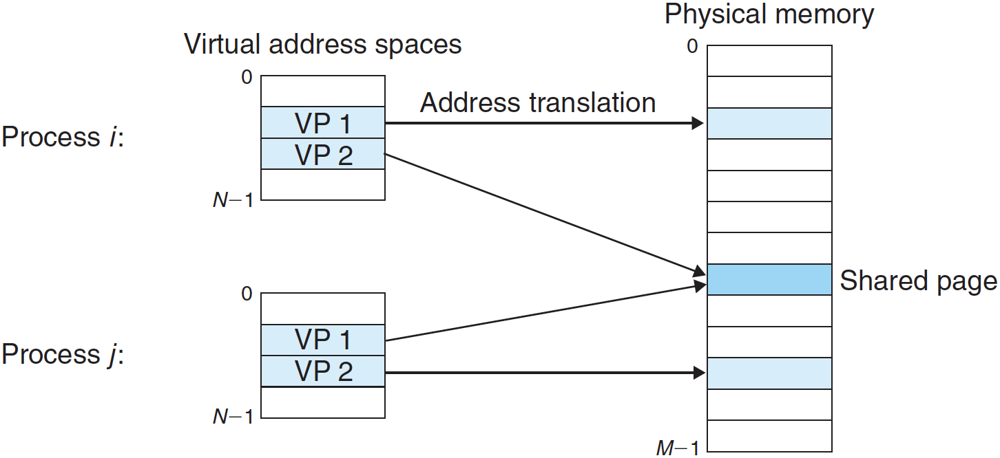
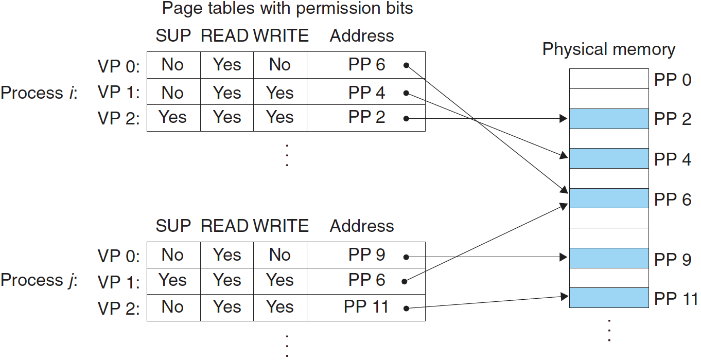

# 가상 메모리

한 시스템의 프로세스들은 CPU와 메인 메모리를 다른 프로세스들과 공유한다. 많은 프로세스들이 많은 메모리를 요구하면 이들 중 일부는 실행할 수도 없게 될 것이다. 또한, 만약 일부 프로세스가 무심코 다른 프로세스가 사용하고 있는 메모리를 쓰게 되면, 이 프로세스는 프로그램의 논리와 전혀 상관없이 실패할 수 있다.

> **가상 메모리**(문화어: **가상**기억기) 또는 **가상** 기억 장치는 RAM을 관리하는 방법의 하나로, 각 프로그램에 실제 **메모리** 주소가 아닌 **가상**의 **메모리** 주소를 주는 방식을 말한다. -위키백과-

메모리를 보다 효율적이고 더 적은 에러를 갖도록 관리하기 위해서 현대의 시스템은 **가상 메모리(virtual memory VM)**라는 메인 메모리의 추상화를 제공한다. 가상 메모리는 각 프로세스에 하나의 크고 통합된, 사적 주소공간을 제공한다. 가상 메모리는 하드웨어 예외, 하드웨어 주소 번역, 메인 메모리, 디스크 파일, 커널 소프트웨어들 사이에서 상호작용을 한다.

가상 메모리는 세 개의 중요한 기능을 제공한다.

- 메인 메모리를 디스크에 저장된 주소공간에 대한 캐시로 취급해서 메인 메모리 내 활성화 영역만 유지하고, 데이터를 디스크와 메모리 간에 필요에 따라 전송하는 방법으로 메인 메모리를 효율적으로 사용한다.
- 각 프로세스에 통일된 주소공간을 제공함으로써 메모리 관리를 단순화한다.
- 각 프로세스의 주소공간을 다른 프로세스에 의한 손상으로부터 보호한다.

---

## 1. 물리 및 가상주소 방식

컴퓨터 시스템의 메인 메모리는 *M*개의 연속적인 바이트 크기 셀의 배열로 구성된다. 각 바이트는 고유의 **물리 주소(PA)**를 가진다. 첫 번째 바이트는 주소 0, 다음 바이트는 주소 1 이런 식이다. CPU가 메모리에 접근하는 가장 자연스러운 방식은 물리 주소를 사용하는 것이다. 이러한 접근법을 **물리 주소 방식**이라고 한다.

위 그림은 물리 주소 4에서 시작하는 4바이트 워드를 읽는 로드 인스트럭션의 컨텍스트에서 물리 주소 방식의 예를 보여준다.

초기의 PC들은 물리 주소 방식을 사용했으나, 현대의 프로세서들은 **가상 주소 방식**을 사용한다.

CPU는 가상 주소 지정으로 **가상 주소(VA)**를 생성해서 메인 메모리에 접근하며, 이것은 메모리로 보내지기 전에 적절한 물리 주소로 변환된다. 가상 주소를 물리 주소로 변환하는 작업을 **주소 번역**이라고 한다. 예외 처리처럼 주소 번역은 CPU와 운영체제 간에 협력이 필요하다. CPU 칩 내에 **메모리 관리 유닛(MMU)**이라는 하드웨어는 메인 메모리에 저장된 참조 테이블을 사용해서 실행 중에 가장주소를 번역하며, 이 테이블의 내용은 운영체제가 관리한다.

---

## 2. 주소공간

가상 메모리를 갖는 시스템에서, CPU는 **가상 주소공간**이라고 불리는 $N=2^n$ 주소의 주소공간에서 가상의 주소를 생성한다:

{0, 1, 2, …, N-1}

주소공간의 크기는 가장 큰 주소를 표시하는 데 필요한 비트 수로 나타낸다. 예를 들어, $N=2^n​$ 주소를 갖는 가상 주소공간은 **n-비트 주소공간**이라고 한다. 현대 시스템은 32비트 또는 64비트 가상 주소공간을 지원한다.

또한, 컴퓨터 시스템은 이 시스템 내의 **M**바이트의 물리 메모리로 대응되는 **물리 주소 공간**을 갖는다:

{0, 1, 2, …, M-1}

*M*은 꼭 2의 제곱일 필요는 없지만, 논의를 단순하게 하기려고 $M=2^m​$이라고 가정할 것이다.

---

## 3. 캐싱 도구로서의 가상 메모리

결과적으로, 가상 메모리는 디스크에 저장된 *N*개의 바이트 크기의 셀 배열로 구성된다. 각 바이트는 특정한 가상주소를 가지며, 배열의 인덱스로 작용한다. 디스크 안의 배열 정보는 메인 메모리에 캐시된다. 메모리 계층구조 안에 있는 캐시는 블록 단위로 분할되며, 디스크와 메인 메모리 사이에 징검다리 역할을 한다.

가상 메모리 시스템은 가상 메모리를 규정된 사이즈 블록 단위로 분할하여 관리한다. 분할된 블록들을 **가상 페이지**라고 한다. 각 가상 페이지는 $P = 2p$ 바이트의 크기를 가진다. 이와 비슷하게 물리 메모리도 물리 페이지로 분할되어 사용된다.

가상 페이지의 집합은 세 개의 중첩되지 않은 부분집합으로 나뉜다.

- **Unallocated** : 가상 메모리 시스템에 의해 아직 할당되지 않은 페이지들. 비할당된 블록들은 이들과 관련된 데이터를 하나도 가지고 있지 않으며, 따라서 디스크 상에 어떤 공간도 차지하지 않는다.
- **Cached** : 현재 물리 메모리에 캐시 되어 할당된 페이지들.
- **Uncached** : 물리 메모리에 캐시 되지 않은 할당된 페이지들.

위 그림은 여덟 개의 가상 페이지를 갖는 작은 가상 메모리를 보여준다. 가상 페이지 0과 3은 아직 할당되지 않았으며, 따라서 디스크 상에 아직 존재하지 않는다. 가상 페이지 1, 4, 6은 물리 메모리에 캐시 되어 있다. 페이지 2, 5, 7이 할당되지만, 현재 물리 메모리에 캐시 되지 않았다.

### 페이지 테이블

가상 페이지는 DRAM 어딘가에 캐시 되야 하는지와 어떤 물리 페이지를 캐싱했는지 결정해야 한다. 또한, 만일 미스가 존재한다면 시스템은 디스크 어디에 가상 페이지가 저장되어 있는지 결정해야 하며, 물리 메모리 중에서 희생할 페이지를 선택해야 하고, 가상 페이지를 디스크에서 DRAM으로 복사해서 희생 페이지를 교체해야 한다.

이러한 역량은 운영체제 소프트웨어와 MMU 내의 주소 번역 하드웨어, 가상 페이지를 물리 페이지로 매핑하는 **페이지 테이블**이라 하는 물리 메모리에 저장된 자료구조의 조합으로 제공된다.

주소 번역 하드웨어는 가상 주소를 물리 주소로 변환할 때마다 페이지 테이블을 읽는다.

위 그림은 페이지 테이블의 기본 구조를 보여준다. 페이지 테이블은 **페이지 테이블 엔트리(PTE)**의 배열이다. 가상 주소공간의 각 페이지는 페이지 테이블 내에 고정된 오프셋 위치에 PTE를 가진다. 유효 비트는 가상 페이지가 현재 DRAM에 캐시 되어 있는지를 나타낸다. 세팅되어 있다면 디스크 상의 가상 페이지 시작 부분을 가리키며, 세팅되지 않았을 때 NULL 주소면, 할당되지 않았음을 나타낸다.

위 그림에서는 8개의 가상 페이지와 4개의 물리 페이지를 가지는 페이지 테이블 시스템을 보여준다. 네 개의 가상 페이지(VP1, VP 2, VP 4, VP 7)는 현재 DRAM에 캐시되어 있다. 두 개의 페이지(VP 0, VP 5)는 할당되었지만 현재 캐시 되지 않은 상태다. 주목해야 할 점은 여기서 DRAM 캐시가 완전 결합성이므로 물리 페이지가 모든 가상 페이지를 포함할 수 있다.

### 페이지 적중

CPU가 DRAM에 캐시 되어 있는 가상메모리의 VP 2 워드 한 개를 읽을 때, 주소 번역 하드웨어는 PTE 2를 찾기 위해서 인덱스로 가상 주소를 사용하고, 이것을 메모리에서 읽는다. 유효 비트가 세팅되어 있기 때문에 주소 번역 하드웨어는 VP 2가 메모리에 캐시 되어 있다는 것을 알고 있다. 그래서 PTE 내의 물리 메모리 주소를 사용해서 해당 워드의 물리 주소를 구성한다.

### 페이지 오류

가상 메모리 용어에서 DRAM 캐시 미스는 **페이지 오류(page fault)**라고 한다.

위 그림은 오류 발생 전의 페이지 테이블의 상태를 보여준다. CPU는 DRAM에 캐시 되어 있지 않은 VP 3 내의 워드를 참조하였다. 주소 번역 하드웨어는 메모리에서 PTE 3을 읽으며, VP 3이 캐시 되어 있지 않다는 것을 유효 비트로부터 유추해서 페이지 오류 예외를 유발한다.

페이지 오류 예외는 커널 내에 페이지 오류 예외 핸들러를 호출해서 희상 페이지인 PP 3에 저장된 VP 4를 선택한다. VP 4가 변경되었다면 커널은 이것을 다시 디스크에 복사한다. 커널은 VP 4에 대한 페이지 테이블 엔트리를 수정해서 VP 4가 더 이상 메인 메모리에 캐시 되지 않았다는 사실을 반영한다.

다음으로, 커널은 VP 3를 디스크에서 메모리 내의 PP 3로 복사하고, PTE 3을 갱신하고 그 후에 리턴한다. 핸들러가 리턴할 때 오류 인스트럭션을 재시작하고, 이것은 오류 가장 주소를 주소 번역 하드웨어로 재전송한다. 그러면 VP 3은 이제 메인 메모리에 캐시되어 있으므로 페이지 적중이다. 위 그림은 페이지 적중 후의 페이지 테이블의 상태를 보여준다.

가상 메모리 시스템은 SRAM 캐시와는 다른 용어들을 사용한다. 가상 메모리 시스템에서 블록은 **페이지**다. 디스크와 메모리 사이에 페이지를 전송하는 동작은 **페이징**이다. 페이지들은 디스크에서 DRAM으로 페이징되어 들어오며, DRAM에서 디스크로 페이징되어 나간다. 미스가 발생할 때, 하나의 페이지로 페이징되어 들어오는 마지막 순간까지 기다리는 전략은 **요구 페이징**이라고 한다.

### 페이지의 할당

위 그림은 운영체제가 가상 메모리의 새로운 페이지를 할당할 때, 예를 들어 malloc을 호출한 결과의 테이블을 보여준다. 예제에서 VP 5는 디스크 상에 공간을 만들고, PTE 5는 디스크에 새롭게 만든 페이지를 가리키도록 할당된다.

---

## 4. 메모리 관리를 위한 도구로서의 가상 메모리

지금까지 하나의 가상 주소공간을 물리 주소공간으로 매핑하는 한 개의 페이지 테이블을 가정하였다. 실제로 운영체제는 각 프로세스마다 별도의 페이지 테이블을 제공하며, 별도의 가상 주소공간을 제공한다.

위 그림은 이 개념을 보여준다. 그림에서 프로세스 *i*에 대한 페이지 테이블은 VP 1을 PP 2로, VP 2는 PP 7로 매핑한다. 비슷하게,  프로세스 j에 대한 페이지 테이블은 VP 1을 PP 7로, VP 2를 PP 10으로 매핑한다. 다수의 가상 페이지들이 같은 공유된 물리 페이지에 매핑될 수 있다는게 중요하다.

요구 페이징과 분리된 가상 주소공간의 조합은 메모리가 시스템에서 사용되고 관리되는 방식을 단순화 해준다.

- 링킹 : 별도의 주소공간은 각 프로세스들이 각 메모리 이미지에 대해서 코드와 데이터가 실제로 물리 메모리 내 어디에 위치하는지에 상관없이 같은 기본 포맷을 사용하도록 해준다.
- 로딩 : 로더는 코드와 데이터 세그먼트를 위한 가상의 페이지를 할당하고, 이들의 페이지 테이블 엔트리를 목적 파일의 해당 위치를 가리키게 한다. 연속된 가상 페이지를 임의의 파일 내의 임의의 위치로 매핑하는 개념을 **메모리 매핑**이라고 한다.
- 공유 : 각 프로세스는 다른 프로세스와 공유되지 않은 자신만의 사적 주소공간을 가지며, 운영체제는 중첩되지 않는 물리 페이지로 매핑하는 페이지 테이블을 만든다. 그러나 커널 코드나 printf 표준 C 라이브러리 같은 코드는 각 프로세스에서 별도로 포함하기보다 공유되는게  좋다. 운영체제는 이것을 서로 다른 프로세스에 들어 있는 가상 페이지들을 같은 물리 페이지로 적절하게 매핑해서 한 개의 사본을 공유하도록 한다.(Shared page)
- 메모리 할당 : 추가적인 힙 공간을 요청할 때, 운영체제는 적당한 수(k개)의 연속적인 가상 메모리 페이지를 할당하고, 이들을 물리 메모리 내에 위치한 k개의 임의의 물리 페이지로 매핑한다.

---

## 5. 메모리 보호를 위한 도구로서의 가상 메모리

현대 컴퓨터 시스템은 운영체제가 메모리 시스템에 접근하는 것을 제어할 수 있는 수단을 제공한다. 사용자 프로세스는 자신의 read-only 코드 섹션을 수정 금지하고, 또한 커널 내의 코드와 데이터 구조들도 읽거나 수정할 수 없어야 한다.

CPU가 주소를 만들 때마다 PTE를 읽으므로 PTE에 허가 비트를 추가해서 주소 번역 하드웨어가 가상 페이지 내용의로의 접근을 제어할 수 있다.

위 예제 그림에서는 각 PTE에 세 개의 허가 비트를 추가했다.

- SUP : 프로세스가 이 페이지에 접근하기 위해 커널 모드이어야 하는지
- READ, WRITE : 이 페이지에 대한 읽기와 쓰기 접근 

만약 어떤 인스트럭션이 이 허가사항을 위반한다면, CPU는 일반 보호 오류를 발생시켜서 SIGSEGV 시그널을 위반한 프로세스로 보내서 커널 내의 예외 핸들러로 제어를 이동시킨다. 리눅스 쉘은 이와 같은 예외를 "세그먼트 오류(segmentation fault)"라고 보고한다.

---