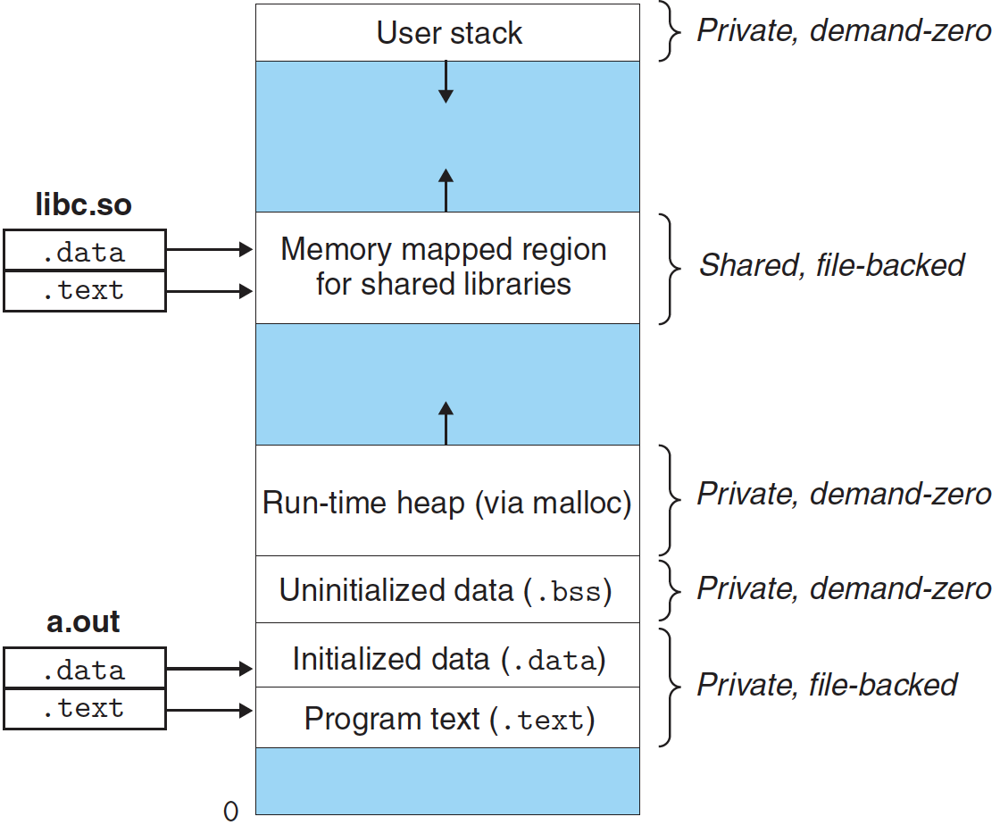

# 메모리 매핑

리눅스는 가상 메모리 영역의 내용을 디스크의 **객체**에 연결해서 초기화한다. 이 과정을 **메모리 매핑** 이라고 한다. 다음 두 종류의 객체 중의 하나로 매핑될 수 있다.

- **리눅스 파일 시스템 내의 일반 파일** : 한 영역은 실행 가능 목적과 같은 일반 디스크의 파일의 연속적인 섹션으로 매핑될 수 있다. 파일 섹션은 페이지 크기의 조각들로 나누어지고, 각각 가상 페이지의 초기 내용을 포함하고 있다. 요구 페이징 때문에 CPU가 처음 페이지에 **접근**할 때까지는 이 가상 페이지들 중 아무것도 실제로 물리 메모리로 스왑되어 들어오지 않는다.
- **익명 파일** : 한 영역은 익명 파일로 매핑될 수 있다. 이 파일은 커널이 만든 것이며, 모두 이진수 0을 포함한다. 어떠한 데이터도 디스크와 메모리 사이에 이동하지 않으므로 익명 파일로 매핑된 영역 내의 페이지들은 **demand-zero(무요구) 페이지**라고 한다.

일단 가상 페이지가 초기화된 후에는 커널이 관리하는 특별한 **스왑 파일** 사이에서 in/out 된다. 스왑 파일은 **스왑 공간** 또는 **스왑 영역**이라고도 한다. 스왑 공간이 동시에 실행되고 있는 프로세스들에 의해 할당된 전체 가상 페이지의 양을 제한한다.

---

## 1. 공유 객체 / 사적 객체

메모리 매핑은 만일 가상 메모리 시스템이 보통의 파일 시스템과 통합될 수 있다면, 프로그램과 데이터를 메모리에 단순하고 효과적으로 로드할 수 있을 것이라는 기발한 아이디어에서 생겨났다.

이 메모리 매핑을 통해서 런타임 라이브러리 코드, 표준 C 라이브러리 코드와 같은 객체들이 어떻게 다수의 프로세스에 의해서 공유될 수 있는지 이해할 수 있다.

객체는 **공유 가상 메모리 영역**에서 **공유 객체** 또는 **사적(private) 객체**로 매핑될 수 있다. 공유 객체로 매핑한다면, 이 프로세스가 이 영역에 쓰는 내용은 다른 프로세스에서도 볼 수 있다. 나아가서, 이러한 변경된 내용은 디스크 상의 객체에도 반영된다.

반면에, 사적 객체로 매핑된 영역에 가한 수정사항은 다른 프로세스에서 볼 수 없으며, 디스크 상의 객체에는 반영되지 않는다. 공유된 객체가 매핑된 가상 메모리 영역은 **공유 영역**이라고 한다.

사적 객체는 **copy-on-write**라는 기법으로 가상 메모리에 매핑된다. 프로세스1과 프로세스2가 사적 객체를 쓰지 쓰려고 하지 않는 한, 이들은 물리 메모리에 단 한 개의 객체 사본을 공유한다. 그렇지만 한 프로세스가 사적 영역 내의 일부 페이지에 쓰려고 하는 순간 쓰기 작업은 보호 오류를 유발하고, 핸들러는 이 페이지의 새로운 사본을 물리페이지 내에 만든 다음 페이지 테이블을 갱신해서 새로운 사본을 가리키도록 한다.

이처럼 copy-on-write는 마지막 순간까지 사적 객체 내에서 페이지를 복사하는 것을 지연시켜서 부족한 물리 메모리를 효율적으로 사용한다.

---

## 2. 다시보는 fork 함수

매모리 매핑을 통해 `fork` 함수가 어떻게 새로운 프로세스에 자신의 독립된 가상 주소공간을 가지는지 이해할 수 있다.

현재 프로세스가 `fork` 함수를 호출하면, 커널은 이 새로운 프로세스를 위한 여러 가지 자료구조를 생성하고, 고유한 PID를 부여한다. 새 프로세스를 위한 가상 메모리를 생성하기 위해 현재 프로세스의 mm_struct, 영역 구조체, 페이지 테이블과 같은 사본을 만든다. 그다음 두 프로세스의 영역을 모두 사적 copy-on-write로 표시한다.

`fork` 함수가 새 프로세스를 리턴할 때, 새 프로세스는 이제 `fork`가 호출되었을 때 존재하던 가사 메모리와 똑같은 사본을 가진다. 이 두 프로세스가 이후에 쓰기 작업을 수행하면 copy-on-write 메커니즘에 따라 새 페이지를 생성하므로 각 프로세스에 대해 사적 주소공간 개념을 유지하게 된다.

---

## 3. 다시보는 execve 함수

가상 메모리와 메모리 매핑은에 대한 개념을 통해 어떻게 `exeve` 함수가 프로그램을 로드하고 실행하는지 이해할 수 있다.

```cpp
exeve("a.out", NULL, NULL)
```

`execve` 함수는 현재 프로세스 내에서 현재 프로그램을 효과적으로 교체하면서 실행 목적 파일 a.out에 포함된 프로그램을 실행하고 로드한다.

1. **기존 사용자 영역을 제거한다.** : 현재 프로세스 가상 주소의 사용자 부분에 있는 기존 영역 구조체들을 삭제한다.
2. **사적 영역을 매핑판다.** : 새 프로그램의 코드, 데이터, bss, 스택을 위한 새로운 영역 구조체를 만든다. 이 모든 새로운 영역들은 사적 copy-on-write 형식을 사용한다. 코드와 데이터 영역은 a.out 파일의 .text와 .data 섹션들에 매핑된다. .bss 영역은 무요구 형식으로, 크기가 a.out에 들어 있는 익명 파일에 대응된다. 스택과 힙 영역 또한 무요구 형식으로, 처음에는 길이가 0이다.
3. **공유 영역들을 매핑한다.** : 만일 a.out 프로그램이 표준 C 라이브러리 libc.so 같은 공유 객체들과 연결되어다면 이 객체들은 프로그램에 동적으로 링크되며, 그 후에 사용자와 가상 주소공간의 공유 영역으로 매핑된다.
4. **프로그램 카운터(PC)를 설정한다.** : 현재 프로세스 컨텍스트 내에 있는 PC를 코드 영역 내 엔트리 포인트를 가리키도록 설정한다.



위 그림은 가상 메모리의 매핑을 보여준다.

---

## 4. 함수를 이용한 사용자 수준 메모리 매핑

리눅스 프로세스는 함수를 이용해서 가상 메모리의 새로운 영역들을 만들 수 있으며, 객체들을 이 영역으로 매핑할 수 있다.

```cpp
#include <unistd.h>
#include <sys/mman.h>

void* mmap(void* start, size_t length, int prot, int flags, int fd, off_t offset);
// Returns: pointer to mapped area if OK, MAP_FAILED (-1) on error
```

`mmap` 함수는 커널에 새 가상 메모리 영역을 생성해 주라고 요청한다.

반대로 `munmap` 함수는 가상메모리의 영역들을 삭제한다. 이후 삭제된 영역으로의 참조는 세그먼트 오류를 발생시킨다.

```cpp
#include <unistd.h>
#include <sys/mman.h>

int munmap(void* start, size_t length);
// Returns: 0 if OK, -1 on error
```

---