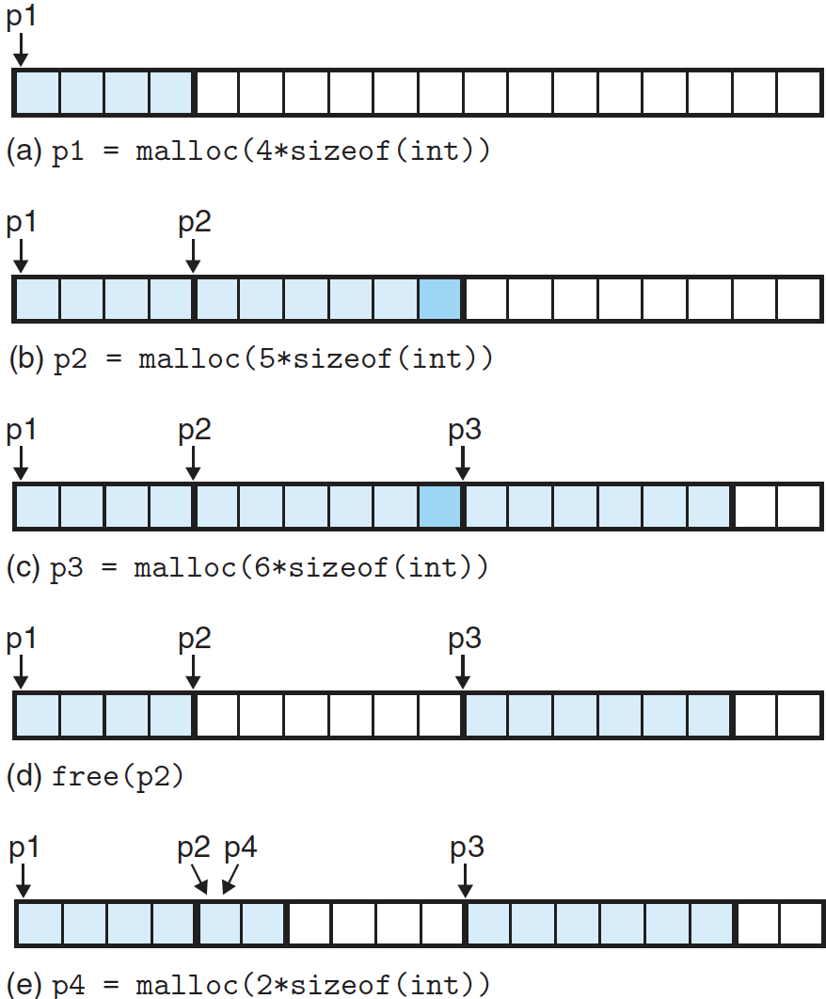

# 동적 메모리 할당

가상 메모리 영역을 저수준의 `mmap`과 `munmap` 함수를 사용해서 생성/삭제할 수 있지만, C 프로그래머들은 대게 추가적인 가상 메모리를 런타임에 획득할 필요가 있을 때, **동적 메모리 할당기**를 사용한다.

**동적 메모리 할당기(dynamic memory allocator)**는 **heap**이라고 하는 프로세스의 가상 메모리 영역을 관리한다. heap은 초기화되지 않은 데이터 영역(.bss) 직후에 시작해서 위쪽으로(높은 주소 방향으로) 커지는 무요구 메모리 영역이다. 각각의 프로세스에 대해서, 커널은 힙의 꼭대기를 가리키는 변수 `brk`를 사용한다.

할당기는 힙을 다양한 크기의 **블록**들의 집합으로 관리한다. 각 블록은 **할당**되었거나 가용한 가상 메모리의 연속적인 묶음이다. 가용한 블록은 명시적으로 할당될 때까지 가용한 상태로 남아있다.

할당기는 두 개의 기본 타입이 있다. 

- **명시적인 할당기** : 응용 프로그램이 명시적으로 할당된 블록을 반환해 줄 것을 요구한다. 예를 들어, C 표준 라이브러리에는 malloc 패키지라는 명시적 할당기를 제공한다. C 프로그램은 `malloc` 함수를 호출해서 블록을 할당하며, `free` 함수를 호출해서 블록을 반환한다.
- **암시적인 할당기** : 할당된 블록이 더 이상 프로그램 때문에 사용되지 않고 블록을 반환하는지를 할당기가 검출할 수 있을 것을 요구한다. 암시적 할당기는 **가비지 컬렉터**라고 알려져 있으며, 자동으로 사용하지 않은 할당된 블록 반환시켜주는 작업을 가비지 컬렉션이라고 한다. 예를 들어, 자바는 가비지 컬렉션을 사용한다.

---

## 1. malloc과 free 함수

C 표준 라이브러리는 malloc 패키지라는 명시적인 할당기를 제공한다. 프로그램은 `malloc` 함수를 호출해서 힙으로부터 블록들을 할당받는다.

```cpp
#include <stdlib.h>

void* malloc(size_t size);
// Returns: pointer to allocated block if OK, NULL on error
```

`malloc` 함수는 블록 내에 포함될 수 있는 어떤 종류의 데이터 객체에 대해서 적절히 정렬된 최소 *size*의 바이트를 갖는 메모리 블록의 포인터를 리턴한다. 32비트 모드에서 `malloc`은 주소가 항상 8의 배수인 블록을 리턴하며, 64비트 모드에서 주소는 항상 16의 배수다.

초기화한 동적 메모리를 원하는 응용들은 `calloc`을 사용할 수 있는데, 이것은 할당된 메모리를 0으로 초기화 하는 `malloc` 함수 주위의 얇은 래퍼 함수다. 이전에 할당된 블록의 크기를 변경하려는 응용은 realloc 함수를 사용할 수 있다.

`malloc` 같은 동적 메모리 할당기는 `mmap`과 `munmap` 함수를 사용해서 명시적으로 힙 메모리를 할당하거나 반환하며, 또는 `sbrk` 함수를 사용할 수 있다:

```cpp
#include <unistd.h>

void* sbrk(intptr_t incr);
// Returns: old brk pointer on success, -1 on error
```

`sbrk` 함수는 커널의 *brk* 포인터에 *incr*을 더해서 힙을 늘리거나 줄인다. 성공한다면 이전의 *brk* 값을 리턴하고, 아니면 -1을 리턴하고 errno를 ENOMEN으로 설정한다. *incr*이 0이면, `sbrk` 함수는 현재의 *brk* 값을 리턴한다.

프로그램들은 할당된 힙 블록을 `free` 함수를 호출해서 반환한다.

```cpp
#include <stdlib.h>

void free(void* ptr);
```

*ptr* 인자는 `malloc`, `calloc`, `realloc` 함수에서 획득한 할당된 블록의 시작을 가리켜야 한다. 그렇지 않다면 `free` 함수의 동작은 정의되지 않는다. 더 나쁜 것은 아무것도 리턴하지 않기 때문에 `free` 함수는 응용에게 뭔가 잘못되었다는 것을 알릴 수 없다.



위 그림은 C  프로그램에 대해서 16워드의 작은 힙을 malloc과 free가 어떻게 관리할 수 있는지를 보여준다. 색이 칠해진 블록들은 할당된 블록을 나타내며, 색이 없으면 가용 블록들이다. 힙에서 좌에서 우로 증가하며, 할당된 블록의 패딩된 영역은 진한 색으로 표현했다.

- (a) : 프로그램은 4워드 블록을 요청한다. malloc은 가용 블록의 앞부분에서 4워드 블록을 잘라내고, 이 블록의 첫 번째 워드를 가리키는 포인터 *p1*을 리턴한다.
- (b) : 프로그램은 5워드 블록을 요청한다. malloc은 가용 블록의 앞부분에서 6워드 블록을 할당한다. 이 예제에서 malloc은 가용 블록이 더블 워드 경계에 정렬되게 하려고 블록에 추가적인 워드를 패딩 하였다.
- (c) : 프로그램은 6워드 블록을 요청하고, malloc은 가용 블록에서 6워드 블록을 잘라낸다.
- (d) : 프로그램은 그림 (b)에서 할당된 6워드 블록을 반환해 준다. free의 호출이 끝난 후에도 포인터 *p2*는 여전히 malloc된 블록을 가리킨다는 점에 주의하자.
- (e) : 프로그램은 2워드 블록을 요청한다. 이 경우에 malloc은 이전 단계에서 반환된 블록의 부분을 할당하고, 이 새로운 블록의 포인터를 리턴한다.

---

## 2. 단편화

나쁜 힙 이용도의 주요 이유는 **단편화**라고라고 알려진 현상인데, 이것은 가용 메모리가 할당 요청을 만족시키기에는 가용하지 않았을 때 일어난다. 두 종류의 단편화가 있다: **내부 단편화**와 **외부 단편화**

> **단편화**(斷片化, **fragmentation**)는 기억 장치의 빈 공간 또는 자료가 여러 개의 조각으로 나뉘는 현상을 말한다. - 위키백과-

또한, 메모리의 공간이 작은 조각으로 나누어져 사용 가능한 메모리가 충분히 존재하지만, 할당(사용)이 불가능한 상태를 보고 **메모리 단편화**가 발생했다고 한다.

**내부 단편화**는 할당된 블록이 데이터 자체보다 더 클 때 일어난다. 예를 들어, 할당기의 구현이 요청한 데이터보다 더 큰 할당된 블록들에 최소 크기를 부여할 수도 있다. 즉, 할당기는 정렬 제한사항을 만족시키기 위해서 그림 (b)처럼 패딩을 이용해 블록의 크기를 증가시킬 수도 있다.

내부 단편화는 정량화하기가 간단하다. 이것은 단순히 할당된 블록의 크기와 이들의 데이터 사이의 차이의 합이다. 그래서 시간상 어디서든 내부 단편화의 양은 이전에 요청한 패턴과 할당기 구현에만 의존한다.

**외부 단편화**는 할당 요청을 만족시키기 위한 모든 가용한 메모리가 충분하지만, 요청을 처리하기에 충분히 큰 한 개의 가용블록이 없을 때 일어난다. 예를 들어, 그림 (e)에서 요청이 2워드가 아니라 8워드였다면 이 요청은 힙에 8개의 가용 워드가 남아 있는데도 커널에서 추가적인 가상 메모리를 요청하지 않고는 만족시킬 수 없다.

외부 단편화는 측정하기 어렵고 예측하기 불가능하므로 할당기들은 많은 수의 더 작은 가용 블록들보다는 더 적은 수의 더 큰 가용 블록들을 유지하려는 방법을 채택하고 있다.

---