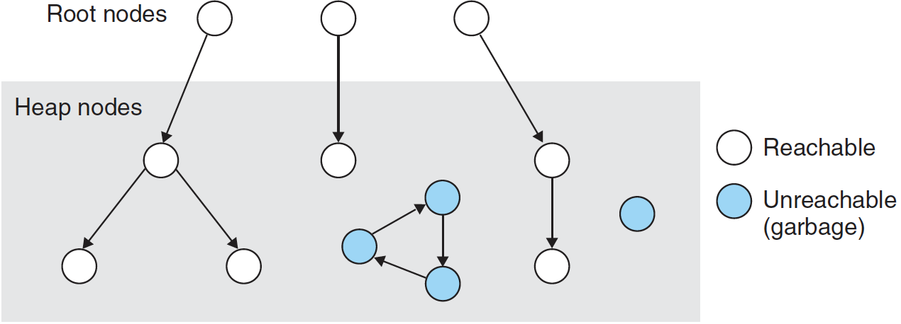
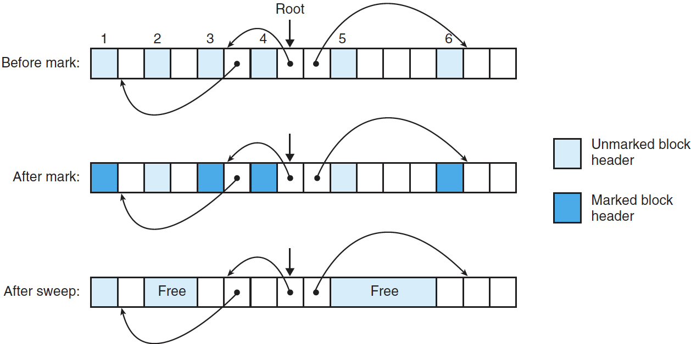
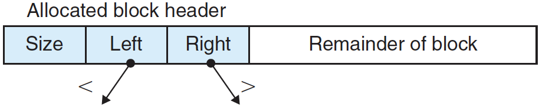

# 가비지 컬렉션

응용 프로그램은 C malloc 패키지 같은 명시적 할당기를 사용해 `malloc`과 `free`를 호출해서 힙 블록을 할당하고 반환한다.

할당한 블록들을 반환하지 않는 것을 일반적인 프로그래밍 에러다:

```cpp
void garbage()
{
	int* p = (int*)malloc(15213);
  
  return; /* Array p is garbage at this point */
}
```

*p*가 더 이상 프로그램에서 불필요하므로 *garbage()* 함수가 리턴되기 전에 반환되었어야 한다. 그러나 위 코드에서 불행하게도, 프로그래머가 이 블록을 반환하는 것을 잊어버렸다. 이러면 이 프로그램이 살아있는 동안 할당된 채로 남아 있으며, 다음 할당 요청들을 위해 사용되어야 하는 힙 공간을 불필요하게 점유한다.

> Garbage Collection (가비지 컬렉션, **GC**)은 메모리 관리 기법 중의 하나로, 프로그램이 동적으로 할당했던 메모리 영역 중에서 필요없게 된 영역을 해제하는 기능이다. 1959년 무렵 리스프의 문제를 해결하기 위해 존 매카시가 개발하였다. -위키백과-

**가비지 컬렉터(garbage collector)**는 더 이상 프로그램에서 사용하지 않는 블록들을 자동으로 반환하는 **동적 저장장치 할당기**다. 자동으로 힙 저장장치를 반납하는 과정을 가비지 컬렉션이라고 한다.

가비지 컬렉션을 지원하는 시스템에서 응용 프로그램은 명시적으로 힙 블록을 할당하지만, 이들을 명시적으로 반환하지 않는다. C 프로그램으로 다지면, `malloc`을 호출하지만 `free`를 호출하지 않아도 되는 것과 같다. 대신, 가비지 컬렉터가 주기적으로 가비지 블록을 식별하고 이 블록들을 가용 리스트로 돌려주기 위해 적절하게 `free`를 호출한다.

이 글에서는 가비지 컬렉션을 존 매카시의 오리지널 Mark&Sweep 알고리즘으로 설명한다. 이것은 기존의 malloc 패키지 위에서 돌아가며 C와 C++ 프로그램에도 가비지 컬렉션을 제공할 수 있다.

---

## 1. 가비지 컬렉터 기초



위 그림처럼 가비지 컬렉터는 메모리를 **방향성 그래프**로 본다. 그래프의 노드들은 **루트 노드**들과 **힙 노드**들로 나눈다. 

- 각 힙 노드는 힙 내 한 개의 할당된 블록에 대응된다.
- 각 루트 노드는 힙으로의 포인터를 포함하며, 힙에 속하지 않는 위치에 대응된다.
  - 이 위치는 가상메모리의 읽기-쓰기 데이터 영역 내 레지스터, 스택 변수, 전역 변수가 될 수 있다.

방향성 에지(edge) *p* →*q*는 블록 *p* 내부의 위치가 블록 *q* 내부의 위치를 가리킨다는 것을 의미한다. 만일 어떤 루트 노드에서 힙 노드 *p*로 **방향성 경로(directed path)**가 존재하면, *p*는 도달할 수 있다고 말한다.

응용 프로그램은 어떤 시점에서든 도달할 수 없는 노드를 다시는 사용할 수 없는 가비지에 대응시킨다. 가비지 컬렉터의 역할은 이 방향성 그래프의 표시를 관리하는 것과 도달 불가 노드들을 `free`시켜서 반환받고, 이들을 가용 리스트로 돌려주는 것이다.

도달성 그래프의 정확한 표시를 유지하는 자바의 가비지 컬렉터와 달리 C와 C++ 같은 언어들을 위한 컬렉터는 일반적으로 도달성 그래프의 정확한 표현을 유지할 수 없다. 이와 같은 컬렉터는 도달 가능 블록은 정확히 도달 가능으로 식별되지만, 일부 도달 불가 노드들은 부정확하게 도달 가능으로 식별될 수도 있으므로 **보수적인 가비지 컬렉터**라고 한다.

응용 프로그램은 힙이 필요할 때마다 일반적인 방법으로 `malloc`을 호출한다. 만일 `malloc`이 맞는 가용 블록을 찾을 수 없다면, 일부 가비지를 가용 리스트로 회수할 수 있으이라는 희망으로 가비지 컬렉터를 호출한다. 핵심 아이디어는 컬렉터가 응용 대신에 `free`를 호출한다는 것이다. 컬렉터로의 호출이 리턴될 때, `malloc`은 크기가 맞는 가용 블록을 다시 찾아본다. 만일 찾지 못하면 운영체제에 추가적인 메모리를 요청한다.

---

## 2. Mark&Sweep 가비지 컬렉터

Mark&Sweep 가비지 컬렉터는 루트 노드들이 도달 가능하며 할당된 하위 노들들을 표시하는 **mark 단계**와 그다음에 수행하는 표시되지 않은 블록을 반환하는 **sweep 단계**로 구성된다. 일반적으로 블록 헤더에 있는 하나의 잔여 하위 비트는 블록이 mark된 것인지 아닌지를 나타내기 위해 사용된다.

Mark&Sweep에 대해 설명하는데 있어서 다음과 같은 기능을 가정하며, 여기서 `ptr`은 `typed void* ptr`로 정의된다.

- ptr isPtr(ptr p): 만일 p가 할당된 블록 내의 어떤 워드를 가리키면, 이 블록의 시작을 가리키는 포인터 b를 리턴한다. 그 외의 경우에는 NULL을 리턴한다.
- int blockMarked(ptr b): 블록 b가 이미 mark되었다면 true를 리턴한다.
- int blockAllocated(ptr b): 블록 b가 할당되어 있다면 true를 리턴한다.
- void markBlock(ptr b): 블록 b를 mark한다.
- int length(ptr b): 블록 b의 길이를 워드로 리턴한다(헤더는 제외).
- void unmarkedBlock(ptr b): 블록 b의 상태를 marked에서 unmarked로 변경한다.
- ptr nextBlock(ptr b): 힙 내에 블록 b의 다음 블록을 리턴한다.

```cpp
void mark(ptr p)
{
  if((b = isPtr(p)) == NULL)
    return;
  if(blockMarked(b))
    return;
  
  markBlock(b);
  len = length(b);
  for(int i = 0; i < len; ++i)
    mark(b[i])
}
```

*mark* 함수를 호출할 때마다 unmarked 상태이며 도달 가능한 루트 노드의 하위 노드들을 mark 한다. mark 단계의 마지막에서, mark되지 않은 할당된 블록들은 모두 도달할 수 없는 것으로 보며, 따라서 sweep 단계에서 반한 될 수 있는 가비지가 된다.

```cpp
void sweep(ptr b, ptr end)
{
  while(b < end)
  {
    if(blockMarked(b))
      unmarkBlock(b);
    else if(blockAllocated(b))
      free(b);
    
    b = nextBlock(b);
  }
}
```

sweep 단계는 위 *sweep* 함수 한 번의 호출이다. *sweep* 함수는 힙 내의 각 블록에 대해서 반복실행하며, unmarked 상태이고, 할당된 블록들(즉, 가비지들)을 반환한다.



위 그림은 크기가 작은 힙에 대해 Mark&Sweep을 보여준다. 블록의 경계는 굵은 선으로 표시했다. 각각의 사각형은 메모리의 워드를 의미한다. 각 블록은 1 워드의 헤더를 가지며, 이것은 marked 또는 unmarked이다.

##### Before mark:

처음에, 힙은 6개의 할당된 블록으로 구성되었으며, 이들 각각은 unmarked이다. 블록 3은 블록 1로의 포인터를 가지고 있다. 블록 4는 블록 3과 6의 포인터를 포함하고 있다. 루트는 블록 4를 가리킨다.

##### After mark:

Mark 단계 후, 블록 1, 3, 4, 6은 루트에서 도달 가능하므로 marked 된다. 블록 2와 5는 unmarked인데, 그것은 이들이 도달 가능하지 않기 때문이다.

##### After sweep:

sweep 단계 후에 두 개의 도달불능 블록은 가용 리스트로 반환된다.

---

## 3. C 프로그램에 대한 보수적 Mark&Sweep

Mark&Sweep은 블록을 이동시키지 않은 채로 동작하므로 가비지 컬렉팅하는 C 프로그램을 위한 적절한 방법이다.

C언어에서 *isPtr* 함수를 구현하기 위해서는 여러 가지 고려할 문제점이 있다.

1. C는 메모리 위치에 타입 정보를 기록하지 않는다. 그래서 *isPtr*은 입력 매개변수가 포인터인지 아닌지를 판단할 수 있는 명확한 방법이 존재하지 않는다.
2. *p*가 포인터였다는 것을 알게 되었다고 하더라도 *isPtr*이 *p*가 할당된 블록의 데이터 중에서 어떤 위치를 가리키는지 판단한 확실한 방법이 없게 된다.



두 번째 문제에 대한 한 가지 해결책은 할당된 블록들의 왼쪽 자식 트리에는 더 작은 주소가 위치하고, 오른쪽에는 더 큰 주소가 위치하는 변성을 유지하는 **균형 이진 트리(balanced binary tree)**를 사용하는 것이다. 위 그림처럼 각 할당된 블록 헤더에 두 개의 추가적인 필드가 필요하다(left와 right).

*isPtr(ptr p)* 함수는 이 트리를 사용해서 할당된 블록을 이진 검색한다. 매 단계에서 블록 헤더의 size 필드를 사용해서 *p*가 블록 내에 들어가는지 결정한다.

---