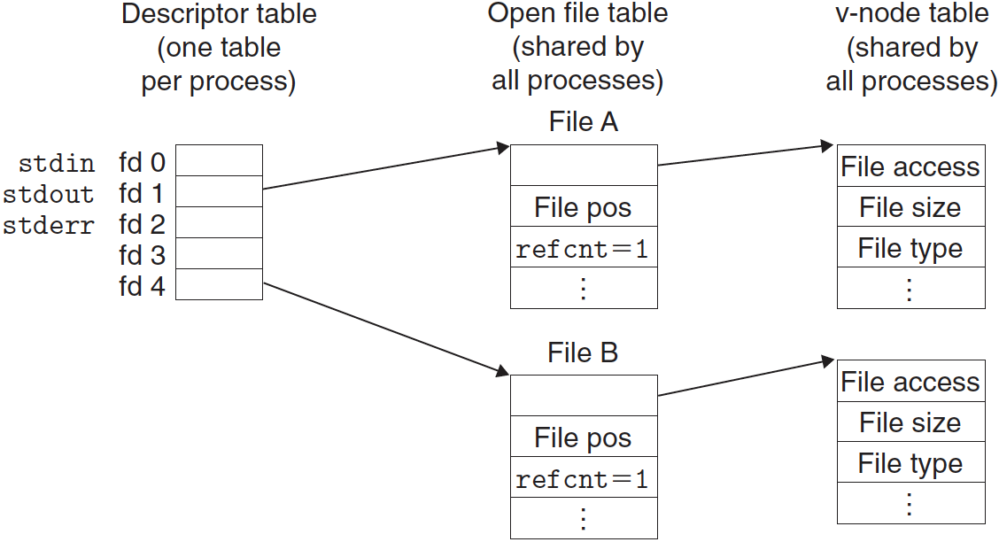
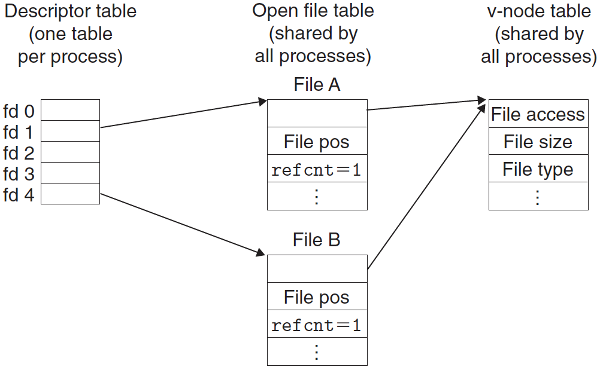
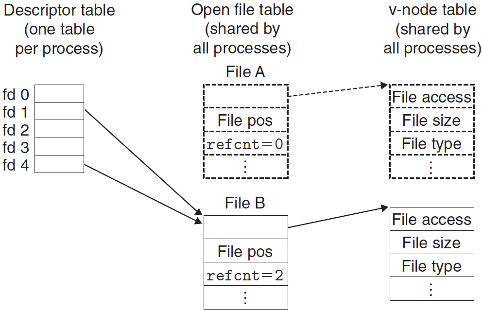

# 시스템 수준 입출력

입출력(I/O)은 메인 메모리와 디스크 드라이브, 터미널, 네트워크 같은 외부 장치 간에 데이터를 복사하는 작업이다. 입력 연산은 입출력 장치에서 메인 메모리로 데이터를 복사하고, 출력 연산은 데이터를 메모리에서 디바이스로 복사한다.

모든 언어의 런타임 시스템은 입출력을 수행하기 위한 고급 기능들을 제공한다. 예를 들어, ANSI C는 버퍼를 이용해서 I/O를 수행하는 `print`와 `scanf` 같은 함수들을 표준 I/O 라이브러리에서 제공한다. 리눅스 시스템에서, 이러한 고급 I/O 함수들은 커널이 제공하는 시스템 수준 Unix I/O 함수들을 사용해서 구현되어 있다.

여기에서는 Unix I/O와 표준 I/O의 일반전인 개념을 소개하고, C 프로그램에서 이들을 어떻게 안정적으로 사용하는지에 대해 설명한다.

---

## 1. Unix I/O

리눅스에서 **파일**은 연속된 *m*개의 바이트다:

$B_0, B_1, …, B_k, …, B_{m-1}$

네트워크, 디스크, 터미널 같은 모든 I/O 디바이스들은 파일로 모델링되며, 모든 입력과 출력은 해당 파일을 읽거나 쓰는 형식으로 수행된다. 이처럼 리눅스 커널은 디바이스에서 파일로 매핑하므로 **Unix I/O**라고 하는 간단한 저급 응용 인터페이스를 제공할 수 있게 되었으며, 이들은 모든 입력과 출력이 일정하고 통일된 방식으로 수행되도록 해준다.

- **파일 열기**: 응용 프로그램은 I/O 디바이스에 접근하겠다는 의도를 해당 파일을 열겠다고 커널에 요청하는 방법으로 알린다. 커널은 **식별자(descriptor)**라고 하는 음수가 아닌 작은 정수를 리턴하며, 이것은 이후의 파일에 관한 모든 연산에서 이 파일을 나타낸다. 커널은 열린 파일에 관한 모든 정보를 추적하고, 응용 프로그램은 식별자만 추적한다.
  - 표준 입력(식별자 0): STDIN_FILENO
  - 표준 출력(식별자 1): STDOUT_FILENO
  - 표준 에러(식별자 2): STDERR_FILENO
- **현재 파일 위치의 변경**: 커널은 파일을 열 때마다 *파일 위치 k*를 관리하며, 이것은 처음에는 0이다. 파일 위치는 파일의 시작 부분에서부터 바이트 오프셋이다. 응용 프로그램은 *seek* 연산을 수행해서 현재의 파일 위치를 명시적으로 설정할 수 있다.
- **파일 읽기와 쓰기**: **읽기** 연산은 현재 파일 위치 *k*에서 시작해서 *n* > 0 바이트를 파일에서 메모리로 복사하고, *k*를 *n* 증가시킨다. 크기가 *m*바이트인 파일이 주어졌을 때, *k*>=*m*인 읽기 연산을 수행하면 *end-of-file* EOF라고 알려진 조건이 발생하며, 이것은 응용 프로그램에서 감지할 수 있다. 실제 파일의 끝에서 "EOF 문자"가 명시적으로 존재하는 것은 아니다. 마찬가지로, **쓰기** 연산은 현재 파일 위치 *k*에서 시작해서 *n* > 0 바이트를 메모리에서 파일로 복사하고, *k*를 갱신한다.
- **파일 닫기**: 응용 프로그램이 파일 접근을 끝마치면, 커널에 파일을 **닫아**줄 것을 요청한다. 커널은 파일을 열었을 때 만든 자료구조들을 반환하는 것으로 대응하며, 식별자를 가용 식별자 풀로 복원한다. 프로세스가 어떤 이유에서든 종료할 때, 커널은 모든 열려 있는 파일들을 닫고, 이들의 메모리 자원을 반환한다.

---

## 2, 파일

각각의 리눅스 파일은 시스템에서의 역할을 나타내는 타입을 가진다:

- **일반 파일**: 임의의 데이터를 포함한다. ASCII 문자나 유니코드만을 포함하는 *텍스트 파일*과 그 외의 모든 파일을 포함하는 *이진 파일* 로구분한다. 커널에게는 파일 간에 차이가 없다. 리눅스 텍스트 파일은 *텍스트 라인*들로 구성되며, 각각의 라인은 *새 줄* 문자 ('\n')으로 종료된다.
- **디렉토리**: *링크*들의 배열로 구성되며, 각각의 링크는 *파일 이름*을 파일로 대응시키거나 또 다른 디렉토리일 수 있다.
- **소켓**: 네트워크상의 다른 프로세스와 통신하기 위해 사용되는 파일이다.

---

## 3. 파일 열기와 닫기

프로세스는 다음과 같은 `open` 함수를 호출해서 기존의 파일을 열거나 새 파일을 생성한다:

```cpp
#include <sys/types.h>
#include <sys/stat.h>
#include <fcntl.h>

int open(char* filename, int flags, mode_t mode);
// Returns: new file descriptor if OK, -1 on error
```

`open` 함수는 *filename*을 파일 식별자로 변환하고 식별자 번호를 리턴한다. 리턴된 식별자는 항상 프로세스 내에서 현재 열려 있지 않은 가장 작은 식별자다. *flags* 인자는 어떻게 프로세스가 파일에 접근하는지를 나타낸다. *mode* 인자는 새 파일들의 접근 권한 비트들을 명시한다.

마지막으로, 프로세스는 오픈한 파일을 `close` 함수를 호출해서 닫는다.

```cpp
#include <unistd.h>

int close(int fd);
// Returns: 0 if OK, -1 on error
```

이미 닫은 파일 식별자를 닫게 되면 에러가 발생한다.

---

## 4. 파일 읽기와 쓰기

응용 프로그램은 `read`와 `write` 함수를 호출해서 읽기와 쓰기를 수행한다.

```cpp
#include <unistd.h>

ssize_t read(int fd, void* buf, size_t n);
// Returns: number of bytes read if OK, 0 on EOF, -1 on error

ssize_t write(int fd, const void* buf, size_t n);
// Returns: number of bytes written if OK, -1 on error
```

`read` 함수는 식별자 *fd*의 현재 파일 위치에서 최대 *n* 바이트를 메모리 위치 *buf*로 복사한다. 반대로, `write` 함수는 메모리 위치 *buf*에서 식별자 *fd*의 현재 파일 위치로 최대 *n* 바이트를 복사한다.

---

## 5. 파일 메타데이터 읽기

응용 프로그램은 파일에 관한 정보를 `stat`과 `fstat` 함수를 호출해서 가져올 수 있다. 파일에 관한 정보를 **메타 데이터**라고 부르기도 한다.

```cpp
#include <unistd.h>
#include <sys/stat.h>

int stat(const char* filename, struct stat* buf);
int fstat(int fd, struct stat* buf);
// Returns: 0 if OK, -1 on error
```

`stat` 함수는 파일 이름을 입력으로 받아서 *stat 구조체*의 멤버들을 채워준다. `fstat` 함수도 비슷하지만, 파일 이름 대신에 파일 식별자를 사용한다.

---

## 6. 디렉토리 내용 읽기

응용 프로그램은 `readdir` 계열의 함수를 이용해서 디렉토리의 내용을 읽을 수 있다.

```cpp
#include <sys/types.h>
#include <dirent.h>

DIR* opendir(const char* name);
// Returns: pointer to handle if OK, NULL on error
```

`opendir` 함수는 경로 이름을 받아서 디렉토리 스트림을 가리키는 포인터를 리턴한다. 스트림은 항목들의 정렬된 리스트에 대한 추상화로, 이 경우에는 디렉토리 항목들의 리스트가 된다.

```cpp
#include <dirent.h>

struct dirent* readdir(DIR* dirp);
// Returns: pointer to next directory entry if OK, NULL if no more entries or error
```

`readdir`를 호출하면 *dirp* 스트림에서 다음 디렉토리 항목으로의 포인터를 리턴하거나 만일 더 이상의 항목이 없는 경우에는 NULL을 리턴한다. 각 디렉토리 항목의 다음과 같은 구조체다.

```cpp
struct dirent
{
  ino_t d_ino;       /* inode number */
  char d_name[256];  /* Filename */
};
```

*d_ino*는 파일의 위치고, *d_name*은 파일 이름이다.

```cpp
#include <dirent.h>

int closedir(DIR* dirp);
// Returns: 0 on success, -1 on error
```

`closedir` 함수는 스트림 닫고 자신의 자원들을 반환한다.

---

## 7. 파일 공유

리눅스 파일은 여러 가지 방법으로 공유될 수 있다. 커널이 어떻게 오픈한 파일들을 표시하는지에 관해 명확한 이해를 하고 있지 않다면, 파일 공유 개념은 매우 혼란스러울 수 있다. 커널은 세 개의 관련 자료구조를 사용해서 오픈한 파일들을 표현한다.

- **식별자 테이블(descriptor table)**: 각 프로세스는 자신만의 별도의 식별자 테이블을 가지고 있으며, 이들의 엔트리는 프로세스의 오픈된 파일 식별자로 인덱스된다. 각 오픈 식별자 엔트리는 파일 테이블 내의 한 개의 엔트리를 가리킨다.
- **파일 테이블(file table)**: 오픈 파일들은 모든 프로세스들이 공유하는 한 개의 파일 테이블로 표시된다. 각 파일 테이블 엔트리는 현재 *파일 위치*, 현재  가리키고 있는 *식별자 엔트리들의 참조 횟수*, *v-노드 테이블의 엔트리로의 포인터*로 구성된다. 식별자를 닫으면 관련 파일 테이블 엔트리에서 참조 횟수를 감소시킨다. 커널은 파일 테이블 엔트리를 자신의 참조 횟수가 0이 될 때까지 지우지 않는다.
- **v-노드 테이블(v-node table)**: 파일 테이블처럼 v-노드 테이블은 모든 프로세스들이 공유한다. 각 엔트리는 *st_mode*, *st_size* 멤버를 포함해서 *stat* 구조체 내의 대부분 정보를 가지고 있다. 



위 그림은 식별자 1과 4가 두 개의 다른 파일을 서로 다른 오픈 파일 테이블 엔트리들을 통해서 참조하는 예를 보여준다. 파일들은 공유되지 않았으며, 각각의 식별자는 서로 다른 파일에 대응된다.



또한, 위 그림처럼 여러 개의 식별자들은 다른 파일 테이블 엔트리를 통해서 같은 파일을 참조할 수 있다. 예를 들어, 같은 *filename*으로 `open`함수를 두 번 호출하면 이런 일이 일어난다. 핵심 개념은 각각의 식별자가 자신의 고유 파일 위치를 가지며, 따라서 다른 식별자에 대한 서로 다른 읽끼 작업은 파일 내의 다른 위치로부터 데이터를 가져올 수 있다.

또한, 부모와 자식 프로세스가 파일을 공유하는 방법을 이해할 수 있다. `fork`를 호출하기 전에 부모 프로세스가 이 섹션의 제일 위 그림과 같은 오픈 파일을 가지고 있다고 하자. 그러면, 아래 그림은 `fork`를 호출한 이후의 상황을 보여준다.


자식은 부모의 식별자 테이블의 자신만의 복사본을 가진다. 부모와 자식은 같은 집합의 오픈 파일 테이블을 공유하고, 따라서 같은 파일의 위치를 공유한다. 이로 인한 중요한 결과는 커널이 대응하는 파일 테이블 엔트리들을 삭제하기 전에 부모와 자식이 모두 자신들의 식별자들을 닫아야 한다는 것이다.

---

## 8. I/O 재지정

리눅스 쉘은 표준 입력 및 출력을 디스크 파일과 연결할 수 있도록 해주는 I/O 재지정 연산자를 제공한다. 예를 들어, 아래와 같이 입력하면:

```
linux> lis > some.txt
```

쉘은 ls 프로그램을 로드하고 실행하게 되며, 표준 출력은 디스크 파일 some.txt로 재지정된다. 나중에 설명할 웹 서버는 CGI 프로그램을 클라이언트 대신 돌릴 때, 이런 종류의 재지정을 수행한다.

어떻게 I/O 재지정이 동작할까? 한 가지 방법은 `dup`함수를 사용하는 것이다.

```cpp
#include <unistd.h>

int dup2(int oldfd, int newfd);
// Returns: nonegative descriptor if OK, -1 on error
```

`dup`함수는 식별자 테이블 엔트리의 이전 내용을 덮어써서 식별자 테이블 엔트리 *oldfd*를 식별자 테이블 엔트리 *newfd*로 복사한다.
 

`dup2(4, 1)`를 호출하기 전에 위 그림과 같은 상태를 가지고 있었다고 가정하자. 여기서 

- 식별자 1(표준 출력)은 파일 A(예를 들어 터미널)에 대응되고, 
- 식별자 4는 파일 B(예를 들어, 어떤 디스크 파일)에 대응된다. 
- A와 B에 대한 참조 횟수는 모두 1이다.



위 그림은 `dup2(4, 1)`를 호출한 후의 상황을 보여준다. 두 개의 식별자는 이제 파일 B를 가리킨다.

- 파일 A는 닫혔으며, 파일 테이블과 v-노드 테이블 엔트리는 삭제되었다.
- 파일 B에 대한 참조 횟수는 증가했다.

이 지점에서부터 표준 출력에 쓰인 모든 데이터는 파일 B로 재지정된다.

---

## 9. 표준 I/O

C언어는 **표준 I/O 라이브러리**라고 부르는 고급 입력 및 출력 함수의 집합을 정의하고 있으며, 이들은 Unix I/O의 고급 대체 함수를 프로그래머에게 제공한다.

- 파일을 열거나 닫고(`fopen`, `fclose`),
- 바이트를 읽거나 쓰고(`fread`, `fwrite`),
- 스트링을 읽거나 쓰고(`fgets`, `fputs`),
- 복잡한 포맷을 갖는 I/O를 위한 함수(`scanf`, `print`)를 제공한다.

표준 I/O 라이브러리는 오픈한 파일을 스트림으로 모델링한다. 프로그래머에게 스트림은 **FILE** 타입을 갖는 구조체로의 포인터다. 모든 ANSIC 프로그램은 세 개의 오픈 파일을 가지고 시작되며, 이들은 stdin, stdout, stderr로 각각 표준 입력, 표준 출력, 표준 에러에 대응된다.

```cpp
#include <stdio.h>

extern FILE* stdin;    /* Standard input  (descriptor 0) */
extern FILE* stdout;   /* Standard output (descriptor 1) */
extern FILE* stderr;   /* Standard error  (descriptor 2) */
```

FILE 타입의 스트림은 파일 식별자와 **스트림 버퍼**에 대한 추상화다. 스트림 버퍼의 목적은 값비싼 리눅스 I/O 시스템 콜의 수를 최소화하기 위해서다. 예를 들어, 표준 I/O `getc` 함수를 반복해서 호출하는 프로그램이 있다고 가정하자. 여기서 각각의 함수 호출은 파일에서 다음 문자를 리턴한다. `getc`가 처음 호출될 때, 라이브러리는 스트림 버퍼를 `read`함수를 한 번 호출해서 채워주고, 그 후에 응용 프로그램으로 버퍼 내의 첫 번째 읽지 않은 바이트를 리턴한다. 버퍼 내에 읽지 않은 바이트들이 존재하는 한, 이후의 `getc` 호출은 이 스트림 버퍼에서 서비스될 수 있다. 

표준 I/O 라이브러리는 Unix I/O 위에 구현되며, 강력한 고급 I/O 루틴들을 제공한다. 대부분 응용 프로그램에서 표준 I/O가 더 간단하므로 Unix I/O보다 더 선호된다. 그러나 표준 I/O에 관한 일부 상호 비호환적인 제약사항들 때문에 네트워크 응용 프로그램에서는 Unix I/O를 사용하기도 한다.

---