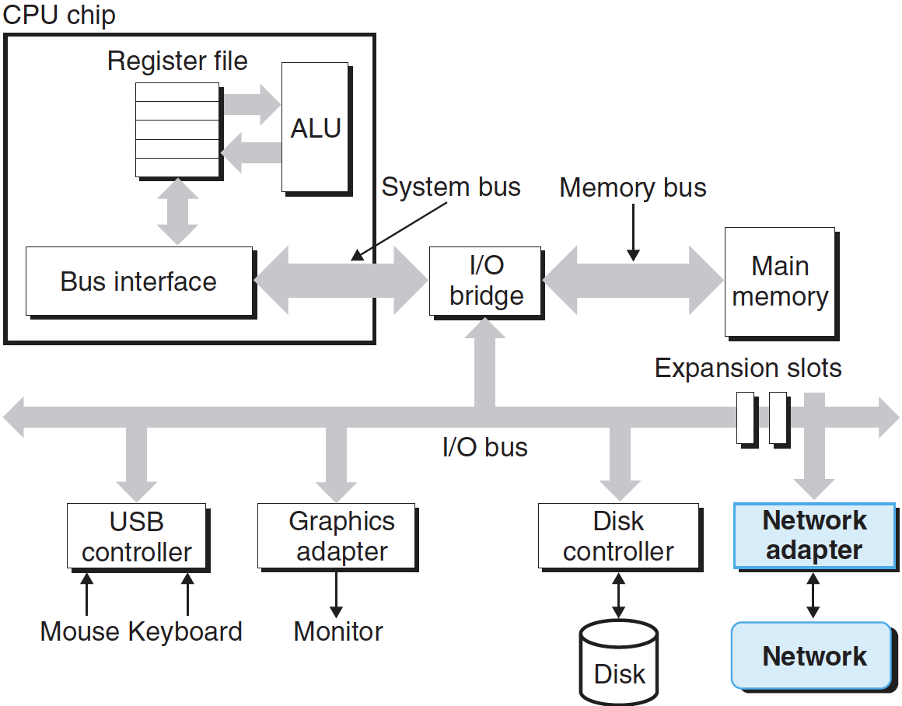
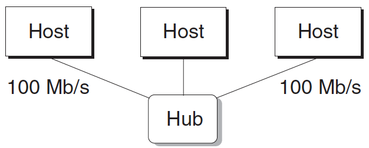

# 네트워크

클라이언트와 서버는 종종 별도의 호스트에서 돌아가며, **컴퓨터 네트워크**의 하드웨어 및 소프트웨어 자원을 사용해서 통신한다. 네트워크는 복잡한 시스템이므로 여기서는 기초적인 내용을 이해하는 것과 프로그래머의 관점에서 쓸 수 있는 개념 모델을 제공한다.

호스트에게 네트워크는 단지 또 다른 I/O 디바이스이며, 위 그림처럼 데이터를 위한 소스와 싱크로 서비스한다. I/O 버스의 확장 슬롯에 꽃혀 있는 어댑터는 네트워크에 물리적인 인터페이스를 제공한다. 네트워크에서 수신한 데이터는 I/O와 메모리 버스를 거쳐서 어댑터에서 메모리로, 대개 **DMA** 전송으로 복사된다. 비슷하게 데이터는 또한 메모리에서 네트워크로 복사될 수 있다.

물리적으로 네트워크는 기학학적 위치로 구성된 계층구조 시스템이다. 하위수준은 **LAN(Local Area Network)**으로 빌딩이나 캠퍼스에 설치된다. 현재 가장 대중적인 LAN 기술은 **이더넷(Ethernet)**이다.

*이더넷 세그먼트*는 위 그림과 같이 몇 개의 전선들과 *허브*라고 부르는 작은 상자로 구성된다. 이더넷 세그먼트는 대개 방이나 빌딩의 층과 같이 작은 지역에 설치한다. 각 전선은 같은 최대 비트 대역폭을 가지며, 대개 100 Mb/s나 1 Gb/s이다. 한쪽 끝은 호스트의 어댑터에 연결되고, 다른 끝은 허브의 포트에 연결된다. 허브는 각 포트에서 수신한 모든 비트를 종속적으로 다른 모든 포트로 복사한다. 그래서 모든 호스트는 모든 비트로 볼 수 있다.

  