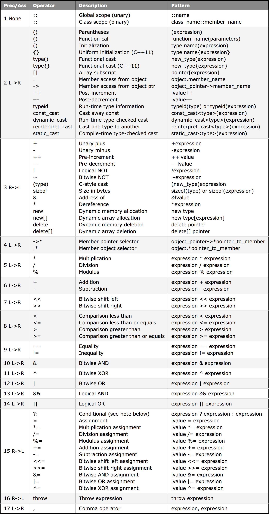

# 03.01 - 연산자 우선순위와 연관성

수학에서 **연산(operation)**은 **입력 값(피연산자: operands)**으로부터 출력 값을 생성하는 수학 계산이다. 더하기 같은 흔한 연산은 특수 기호 `+`을 사용한다. 이러한 기호를 **연산자(operator)**라고 한다. 연산자는 입력 매개 변수가 있고 값을 반환한다는 점에서 함수(function)와 유사하게 작동하지만, 더 간결하다. 예를 들어, `4 + 2 * 3`은 `add(4, mul(2, 3))`보다 읽기 쉽다.

`4 + 2 * 3`과 같은 표현식(expression)을 이해하기 위해서는 연산자의 역할과 적용 순서를 모두 이해해야 한다. 복합 표현식에서 연산자가 평가되는 순서를 **연산자 우선순위(operator precedence)**라고 한다. 여기서 복합 표현식  `4 + 2 * 3`은 일반적인 수학 우선순위 규칙이 적용되어 값 10으로 평가된다는 것을 유추할 수 있다.

C++에서 컴파일러가 표현식을 발견하면 컴파일러는 표현식을 분석하고 평가 방법을 결정한다. 이를 돕기 위해 모든 연산자에 가 할당된다. 가장 우선순위가 높은 연산자가 먼저 평가된다. 아래 표에 보면 곱하기(`*`)와 나누기(`/`)가 더하기(`+`)와 빼기(`-`)보다 우선순위가 높다는 것을 알 수 있다. 컴파일러는 이런 우선순위에 따라 평가하는 방법을 결정한다.

따라서 `4 + 2 * 3`은 더하기보다 곱하기의 우선순위가 더 높으므로  `4 + (2 * 3)`로 평가된다.

만약 표현식에 같은 우선순위의 두 연산자가 인접해 있으면, **연산자 연관성(operator associativity)** 규칙은 연산자를 왼쪽에서 오른쪽으로 평가할지 아니면 오른쪽에서 왼쪽으로 평가할지 컴파일러에 알린다. 예를 들어, 표현식  `3 * 4 / 2`에서 곱하기(`*`)와 나누기(`/`) 연산자는 우선순위 레벨이 같다. 두 연산자의 레벨은 왼쪽에서 오른쪽으로 순서가 연관되어 있으므로 왼쪽에서 오른쪽으로 계산된다. `(3 * 4) / 2`

###### 연산자(operator):

- 우선순위(precedence) 레벨 1이 가장 높은 우선순위고, 레벨 17이 가장 낮은 우선순위다. 우선순위가 높은 연산자가 먼저 평가된다.
- L→R: 왼쪽에서 오른쪽으로의 연관성(associativity)을 의미한다.



표현식의 평가 순서 명확히 하려면 괄호`()` 연산자를 사용하면 된다.

---

## 거듭제곱 연산은 어떻게 할까? (How do I do exponents?)

몇몇 프로그래밍 언어에서 `^` 연산자는 거듭제곱 연산을 수행하지만, C++에서는 거듭제곱 연산자를 지원하지 않는다. C++에서 `^` 연산자는 비트 XOR 연산자(Bitwise XOR operation)다. C++에서 거듭제곱 연산을 실행하려면 `<cmath>` 라이브러리를 `#include`하여 `pow()` 함수를 사용하면 된다.

```cpp
#include <cmath>
 
double x = std::pow(3.0, 4.0); // 3 to the 4th power
```

`pow()` 함수의 매개 변수(parameter) 및 반환 값(return value) 모두 자료형이 `double`이다. 이것은 거듭제곱 연산에서 밑(base)과 지수(exponentiation)를 부동 소수점 숫자로 가정한다. 때문에, 부동 소수점 숫자의 반올림 오류로 인해 결과가 정확하지 않을 수 있다.

정수(integer) 기준으로 거듭제곱하려면 다음과 같이 함수를 작성하는 게 좋다.

```cpp
int pow(int base, int exp)
{
    int result = 1;
    while (exp)
    {
        if (exp & 1)
            result *= base;
        exp >>= 1;
        base *= base;
    }
 
    return result;
}
```

아직, 위 함수를 이해하기는 어렵다. 모든 동작 원리를 이해하지 못하더라도 걱정하지 말자.

---

이 포스트의 원문은 [http://www.learncpp.com/cpp-tutorial/31-precedence-and-associativity/](http://www.learncpp.com/cpp-tutorial/31-precedence-and-associativity/) 입니다.