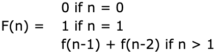

# 08.12 - 재귀 (Recursion)

C++에서 **재귀함수(recursion function)**는 자기 자신을 호출하는 함수다.

다음은 잘못 작성된 재귀함수의 예제다:

```cpp
void countDown(int count)
{
    std::cout << "push " << count << '\n';
    countDown(count-1); // 자기 자신을 재귀적으로 호출한다.
}
 
int main()
{
    countDown(5);
 
    return 0;
}
```

`countDown(5)`가 호출되면 "push 5"가 출력되고 `countDown(4)`가 호출된다. `countDown(4)`는 "push 4"를 출력하고 `countDown(3)`을 호출한다. `countDown(3)`은 "push 3"을 출력하고 `countDown(2)`를 호출한다. 즉, `countDown(n)`은 `countDown(n-1)`을 호출하는 순서를 가지므로 **무한 루프** 같은 **재귀**가 형성된다.

[스택과 힙 (Stack and Heap)](https://boycoding.tistory.com/235)에서 모든 함수 호출이 데이터를 콜 스택에 삽입한다는 것을 알았다. `countDown()` 함수는 반환되지 않는 무한 재귀 함수이므로 이 정보는 콜 스택(=스택 세그먼트)에서 제거(pop)되지 않을 것이다. 따라서 결국 컴퓨터의 스택 메모리가 부족해지므로 스택 오버플로가 발생해서 프로그램이 중단되거나 종료된다. 

---

## 재귀 종료 조건 (Recursive termination conditions)

위의 예제 프로그램은 재귀 함수의 가장 중요한 것을 보여준다. 재귀 종료 조건을 포함하지 않으면 콜 스택 메모리가 부족해질 때까지 무한히 호출하므로 스택 오버플로가 발생한다. **재귀 종료 조건이란 재귀 함수의 호출을 중지하게 만드는 조건이다.**

재귀 종료 조건은 보통 `if` 제어문을 사용한다. 다음은 종료 조건을 포함한 예제다:

```cpp
void countDown(int count)
{
    std::cout << "push " << count << '\n';
 
    if (count > 1) // 종료 조건
        countDown(count-1);
 
    std::cout << "pop " << count << '\n';
}
 
int main()
{
    countDown(5);
    return 0;
}
```

이제 프로그램을 실행하면 아래와 같이 출력을 시작한다:

```
push 5
push 4
push 3
push 2
push 1
```

이 시점에서 콜 스택을 보면 다음과 같다:

```
countDown(1)
countDown(2)
countDown(3)
countDown(4)
countDown(5)
main()
```

종료 조건 때문에 `countDown(1)`은 `countDown(0)`을 호출하지 않는다. 대신 "pop 1"을 출력한 다음 종료한다. 이 시점에서 `countDown(1)`은 콜 스택에서 제거되고 제어는 `countDown(2)`로 돌아간다. `countDown(2)`는 `countDown(1)`이 호출된 후 실행을 재개하므로 "pop 2"를 출력한 다음 종료된다. 재귀 함수 호출은 `countDown`의 모든 인스턴스가 제거될 때까지 스택에서 계속해서 팝 된다.

따라서 이 예제 프로그램은 최종적으로 다음과 같이 출력한다:

```
push 5
push 4
push 3
push 2
push 1
pop 1
pop 2
pop 3
pop 4
pop 5
```

---

## 더 유용한 예제

재귀 함수의 일반적인 메커니즘을 살펴보았으니 좀 더 유용한 예제를 보자.

```cpp
// 1부터 sumto까지 모든 정수의 합계를 반환하는 함수
int sumTo(int sumto)
{
    if (sumto <= 0) // 종료 조건
        return 0;
    else if (sumto == 1)
        return 1;
    else
        return sumTo(sumto - 1) + sumto; // 재귀적으로 함수 호출
}
```

재귀 함수는 보기만 해서는 함수의 기능을 알아내기가 힘들다. 특정 값을 갖는 재귀 함수를 호출할 때 어떤 일이 발생 하는지 보는 방법은 기능을 알아내기에 유용하다. 이 함수를 sumto = 5 매개 변수로 호출하면 어떤 일이 발생하는지 보자.

```
sumTo(5) called, 5 <= 1 is false, so we return sumTo(4) + 5.
sumTo(4) called, 4 <= 1 is false, so we return sumTo(3) + 4.
sumTo(3) called, 3 <= 1 is false, so we return sumTo(2) + 3.
sumTo(2) called, 2 <= 1 is false, so we return sumTo(1) + 2.
sumTo(1) called, 1 <= 1 is true, so we return 1.  This is the termination condition
```

콜 스택을 풀어보면 다음과 같다:

```
sumTo(1) returns 1.
sumTo(2) returns sumTo(1) + 2, which is 1 + 2 = 3.
sumTo(3) returns sumTo(2) + 3, which is 3 + 3 = 6.
sumTo(4) returns sumTo(3) + 4, which is 6 + 4 = 10.
sumTo(5) returns sumTo(4) + 5, which is 10 + 5 = 15.
```

재귀 함수를 이해하기 어려울 수 있으므로 좋은 주석을 삽입하는 게 중요하다.

---

## 재귀 알고리즘

재귀 함수는 일반적으로 문제의 하위 집합에 대한 솔루션을 먼저 찾은 다음 해당 하위 솔루션을 수정하여 솔루션을 얻는 방식으로 문제를 해결합니다. 위의 알고리즘에서 `sumTo(value)`는 먼저 `sumTo(value-1)`을 풀고 `sumTo(value)`에 대한 해를 찾기 위해 변수값을 더한다.

---

## 피보나치 수 (Fibonacci numbers)

> 수학에서, **피보나치 수**(영어: Fibonacci numbers)는 첫째 및 둘째 항이 1이며 그 뒤의 모든 항은 바로 앞 두 항의 합인 수열이다. 처음 여섯 항은 각각 1, 1, 2, 3, 5, 8이다. 편의상 0번째 항을 0으로 두기도 한다. -위키백과-

가장 유명한 수학 재귀 알고리즘 중 하나는 피보나치 수열이다. 피보나치 수는 수학적으로 다음과 같이 정의된다:



피보나치 수를 계산하는 재귀 함수:

```cpp
int fibonacci(int number)
{
    if (number == 0)
        return 0; // base case (termination condition)
    if (number == 1)
        return 1; // base case (termination condition)
    return fibonacci(number-1) + fibonacci(number-2);
}
 
// 첫 13개의 피보나치 수를 출력하는 메인 프로그램
int main()
{
    for (int count=0; count < 13; ++count)
        std:: cout << fibonacci(count) << " ";
 
    return 0;
}
// 0 1 1 2 3 5 8 13 21 34 55 89 144
```

---

## 재귀 vs 반복 (Recursive vs iterative)

재귀 함수에 대한 흔한 질문은 "for 루프 또는 while 루프를 사용해서 같은 작업을 반복적으로 할 수 있는 경우 굳이 왜 재귀 함수를 써야 합니까?"이다. 반복문을 사용해서 풀 수도 있는 문제는 종종 재귀로 풀 때 더 간단한 경우가 있다. 예를 들어 위의 피보나치를 반복문으로 풀어보라. 더 어려울 것이다. (한번 해봐!)

반복문(for, while)을 사용하는 것은 재귀 함수보다 거의 항상 더 효율적이다. 함수는 함수를 호출할 때마다 스택 프레임을 콜 스택에 푸시하는 **오버헤드**가 있기 때문이다. 반복문을 사용하면 이 오버헤드를 피할 수 있다.

그렇다고 반복문이 항상 좋다는 것은 아니다. 때로는 함수를 재귀적으로 호출하는 게 더 깔끔하고 보기 쉬울 수 있다. 그래서 오버헤드가 발생하더라도 유지보수를 위해 재귀 함수를 사용하기도 한다.

재귀가 실제로 의미가 있는 경우를 제외하고는 일반적으로 반복문을 더 선호한다.

---