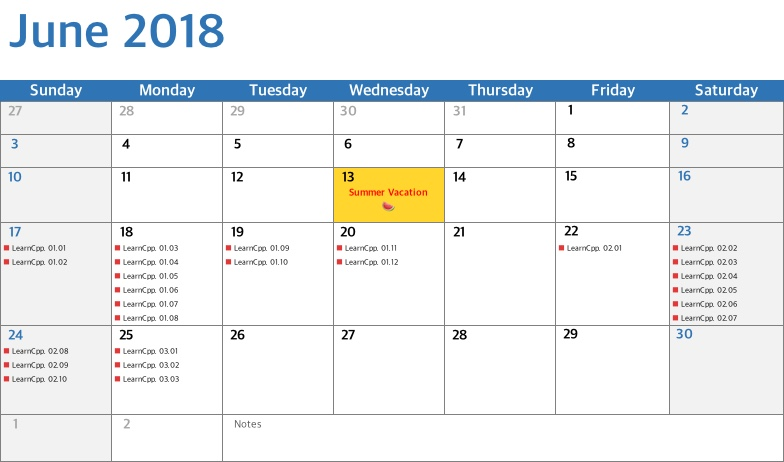

# 여름방학 폐관수련 :book:

> 실력 향상을 위한 여름방학 폐관수련

## Calendar :calendar:

## Todo List

- [x] :sunny:KPU_Sunny (+BossLocker)
- [x]   LearnCpp
- [ ]   Programmers Algorithm 
- [ ]   Math, Geometry
- [ ]   CS:APP
- [ ]   Hacker's Delight
- [ ]   SCIP
- [ ]   Multi-Thread

 

 

 

 

 

### 1. KPU_Sunny (+BossLocker)

- [KPU_Sunny](https://github.com/adunStudio/KPU_Sunny) 프로젝트 완성
- 2D / 3D Game Engine for KPU student who make graduation project with DirectX 11
- BossLocker 게임 개발 (~ 8.20)

### 2. LearnCpp

- http://www.learncpp.com/ 튜토리얼 번역
- C++ 문법 복습 / [블로그](https://boycoding.tistory.com) 포스팅

### 3. Programmers Algorithm

### 4. Math, Geometry

### 5. CS:APP

### 6. Hacker's Delight

### 7. SCIP

### 8. Multi-Thread

 

---

